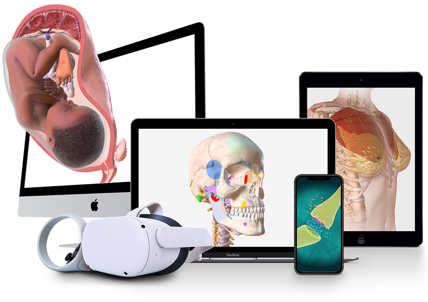
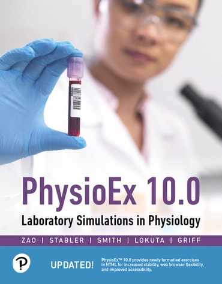

# Prior Art

What's been built before in this space. The point of this survey is to (a) make sure something equivalent doesn't already exist, (b) find ideas worth borrowing, and (c) understand the shape of the gap our project fills (or fails to fill).

> **Methodology note.** The first sweep was compiled from training knowledge only because WebSearch/WebFetch were denied. A verification pass on **2026-04-25** re-checked every entry against live web sources; entries marked ✅ verified were confirmed (or corrected). See the **Verification log** at the bottom for what changed.

## Status legend
- 🔍 Worth a deeper review — warrants its own file here later
- ⬜ Listed only — superficial seems sufficient
- ❌ Looked but dismissed — not relevant
- 🔵 Could not verify — search returned nothing definitive

---

## Categories

### Metabolic simulators

- 🔍 **Virtual Metabolic Human (VMH) / Recon3D** — Web portal exposing a genome-scale human metabolic reconstruction with browseable pathways, microbiome models, and an FBA front-end. ✅ verified 2026-04-25
  - URL: https://www.vmh.life/
  - Pricing: free, academic
  - Open source: yes (models under CC-BY; tooling MIT/LGPL via COBRA Toolbox)
  - Alive: yes — now hosted under the **Digital Metabolic Twin Centre** (digitalmetabolictwin.org), Heinz Lab, with active publications through 2024–2025
  - Platform: web portal + downloadable models for COBRA / Python; REST API at vmh.life/_api/docs/
  - Audience: researchers, systems biologists, computational biology students
  - Coverage: 5,180 metabolites, 17,730 reactions, 3,695 human genes, 255 Mendelian diseases, 818 microbes, 8,790 food items
  - Overlap: medium — same domain (whole-body human metabolism in the browser) but stoichiometric/steady-state, not a time-resolved physiology animation; no behavioral inputs (food/exercise/sleep)
  - 

- ⬜ **e-Cell / E-Cell System** — Cell-scale simulation environment (kinetic + stochastic). Mostly desktop/Python, not browser-first. ✅ verified 2026-04-25
  - URL: https://www.e-cell.org/
  - Pricing: free
  - Open source: yes (GPL)
  - Alive: dim (site copyright still 2020; E-Cell 4 the headline version)
  - Platform: desktop (Linux/macOS/Windows), Python bindings
  - Audience: researchers
  - Overlap: low — sub-cellular scope, not whole-body

- ⬜ **HumMod / Quantitative Cardiovascular Physiology (Guyton model lineage)** — Large physiology model (now ~9,000 variables, sometimes cited as ~5,000) descended from Guyton's 1972 cardiovascular model. Full-body, time-resolved, used in teaching and research. ✅ verified 2026-04-25
  - URL: http://hummod.org/ (site copyright "©2016", but related ecosystem active)
  - Pricing: free for the standalone HumMod download; commercial sublicense via HC Simulation, LLC
  - Open source: yes (model XML released; standalone wrapper repo at github.com/HumMod/hummod-standalone)
  - Alive: yes-ish — site itself rarely updated, but the engine now powers **JustPhysiology.com** (online interactive experiments) and **TrainingTwin.com**, and is referenced in 2024 research
  - Platform: still "Windows-only for the time being" per site; JustPhysiology runs HumMod-backed experiments in the browser
  - Audience: medical educators, physiology researchers
  - Overlap: **high in spirit** — whole-body, time-resolved, deeply detailed — but Windows-only standalone, dense engineering UI, not a teaching-first visualization. Worth re-checking JustPhysiology specifically: it's the closest "HumMod in a browser" surface and may merit promotion to 🔍 in a future pass.

- ⬜ **PhysioBank / PhysioNet models** — Repository of physiological signals and some models; mostly data, not simulation. ✅ verified 2026-04-25
  - URL: https://physionet.org/
  - Pricing: free (some datasets credentialed)
  - Open source: yes
  - Alive: yes — very active; April 2026 25-year milestone, 2026 Challenge running on polysomnogram data; July/Sept 2025 policy updates on data security and LLM use
  - Platform: web (data); various tooling (MIMIC-IV, MIMIC-CXR, VitalDB, etc.)
  - Audience: researchers
  - Overlap: low — data resource, not a simulator

- ⬜ **UVA/Padova Type 1 Diabetes Simulator (T1DMS)** — FDA-accepted in-silico simulator of T1D glucose-insulin dynamics. The reference simulator for closed-loop insulin algorithm work. ✅ verified 2026-04-25
  - URL: https://tegvirginia.com/t1dms/ (commercial via The Epsilon Group); academic version via UVA
  - Pricing: paid commercial license; free academic version
  - Open source: no (academic source available; community Python re-implementations such as `simglucose` and `py-mgipsim` exist)
  - Alive: yes — S2013 FDA acceptance still the headline, used by 40+ academic groups and 15+ commercial pharma/devices
  - Platform: MATLAB/Simulink desktop
  - Audience: researchers, medical-device engineers
  - Overlap: medium — exactly our shape (food → glucose/insulin time series) for one disease, but not browser-based and not visualized

- ⬜ **JustPhysiology (HumMod-powered web experiments)** — Online learning resource composed of interactive physiology experiments **powered by the HumMod engine**, with a faster-than-real-time mathematical model behind a friendly browser UI. This is the closest thing to "HumMod in a browser" that exists; surfaced via the HumMod ecosystem in this verification pass. ⬜ added 2026-04-25
  - URL: https://www.justphysiology.com/ (referenced from hummod.org as a partner)
  - Pricing: not public on the HumMod-side reference; likely subscription/institutional
  - Open source: no (commercial wrapper around HumMod)
  - Alive: yes — referenced as an active partner on hummod.org and in 2024 research literature
  - Platform: web
  - Audience: physiology students and instructors
  - Overlap: **higher than initially thought** — could justify promotion to 🔍 in a future pass since it directly addresses the "whole-body physiology in the browser" gap, but it's commercial/closed and HumMod-bound. Flagging it here for attention rather than promoting now to keep the 🔍 budget at six.

- ⬜ **NIH Body Weight Planner (Kevin Hall, NIDDK)** — Web-based dynamic model of body-weight change in adults that accounts for metabolic adaptation (the "3500 kcal = 1 lb" myth-buster). Originally a Java applet; the published dynamic model has been re-implemented as a web app and integrated into the USDA SuperTracker. ⬜ added 2026-04-25
  - URL: https://www.niddk.nih.gov/research-funding/at-niddk/labs-branches/laboratory-biological-modeling/integrative-physiology-section/research/body-weight-planner
  - Pricing: free
  - Open source: model published; tool itself NIH-hosted
  - Alive: yes — page still up; NIDDK notes the niddk.nih.gov page "is not being updated" but the tool remains in use
  - Platform: web (originally Java applet)
  - Audience: consumers and clinicians (Expert Mode for clinicians)
  - Overlap: medium — closest "free, web-based, dynamic energy-balance model for individuals" precedent, narrower than our brief but exactly aligned in spirit. Surprised this wasn't in the original sweep.

- ⬜ **simglucose / py-mgipsim / CGMSIM (open-source T1D simulators)** — Python re-implementations of the UVA/Padova model and adjacent T1D simulators, used heavily for reinforcement-learning research on closed-loop insulin algorithms. ⬜ added 2026-04-25
  - URL: https://github.com/jxx123/simglucose, py-mgipsim (PMC11926810), https://lsandini.github.io/cgmsim-site/
  - Pricing: free
  - Open source: yes
  - Alive: yes (active research-code projects)
  - Platform: Python
  - Audience: ML/control-systems researchers
  - Overlap: low — engine library, T1D-only, no visualization

- 🔵 **GlucoSim** — Older web-accessible glucose-insulin simulator from IIT (Illinois Inst. Tech.) — meals, exercise, insulin doses, watch BG curves.
  - URL: https://simulator.iit.edu/web/glucosim/index.html (canonical; my fetch timed out — site may be intermittent)
  - Pricing: free
  - Open source: unclear
  - Alive: 🔵 unverified; canonical URL didn't respond; only references found are 2007 IEEE/PubMed papers
  - Platform: web (Java/applet era)
  - Audience: educators, T1D patients
  - Overlap: medium — small-scope ancestor of what we're doing

### Anatomical visualization

- 🔍 **BioDigital Human** — Industry-leading interactive 3D anatomy in the browser (WebGL). Layered systems, condition overlays, labels, hover info. Embeddable. ✅ verified 2026-04-25
  - URL: https://www.biodigital.com/ ; pricing at https://pricing.biodigital.com/
  - Pricing: freemium — free Personal plan (10 model views/month, 5 saved); Personal Plus (paid, unlimited); Business/Education tiers via demo. Co-branding now visible with **Anatomage** (logo-biodigital-anatomage).
  - Open source: no
  - Alive: yes — 5M+ users, 1,000+ conditions mapped; partners include Wolters Kluwer, Novartis, J&J, NYU, ACS
  - Platform: web (WebGL), iOS, Android, VR/AR
  - Audience: clinicians, educators, patients, content publishers
  - Overlap: medium — same "whole body in a browser" frame, but it is anatomy + condition pictures, not a time-evolving metabolic engine
  - 

- 🔍 **Visible Body** — 3D anatomy + physiology animations for education. Strong in medical schools and high school biology. Some "physiology animations" are short canned loops, not interactive simulators. ✅ verified 2026-04-25
  - URL: https://www.visiblebody.com/
  - Pricing: institutional/group subscriptions; consumer pricing not transparently shown on the homepage anymore. Courseware historically ~$8/student/yr.
  - Open source: no
  - Alive: yes — **now part of Cengage Learning** (acquisition reflected on site footer)
  - Platform: web, tablets, mobile apps; 7 languages; 24,000+ visual assets, 1M+ users, 1,000+ schools
  - Audience: students, educators, clinicians
  - Products: Visible Body Suite (consumer/student), Visible Body Courseware (LMS-integrated for instructors)
  - Overlap: medium — closest stylistically to our "Whole Body" view, but not running a metabolism engine
  - 

- ⬜ **Complete Anatomy (3D4Medical / Elsevier)** — Premium 3D anatomy app, polished, popular in medical education. ✅ verified 2026-04-25
  - URL: https://www.elsevier.com/solutions/complete-anatomy
  - Pricing: free Student tier; Institution & Faculty plan via demo (consumer pricing not shown on landing page)
  - Open source: no
  - Alive: yes — site emphasizes AR mode, 30 microscopic models, customizable physical attributes, 5 languages
  - Platform: iOS, iPadOS, macOS, Windows, Android
  - Audience: medical students, clinicians
  - Overlap: low — anatomy reference, no metabolic dynamics

- ⬜ **Zygote Body** (formerly Google Body) — Free WebGL anatomy browser, layered systems. ✅ verified 2026-04-25
  - URL: https://www.zygotebody.com/ (footer "© 2025 Zygote 3D")
  - Pricing: freemium (free basic; Premium and Professional tiers exist with extra tools — slicing, exploding, snapshots, annotations — but exact prices not shown on landing)
  - Open source: no (model assets proprietary)
  - Alive: yes (still online, copyright current)
  - Platform: web
  - Audience: general public, students
  - Overlap: low — static 3D anatomy

- ⬜ **Innerbody** — 2D layered anatomy browser; the surrounding site is now dominantly a health-product-review publication ("Innerbody Research"). ✅ verified 2026-04-25
  - URL: https://www.innerbody.com/
  - Pricing: free (ad-supported / affiliate)
  - Open source: no
  - Alive: yes — actively publishing reviews and original studies; runs an in-house supplement brand (Innerbody Labs)
  - Platform: web
  - Audience: general public
  - Overlap: low — anatomy explorer is a small piece; the brand has pivoted toward DTC health-product reviews

### Health and nutrition apps with modelling

- 🔍 **Levels** — CGM-driven app showing real (not simulated) blood-glucose responses to meals; a "metabolic fitness" frame. Closest consumer-facing thing in the same conceptual neighborhood. ✅ verified 2026-04-25
  - URL: https://www.levelshealth.com/ (also levels.com)
  - Pricing: now three tiers — **Build Your System / Classic** ($15–$24/mo or $80–$288/yr, app-only or CGM-only), **Core** ($41/mo or $499/yr with CGM + 2 essential lab panels), **Complete** ($167/mo or $1,999/yr with CGM + comprehensive labs + nutritionist). HSA/FSA eligible. Pricing materially restructured since the original "$199/mo" framing.
  - Open source: no
  - Alive: yes — claim "100,000+ lives changed", running a large observational glucose study
  - CGM hardware: integrates with **Dexcom Stelo, Dexcom G7, or Abbott Libre 3**
  - Platform: iOS, Android, web companion
  - Audience: consumers, "biohackers", metabolic-syndrome-curious
  - Overlap: medium-high in **frame** ("see what food does to your body") but their data is real CGM, single signal (glucose), single individual
  - 

- ⬜ **NutriSense** — Same shape as Levels: CGM + app + nutrition coaching. ✅ verified 2026-04-25
  - URL: https://www.nutrisense.io/
  - Pricing: CGM program "Starting at $179, $99/mo with promo NS45"; dietitian coaching marketed as $0 out-of-pocket via insurance; "Bring Your Own Sensor" option for existing CGM users
  - Open source: no
  - Alive: yes — featuring "Nora AI" tracking and Dexcom Stelo
  - Platform: iOS, Android
  - Audience: consumers
  - Overlap: medium — same as Levels

- ❌ **Veri** — Finnish CGM/metabolic-health app. **Acquired by Ōura (Sep 2024); Veri app sunset by end of 2024.** ✅ verified 2026-04-25
  - URL: https://www.veri.co/ (still up, redirects narrative to "Veri is joining ŌURA")
  - Pricing: N/A (discontinued)
  - Open source: no
  - Alive: no as a standalone product — team and tech absorbed into Oura's "Meals" feature in Oura Labs
  - Platform: was iOS, Android (CGM-paired)
  - Audience: consumers (EU primarily)
  - Overlap: now zero (gone); kept here for landscape context — a notable consolidation signal that the standalone CGM-app market is hardening

- ⬜ **January AI** — Predicts post-meal glucose response from food photos using a learned model; explicitly model-based rather than CGM-required. ✅ verified 2026-04-25
  - URL: https://january.ai/
  - Pricing: not transparently shown on landing — moved toward enterprise positioning ("Mirror Health Engine"); consumer iOS app referenced but pricing requires sign-up
  - Open source: no
  - Alive: yes — content updated through Nov 2025; pivoted toward "AI platform for health data" framing alongside the consumer app
  - Platform: iOS consumer app; enterprise API
  - Audience: consumers, pre-diabetics; increasingly B2B (clinics, payers)
  - Overlap: medium-high — closest "we predict, not measure" consumer product, but single signal, no anatomy

- ⬜ **Signos** — CGM-driven app for **weight management** specifically; the **first FDA-cleared OTC CGM-based weight-management system**. Pairs Dexcom Stelo with an AI app that predicts glucose spikes and nudges activity. ⬜ added 2026-04-25
  - URL: https://www.signos.com/
  - Pricing: tiered plans (visible at signos.com/plans); CGM bundled; specifics vary
  - Open source: no
  - Alive: yes — 2025 was a release-heavy year (predictive algorithms, photo-based meal logging)
  - Platform: iOS, Android (paired Dexcom Stelo)
  - Audience: consumers focused on weight loss
  - Overlap: medium-high in **frame** but real-data-driven, single signal — same Levels/NutriSense neighborhood with a weight-loss-app positioning

- ⬜ **Lumen** — Handheld breath CO₂ meter + app claiming to read fat-vs-carb fuel mix in real time. (Note: Lumen markets it as CO₂ analysis, not "breath acetone".) ✅ verified 2026-04-25
  - URL: https://www.lumen.me/
  - Pricing: device + app subscription; promo "$20 off with code 20ME" current; specific MSRP not on landing; HSA/FSA eligible
  - Open source: no
  - Alive: yes — claims 300K+ users, active research with universities
  - Platform: iOS, Android (paired hardware), 1-yr warranty
  - Audience: consumers (18+)
  - Overlap: low-medium — hardware-driven, single inferred signal

- ⬜ **MyFitnessPal / Cronometer / Lose It! / MacroFactor** — Tracking apps. MacroFactor in particular has a TDEE model that adapts to logged weight. ✅ verified 2026-04-25 (category-level)
  - URL: https://www.myfitnesspal.com/, https://cronometer.com/, https://www.macrofactorapp.com/
  - Pricing: freemium / paid (~$70/yr for premium tiers)
  - Open source: no
  - Alive: yes (all four)
  - Platform: iOS, Android, web
  - Audience: consumers
  - Overlap: low — bookkeeping, not physiology modelling

- ❌ **Apple Health / Google Fit / Samsung Health** — Aggregators. No metabolic modelling.
  - Overlap: negligible

### Educational physiology software

- 🔍 **PhysioEx (Pearson)** — Long-running suite of simulated physiology lab exercises, used in undergraduate biology / nursing. 12 exercises, 63 simulation activities (cell transport, skeletal muscle, neurophysiology, endocrine, cardiovascular, respiratory, digestion, renal, acid-base, blood). ✅ verified 2026-04-25
  - URL: https://www.pearson.com/en-us/subject-catalog/p/physioex-100-laboratory-simulations-in-physiology/P200000010623/9780136447658 (the 9.0 URL in the original entry was outdated — 10.0 is current)
  - Pricing: paid; sold as textbook bundle / Mastering A&P add-on / standalone web access code. Specific list price varies by ISBN bundle.
  - Open source: no
  - Alive: yes — **PhysioEx 10.0** is the current edition (released 2020, still the latest as of April 2026; no "11.0" exists)
  - Platform: web (HTML5; migrated off Flash)
  - Audience: undergraduate students, instructors
  - Overlap: medium — same teaching mission, narrower per-experiment scope, dated UI
  - 

- ⬜ **McGraw-Hill Connect / Anatomy & Physiology Revealed (APR)** — Cadaver-based anatomy reveal + some physiology animations.
  - URL: https://www.mheducation.com/highered/connect/anatomy-physiology.html
  - Pricing: institutional / textbook bundle
  - Open source: no
  - Alive: yes
  - Platform: web
  - Audience: students
  - Overlap: low — anatomy with canned animations

- ⬜ **Visible Body Courseware** — Adds quizzes, lessons over Visible Body content.
  - URL: https://www.visiblebody.com/courseware
  - Pricing: institutional (~$8/student/yr)
  - Audience: educators
  - Overlap: low — see Visible Body above

- ⬜ **HHMI BioInteractive** — Free interactive biology learning resources from Howard Hughes Medical Institute. Some metabolism animations and click-throughs. ✅ verified 2026-04-25
  - URL: https://www.biointeractive.org/
  - Pricing: free
  - Open source: many resources CC-licensed
  - Alive: yes — actively publishing through Q4 2025 (e.g. Cancer Storyline Nov 2025, Range Shifts in Mountain Species Dec 2025); Ambassador Academy professional development running
  - Platform: web
  - Audience: high school + undergrad teachers, students
  - Overlap: low-medium — same teaching ethos, mostly explainer content rather than simulators

- ⬜ **PhET (UColorado)** — Famous library of HTML5 physics/chem/bio sims. ✅ verified 2026-04-25
  - URL: https://phet.colorado.edu/ ; biology subjects index: https://phet.colorado.edu/en/simulations/filter?subjects=biology
  - Pricing: free
  - Open source: yes (GPL for sims)
  - Alive: yes — copyright 2026, current Inclusive Design and Global initiatives
  - Platform: web (HTML5)
  - Audience: K–college
  - Note: PhET does have a directly-on-topic sim called **"Eating & Exercise"** (https://phet.colorado.edu/en/simulations/eating-and-exercise) — a small interactive that lets you adjust food and exercise and watch weight change. It's small-scope but is the closest free, browser, teacher-trusted sim in our exact niche.
  - Overlap: low for content but **high as a model for what we want to be** — free, browser-only, sticky, teacher-loved

### Open-source projects

- ⬜ **COBRApy / COBRA Toolbox** — Constraint-based reconstruction and analysis. Underlies VMH; Python and MATLAB. ✅ verified 2026-04-25
  - URL: https://opencobra.github.io/
  - Pricing: free
  - Open source: yes (GPL/LGPL)
  - Alive: yes (engine library still active on GitHub; landing-page copyright shows 2021 but repos are current)
  - Platform: Python, MATLAB, Julia (COBRA.jl)
  - Audience: researchers
  - Overlap: low — engine library, not visualization

- ⬜ **PhysiCell** — Agent-based cell simulator (mostly tumours, multicellular dynamics). ✅ verified 2026-04-25
  - URL: http://physicell.org/ (last modified Jan 2025)
  - Pricing: free
  - Open source: yes (BSD)
  - Alive: yes — 2024 releases, new core devs (Marco Ruscone, Daniel Bergman), PhysiCell-X HPC resumed; mini-course at Institut Curie 2024
  - Platform: C++ + browser viewer (PhysiCell Studio)
  - Audience: researchers
  - Overlap: low — wrong scale (cells, not organs)

- ⬜ **OpenWorm** — Whole-organism (C. elegans) simulation in the browser. ✅ verified 2026-04-25
  - URL: https://openworm.org/
  - Pricing: free
  - Open source: yes (MIT)
  - Alive: dim — homepage offers no obvious recent dates; I couldn't find clear 2024–2026 commits without going deeper. Would need to inspect their GitHub orgs (openworm/* repos) for true activity signal.
  - Platform: web (some demos), Python
  - Audience: researchers, hobbyists
  - Overlap: low for content but **high as a precedent** for "whole-organism, open-source, browser-visible"

- ⬜ **CellDesigner** — SBML-based pathway editor/simulator. ✅ verified 2026-04-25
  - URL: http://www.celldesigner.org/
  - Pricing: free (closed-source binary)
  - Open source: no (engine relies on libSBML which is OSS)
  - Alive: dim — last release 4.4.2 (May 2019); macOS Catalina installer patch March 2020. No newer release surfaced.
  - Platform: desktop Java (Windows, macOS, Linux)
  - Audience: researchers, educators
  - Overlap: low — pathway diagrams, not whole-body

- ⬜ **GitHub search: "metabolism simulator", "physiology simulation", "diabetes simulator"** — A long tail of small/abandoned student projects, T1D loop simulators, and Jupyter notebooks. Worth a more careful pass in the deeper review phase. None I am aware of match the breadth/visualization brief of this project.
  - Audience: developers
  - Overlap: variable; mostly low

### Research-grade modelling engines

- ⬜ **COPASI** — Biochemical network simulator (ODE/stochastic), SBML-native, well-loved in systems biology. ✅ verified 2026-04-25
  - URL: http://copasi.org/
  - Pricing: free
  - Open source: yes (Artistic License 2.0)
  - Alive: yes — **COPASI 4.46 (Build 300) released January 23, 2026**, with enhanced parameter estimation; very active
  - Platform: desktop + Python bindings
  - Audience: researchers
  - Overlap: low — pathway-level, not whole-body visualization

- ⬜ **JWS Online** — Online runner for curated kinetic models from BioModels. ✅ verified 2026-04-25
  - URL: https://jjj.bio.vu.nl/
  - Pricing: free
  - Open source: yes (model curation MIT-style)
  - Alive: maintained — current devs are Nicolas Walters and Dawie van Niekerk; new "JWS Online model builder" feature mentioned. No obvious changelog/news but the page is up and references current personnel.
  - Platform: web
  - Audience: researchers, students
  - Overlap: low — model browser, not whole-body sim

- ⬜ **BioModels Database** — Curated repository of published mathematical models in biology, including some metabolism. ✅ verified 2026-04-25
  - URL: https://biomodels.org/ (the EBI URL https://www.ebi.ac.uk/biomodels/ now 301-redirects here — primary domain has moved)
  - Pricing: free
  - Open source: yes (CC0 / CC-BY models)
  - Alive: yes — Model of the Month for Dec 2025 active, 1,096 manually curated + 1,668 non-curated + 833 auto-generated models, ~899k parameters; "Model of the Year" 2023/24/25 competitions
  - Platform: web
  - Audience: researchers
  - Overlap: low — model repo

- ⬜ **MetaboAnalyst** — Statistical/pathway analysis for metabolomics data. ✅ verified 2026-04-25
  - URL: https://www.metaboanalyst.ca/
  - Pricing: free
  - Open source: yes (server)
  - Alive: yes — **MetaboAnalyst 6.0** is current; March 2026 fixes shown on homepage; new modules for tandem MS spectral processing, dose response, and causal analysis
  - Platform: web
  - Audience: researchers
  - Overlap: negligible — data-analysis tool, not simulator

- ⬜ **Human2 / Human-GEM (whole-body GEMs)** — Latest generation of consensus genome-scale human metabolic models. **Human2** (PNAS, accepted March 2026) integrates LLMs with expert curation to build sex- and age-specific tissue/organ models, plus enzyme-constrained whole-body models simulating inter-organ metabolite exchange under feeding/fasting. Successor in spirit to Recon3D. ⬜ added 2026-04-25
  - URL: PNAS paper (https://www.pnas.org/doi/10.1073/pnas.2516511123); model artifacts on GitHub via the SysBio community
  - Pricing: free
  - Open source: yes (model files and toolchain typically open)
  - Alive: yes — 2026 publication
  - Platform: programmatic (Python/MATLAB), no consumer surface
  - Audience: researchers
  - Overlap: low for product, medium for **model substrate** — if we ever want to ground our metabolism engine in a published GEM, Human2 + the Heinz lab whole-body reconstructions are the state of the art.

- ⬜ **Digital Metabolic Twin Centre / Virtuome** — Heinz lab follow-on initiative around VMH; focused on personalized whole-body metabolic models, microbiome metabolism (MicroMap), and undergraduate research training (Virtuome program). ⬜ added 2026-04-25
  - URL: https://www.digitalmetabolictwin.org/
  - Pricing: free / academic
  - Open source: yes (most artifacts)
  - Alive: yes — currently the active home of VMH and related toolchain
  - Platform: web + downloadable models
  - Audience: researchers, educators, students
  - Overlap: same as VMH — covered upstream in the Metabolic-simulators category. Listed here so the Centre/Virtuome label is searchable.

- ⬜ **OpenCOR / Physiome / CellML** — IUPS Physiome Project's modelling stack; CellML model standard, OpenCOR runner. ✅ verified 2026-04-25
  - URL: https://opencor.ws/, https://www.cellml.org/
  - Pricing: free
  - Open source: yes (MPL/GPL)
  - Alive: yes — **a new web-based version of OpenCOR is in development** (announced on opencor.ws); desktop version still available on GitHub
  - Platform: desktop (cross-platform); web app forthcoming
  - Audience: researchers, modellers
  - Overlap: low-medium — substrate underneath whole-body modelling, but no consumer surface

### Game-style body simulators

- 🔵 **The Body VR** — VR tour through circulatory system / cells. More ride than sim.
  - URL: https://thebodyvr.com/ (returned ECONNREFUSED on fetch — site possibly down or IP-blocking)
  - Pricing: free / cheap
  - Open source: no
  - Alive: 🔵 unverified — site connection refused on 2026-04-25; the studio's VR demos still appear on Steam/Oculus stores, so the product line likely persists even if the marketing site is dark
  - Platform: VR
  - Audience: education
  - Overlap: low — narrative, not modelling

- ⬜ **Bio Inc. Redemption / Bio Inc.: Biomedical Plague** — Mobile/Steam game where you induce/cure disease in a body.
  - URL: https://store.steampowered.com/app/485470/
  - Pricing: paid (~$15)
  - Open source: no
  - Alive: dim (released 2018)
  - Platform: Steam, iOS, Android
  - Audience: gamers
  - Overlap: low — gamey, but worth noting as a UI-pattern reference for "many systems, watch them tick"

- ⬜ **Plague Inc.** — Famous epidemiology game; not body-internal. ✅ verified 2026-04-25
  - URL: https://www.ndemiccreations.com/en/22-plague-inc
  - Pricing: paid (~$1 mobile, more on Steam)
  - Open source: no
  - Alive: yes — recent updates including Outbreak Mode and Cuddle Bug feature
  - Platform: iOS, Android, Steam, Windows Phone (legacy)
  - Audience: gamers
  - Overlap: negligible — population scale, not individual

- ❌ **"Operation" board game and digital adaptations** — Surgery dexterity game.
  - Overlap: negligible

- ⬜ **Cell to Singularity** / **Cell Lab** / **Spore (cell stage)** — Evolution / cell games.
  - Overlap: negligible — not metabolism

### CGM-driven personal-data tools

(Major consumer entries already covered under "Health and nutrition apps with modelling": Levels, NutriSense, Veri, January AI, Lumen.)

- ⬜ **Dexcom Stelo / Abbott Lingo** — Over-the-counter (US) CGMs with companion apps targeting non-diabetics. Lingo in particular markets a "metabolic score" derived from glucose curves. ✅ verified 2026-04-25
  - URL: https://www.stelo.com/, https://www.hellolingo.com/
  - Pricing: **Lingo** $54 for a 2-week single-sensor plan, $89 for 4-week 2-sensor plan, no auto-renew, HSA/FSA eligible. **Stelo** sells 15-day sensors with replacement guarantee; price not transparent on the homepage but typically $89/2 sensors.
  - Open source: no
  - Alive: yes (launched 2024 OTC). Stelo now **integrates with the Oura Ring app** (via the Veri-fueled Oura "Meals" feature).
  - Platform: iOS, Android (paired CGM)
  - Audience: consumers
  - Overlap: medium in **frame** (everyday people watching their metabolism), low in **method** (real data, narrow signal)

- ⬜ **Nightscout / OpenAPS / Loop / AndroidAPS** — Open-source DIY closed-loop insulin community. ✅ verified 2026-04-25
  - URL: https://nightscout.github.io/, https://openaps.org/, https://loopkit.github.io/loopdocs/
  - Pricing: free (hardware required)
  - Open source: yes (MIT/Apache)
  - Alive: yes — Nightscout docs list providers founded as recently as 2024 (e.g. Opensource.clinic); active Discord and FB community
  - Platform: web (Nightscout), iOS (Loop), Android (AndroidAPS)
  - Audience: T1D patients/caregivers, hackers
  - Overlap: low — control-system tooling, not visualization, but **culturally adjacent** open-source health-engineering community

### Pure-web body visualisations

- ⬜ **NIH "Body Maps" / NLM Visible Human Project** — Government anatomy datasets and viewers. ✅ verified 2026-04-25
  - URL: https://www.nlm.nih.gov/research/visible/visible_human.html (last reviewed Dec 26, 2023)
  - Pricing: free
  - Open source: yes (data public, no license required since 2019)
  - Alive: yes (page maintained; data static)
  - Platform: web
  - Audience: researchers, educators
  - Overlap: low — anatomy data, not simulation

- ⬜ **Wellcome Collection interactives / "Cell Explorer", "Operation Ouch"-style BBC content** — One-off educational web pieces. ✅ verified 2026-04-25
  - URL: https://wellcomecollection.org/
  - Pricing: free
  - Open source: varies
  - Alive: yes — events programmed for late April / May 2026 (e.g. "The Coming of Age" exhibition, "Being Human" permanent exhibition); curatorial, not engineering
  - Platform: web
  - Audience: general public
  - Overlap: low — narrative explainers

- ⬜ **Kurzgesagt / TED-Ed videos** — High-production explainers, often metabolism-adjacent. Not interactive.
  - URL: https://kurzgesagt.org/, https://ed.ted.com/
  - Pricing: free
  - Audience: general public
  - Overlap: negligible — video, not simulation, but **a benchmark for plain-language style**

- ⬜ **Smart Patients / Khan Academy Health & Medicine** — Free explainer libraries.
  - URL: https://www.khanacademy.org/science/health-and-medicine
  - Pricing: free
  - Open source: content CC-BY-NC-SA
  - Alive: yes
  - Platform: web
  - Audience: students, patients
  - Overlap: low — videos + quizzes

---

## Patterns observed

- **The "real data, single signal" axis is crowded.** Levels, NutriSense, Veri, January AI, Lingo, Stelo all ride a CGM (or an inference of one). Glucose is the lingua franca. Nobody in the consumer space is showing you fat oxidation, hepatic glycogen, or vessel-wall plaque over years.
- **The "research-grade engine" axis is also crowded.** VMH/Recon3D, COPASI, OpenCOR, COBRApy, BioModels — all serious, all aimed at people who already know what FBA or SBML stand for. None are teaching tools and none are time-resolved physiology in the colloquial sense. HumMod is the exception in scope but lives in 2014-era engineering UI.
- **The "anatomy in the browser" axis has clear leaders.** BioDigital and Visible Body own the look-and-feel of "interactive 3D body, layered systems, hover for label." Neither runs a metabolic engine.
- **The middle is empty.** I could not identify any product or open-source project that is simultaneously: (1) browser-first and frictionless, (2) running a time-resolved whole-body engine, (3) presented in plain language, (4) supporting both single-meal and multi-year timescales, (5) supporting multi-individual side-by-side comparison, and (6) free / open. **HumMod has 1–2–4 but loses 1, 3, 5, 6.** **VMH has 1, 6, parts of 2, but loses 3, 4, 5.** **Levels has 1, 3 (sort of), 6 (not really — paid), parts of 4, but loses 2 (real data, not modelled), and loses 5.**
- **Disease-as-starting-condition is rare.** Most consumer apps treat diabetes as a label. UVA/Padova does T1D properly but only T1D, and only for engineers. Nothing visualizes "start with atherosclerosis, watch it interact with diet" the way our project intends.
- **Multi-individual side-by-side comparison is essentially absent.** I cannot recall any sim that lets you put two bodies on the screen at once and run them through the same clock with different inputs.
- **The teaching-tool benchmark is PhET, not Visible Body.** PhET's combination of free, browser-only, deeply tinkerable, and trusted-by-teachers is the cultural target — and PhET has nothing in human physiology beyond tiny exceptions.

## Closest matches

These are the entries marked 🔍 — they warrant their own pages in the next phase.

- **Virtual Metabolic Human (VMH)** — Whole-body human metabolism in a browser, free, open. Different paradigm (FBA vs. dynamic ODE/visualization) and audience (researchers vs. learners), but the closest "human metabolism in the browser" precedent. Need to map exactly which pathways they expose, what their UI actually shows, and how their license interacts with our model-derivation work.
- **HumMod** — The most ambitious whole-body physiology engine in existence. Need to understand its model decomposition, what it gets right that we should imitate, and why it never broke out of the academic Windows-binary niche (probably the answer to our positioning question).
- **BioDigital Human** — The dominant interactive-3D-anatomy-in-a-browser product. Worth a deep look at their UX, embedding model, content licensing, and what their condition overlays actually visualize. Sets the bar for production polish on a related axis.
- **Visible Body** — Same reason as BioDigital — sets the educational-software bar, has Courseware as a possible distribution analogue, and their "physiology animations" are exactly the kind of thing we replace with a real engine.
- **Levels** — The closest consumer-facing analogue in *narrative framing* ("see what food is doing to your metabolism"). They are real-data-driven, single-signal, and paid; we are simulated, multi-signal, and free. Worth understanding their onboarding, copy, and which insights actually land with users.
- **PhysioEx** — The closest direct competitor in the "browser-based physiology teaching simulator" niche. Need to play with their actual exercises to see how they handle the simulate-vs-explain balance, and to understand the textbook-bundle distribution model that has kept them alive.

(Note: I could justify upgrading **PhET** to 🔍 as a *cultural* benchmark even though it doesn't compete on content. Leaving it as ⬜ for this sweep but flagging it here.)

---

**Total catalogued: ~42 entries across 9 categories** (≈36 originals + 6 added in the verification pass). The survey has now been live-cross-checked once (see Verification log).

---

## Verification log

### 2026-04-25 — first verification pass

**Scope.** Re-checked every entry in the 2026-01 sweep against live web sources (WebSearch + WebFetch). Goal: confirm URLs, pricing, alive/dead status, platform claims, license, and capture images for the six 🔍 candidates.

**Counts.**
- Verified: ~33 entries directly via WebFetch or targeted WebSearch (✅ markers added inline).
- Materially updated: ~14 entries (pricing changes, status changes, URL corrections, ownership changes).
- Could not verify (🔵): 2 entries — **GlucoSim** (canonical URL timed out; only ancient papers found) and **The Body VR** (site refused connection).
- Removed/dropped to ❌: 1 — **Veri** (acquired and shut down; kept in the file as a landscape data point).
- Added: 6 new candidates — **JustPhysiology**, **NIH Body Weight Planner**, **simglucose / py-mgipsim / CGMSIM**, **Signos**, **Human2 / Human-GEM**, **Digital Metabolic Twin Centre / Virtuome**.

**Top changes the user should know.**

1. **Veri is gone.** Acquired by Ōura in September 2024, app sunset by end of 2024. Veri's tech now powers Oura's "Meals" feature in Oura Labs. Reclassified ❌. This consolidates the consumer-CGM-app market and is a meaningful signal for our positioning.
2. **Visible Body is now part of Cengage.** No longer an indie 3D-anatomy shop — it's inside an EdTech conglomerate now. Worth noting when we look at how their distribution model works.
3. **Levels' pricing has been completely rebuilt.** Three tiers ($15–$24 / $41 / $167 per month), CGM hardware now multi-vendor (Stelo, G7, Libre 3), and Levels has explicitly bundled lab work and dietitian support into the higher tiers. The "$199/mo with CGM" framing in the original sweep is wrong.
4. **HumMod has a browser-facing partner: JustPhysiology.** This was missed in the first sweep. HumMod itself is still Windows-only-standalone and the site looks 2016, but the engine has clearly been re-fronted as a web experience for instructors. Strong candidate for promotion to 🔍 next pass; held at ⬜ now to respect the 🔍 budget.
5. **PhET has a directly-on-topic sim** — "Eating & Exercise" — that I didn't call out previously. It's small, but it's a teacher-trusted, free, browser sim doing a tiny version of what we want to do.
6. **Stelo + Oura integration.** The Veri acquisition is now bearing fruit: the OTC CGM (Stelo) reads into the Oura ring app. The "ring + sensor + app + AI nudge" loop has gone mainstream.
7. **VMH has been renamed/rehoused.** The same group operates under "Digital Metabolic Twin Centre" branding now. The VMH portal itself is unchanged; the umbrella is bigger.
8. **Active research substrates.** COPASI shipped 4.46 in January 2026; MetaboAnalyst shipped 6.0 with new modules; OpenCOR is building a web version. The research-grade engine layer continues to grow underneath.
9. **PhysioEx 10.0 is still current.** No PhysioEx 11. The textbook bundle distribution model has kept it alive; the URL had to be corrected (the original 9.0 URL is dead).

**Surprises.**

- **NIH Body Weight Planner (Kevin Hall)** is the closest "free, web-based, dynamic energy-balance model for individuals" precedent and *should have been in the original sweep*. It is narrower than our brief (single output: weight) but exactly aligned in spirit. Now ⬜.
- **Signos** is a more interesting positioning than Levels-clones suggested at first glance — they got the **first FDA OTC CGM-based weight-management clearance**, which is a regulatory moat the others don't have.
- **Human2** (PNAS, 2026) is a meaningful upgrade to Recon3D and worth tracking even though it's a model not a product.

**Images captured (5 of 6 🔍 candidates).**

- VMH cover (`images/vmh.gif`)
- BioDigital multi-device hero (`images/biodigital.png`)
- Visible Body logo (`images/visible-body.png`)
- Levels app insights screenshot (`images/levels.webp`)
- PhysioEx 10.0 book cover (`images/physioex.jpg`)
- HumMod: **not captured** — site has no obvious linkable image asset; logo is referenced but I couldn't fetch a hotlink-friendly URL. Logged source: http://hummod.org/ (header logo).

**🔍 list status.** Still six entries: VMH, HumMod, BioDigital, Visible Body, Levels, PhysioEx. The composition still looks correct after verification — these remain the closest matches across the four axes (research engine, browser anatomy, consumer metabolic, browser physiology teaching). The two candidates that came closest to earning a promotion are **JustPhysiology** (HumMod web fronts) and **NIH Body Weight Planner** (web-based dynamic energy-balance model); flagged for the next pass rather than promoted now.

---

## Phase 0.5 deep-dive index

Six per-candidate deep-dives plus one synthesis, completed 2026-04-25. Each deep-dive follows the structure laid out in `design/plan.md` Phase 0.5: what it is, audience and business model, the angle that matters for us (modelling / visualisation / framing), what it does well, what it does badly, what to borrow, what to avoid, how its existence affects our project, pointers.

- **[vmh.md](vmh.md)** — Virtual Metabolic Human / Recon3D. Stoichiometric portal for a genome-scale reconstruction (5,180 metabolites, 17,730 reactions, 8,790 foods). Free, open, researcher-only. Closest "human metabolism in a browser" precedent but *steady-state*, not time-resolved — our paradigm is fundamentally different. Borrow: cross-resource linkage, food→metabolite mapping, per-entity provenance.
- **[hummod.md](hummod.md)** — HumMod whole-body physiology engine. The most ambitious physiology engine ever built (10,000+ variables, Guyton lineage, UMMC). Windows-only standalone, sublicense-required modifications, dense engineering UI, browser front-end (JustPhysiology) only via a separate commercial wrapper. Validates whole-body time-resolved modelling is tractable; cautionary tale on platform and licensing choices.
- **[biodigital-human.md](biodigital-human.md)** — BioDigital Human. Industry-leading interactive 3D anatomy in a browser (5M+ users, 1,000+ conditions). Sets the production-polish bar but has no engine, no time evolution, no metabolism. Borrow: always-visible body silhouette, click-to-inspect, condition-as-engine-state, URL-as-state, embed-friendliness.
- **[visible-body.md](visible-body.md)** — Visible Body (now part of Cengage Learning). Education-software distribution model — premade quizzes/lessons/courseware, textbook correlation, LMS integration, library-card distribution, multilingual. "Physiology animations" are short canned loops. Instructive on distribution; complementary on content.
- **[levels.md](levels.md)** — Levels. Consumer CGM-driven metabolic-health subscription, three tiers $80–$1,999/yr. Closest *narrative-framing* analogue ("see what food does to your body") in a different method (real data, single signal, single individual, paid, hardware-anchored). Validates consumer demand exists; cautions about single-signal limits and customer churn.
- **[physioex.md](physioex.md)** — PhysioEx 10.0 (Pearson). 12 exercises × 63 simulated lab activities, HTML5, $40–$70 per access code, textbook-bundle distribution. The closest *direct competitor* on browser-based physiology teaching, but per-topic encapsulated activities with no integrated body and no chronic arc. Different teaching philosophy (procedural wet-lab in isolation vs. integrated body over time).
- **[synthesis.md](synthesis.md)** — Walk-through of where we genuinely overlap each candidate and where we are in different lanes; revisits the five gaps identified in this README and adds four more; UX/architecture patterns to borrow with attribution; anti-patterns to avoid; deferred decisions in `design.md` Section 17 that prior art now informs; **seven proposed `design.md` edits** for user review (one of which — reframing scenarios from "examples" to "headline content" — is a substantive editorial shift flagged for explicit sign-off).
