# Parametric SVG Anatomy — A Survey of What Code Exists for Drawing Bodies and Organs from Sliders

*Scope note: This is research for the forthcoming `background/svg-techniques/` folder, where the team will write code that draws the simulator's anatomical schematic procedurally so that it responds live to body-fat, age, plaque-thickness, bone-density, and similar parameters. The brief was to find published code, libraries, and techniques that **emit SVG from numeric inputs** — not asset libraries. CC0 anatomy-clipart catalogues (BioIcons, Servier, Wikimedia, Reactome) are deliberately excluded; they are static and already covered in `background/svg-illustrations/` as samples for traceable visual-style work.*

*Image-capture note: a follow-up pass landed 12 demonstration images in `background/svg-illustrations/` covering the highest-leverage finds (Anny, Jason Webb's space-colonization, flubber, gganatogram, Webb's reaction-diffusion playground). They are embedded inline below alongside the static anatomy baselines (EBI Anatomogram, DBCLS BioIcons, Servier, Wikimedia) that were already in the directory. Where a project is JS-rendered with no static screenshot in its repo (Observable notebooks, live d3 demos), the entry carries the demo URL and a description in lieu of an image.*

---

## 1. Executive Summary

Truly parametric, code-driven, SVG-output anatomy on the public web is a thin slice. The strong work clusters in three distinct corners that almost never talk to each other:

1. **3D body models projected to 2D** — MakeHuman, SMPL, Anny, BodyVisualizer. These take age, sex, BMI, height, muscle, body-fat as input and emit a parameterised body. They are the deepest pool of code, but they output WebGL meshes; getting flat SVG out requires projecting the silhouette and inking outlines. There is no published SVG path version of any of them.
2. **Generative-art techniques retargeted to anatomy** — L-systems and the space-colonization algorithm for branching (vasculature, bronchi, neurons), Voronoi tessellation for trabecular bone, metaballs for soft glandular outlines, reaction-diffusion for surface texture, SVG path-morphing libraries (flubber, KUTE.js, GSAP MorphSVG, svg-path-morph) for tweening between hand-drawn key shapes. Mature general-purpose libraries; very few worked anatomical examples in public.
3. **Single-purpose medical demos** — ECGSYN-style waveform synthesizers, atlas-based coloured-region tools (gganatogram, EBI Anatomogram, etal/bodymap), clickable body-part selectors. These are parametric in the *colouring* sense (each region's fill is data-driven) but the underlying paths are static — they cannot make a body slimmer or a vessel narrower.

The headline gap, blunt: **nobody has published the thing the simulator wants.** A parametric, slider-driven, hand-tuned SVG anatomical schematic — one body figure whose silhouette responds to body-fat, whose vessels narrow with plaque-thickness, whose trabeculae thin with osteoporosis, whose liver darkens with steatosis, whose intestine coil-count tracks length — is, as far as the searches surfaced, not extant in CC-licensed public code. There are pieces. There is no whole.

The implication for `svg-techniques/` is liberating: there is no canonical implementation to reproduce. The folder should be a sequence of focused experiments — one per parameterised feature — combining (a) hand-tuned SVG key shapes, (b) shape-morphing between them as a continuous parameter sweeps, and (c) procedural overlays (Voronoi, branching, noise) for the textures that are too fine to keyframe. The candidate first experiments fall out of the survey naturally: §8 lists four.

The note runs roughly 2,800 words. Sources are linked inline; web searches were the primary instrument.

---

## 2. Parametric Whole-Body Generators

### 2.1 MakeHuman (and Anny, its modern descendant)

**One-line.** A community-built parametric humanoid mesh that interpolates smoothly across age (infant to elderly), sex, body-mass, and muscularity from a small set of macro sliders driving thousands of blendshape targets underneath.

**URL.** <http://www.makehumancommunity.org/> · Naver Labs' 2025 PyTorch reimplementation Anny: <https://github.com/naver/anny> · <https://europe.naverlabs.com/blog/anny-a-free-to-use-3d-human-parametric-model-for-all-ages/>

**Inputs.** Age, height, weight, muscle mass, sex (continuous, not binary). Anny is calibrated against WHO anthropometric data.

**Output.** 3D mesh (OBJ / glTF). **Not SVG.** A 2D silhouette is obtained by orthographic projection — this is how `bmivisualizer.com`, `bodyvisualizer.is.tue.mpg.de`, and most fitness-app body visualizers work under the hood. The simulator will need to do the same and convert the silhouette polyline to a smoothed SVG path, *or* hand-draw a small set of MakeHuman renders and morph between them.

**License.** MakeHuman is AGPL3 with characters released under CC0. Anny is Apache 2.0 — **the cleanest license in the parametric-body space** and a strong fork candidate.

**Technique.** Linear blend of vertex offsets across target meshes, plus skinning. Anny's headline contribution is making the whole stack differentiable and re-fitting it to WHO body-shape data.

**Why it matters here.** If any approach has solved "age plus body-fat plus sex yields an anatomically sensible figure," it is this lineage. The path forward is almost certainly: render a small grid (e.g. 5 ages × 3 BMIs × 2 sexes = 30 silhouettes) from Anny, ink outlines and landmarks by hand into SVG, then use `flubber` (§4) to morph between them at runtime.

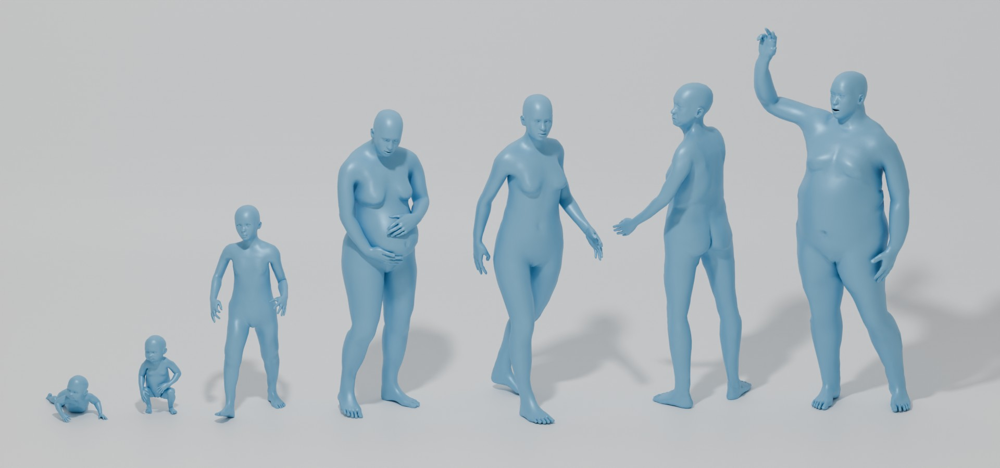
*Anny's published teaser — the same parametric figure rendered across age (infant to elderly), sex, and body shape. This is the slider grid the simulator wants to trace into SVG keys.*

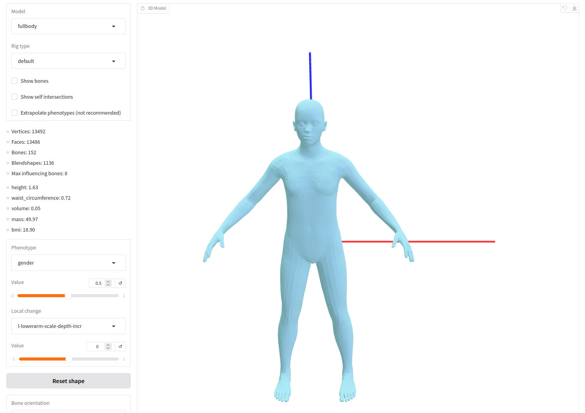
*Anny's interactive demo with macro sliders (age, height, weight, muscle, sex on a continuum). The figure morphs live; the simulator's body panel will need this same parameter surface, but emitting SVG instead of a 3D mesh.*

### 2.2 SMPL / SMPL-X (Max Planck Institute)

The academic gold-standard parametric body — a learned linear model that maps 10 shape parameters (β) plus pose parameters (θ) to a full mesh. <https://smpl.is.tue.mpg.de/> · <https://smpl-x.is.tue.mpg.de/> · BodyVisualizer at <https://bodyvisualizer.is.tue.mpg.de/>. Built by PCA over 4,000+ body scans; β₁ alone moves the figure along a thin-to-heavy axis with surprising fidelity. Output is 3D mesh — same SVG conversion problem as MakeHuman. License is **non-commercial research only** — a real obstacle, the reason Anny exists. Treat SMPL as inspiration, not a fork target.

### 2.3 UMTRI HumanShape

University of Michigan Transportation Research Institute's parametric body at <http://humanshape.org/>, built for vehicle-occupant simulation. Inputs: stature, BMI, sitting/standing height ratio, age, sex. Output is a 3D mesh. Free for research. Technique is statistical regression on a population body-scan dataset, conceptually similar to SMPL but with anthropometric (rather than principal-component) controls — **more interpretable for a simulator UI**, which is the relevant lesson.

### 2.4 BMI Visualizer / Body Visualizer / Body Fat Estimator / Figa / ZOZOFIT

A cluster of fitness-app derivatives of SMPL/MakeHuman that expose two-to-seven sliders (BMI, body-fat %, weight, height, optionally muscle mass) and tween a 3D WebGL figure live. <https://www.bmivisualizer.com/> · <https://3dbodyvisualizer.net/> · <https://bodyfatestimator.ai/body-visualizer> · <https://www.strongrfastr.com/app/body_visualizer_simulator> · <https://zozofit.com/>. All proprietary; under the hood almost all are SMPL-derivative with a slider-bound shell. The UI patterns — Body Fat Estimator's "Linked" vs "Independent" mode for BMI and body-fat-fraction is the cleanest example — are worth photographing for the simulator's own slider design.

### 2.5 Model My Diet

A 2D — not 3D — virtual weight-loss visualizer at <https://modelmydiet.com/> that renders a parametric front-view body silhouette from current-weight, goal-weight, sex, height. Output is 2D raster, not SVG, but it is the closest *philosophical* fit to what the simulator wants. From visual inspection it appears to be image morphing across a hand-drawn library of silhouettes binned by weight and height — more or less the recipe outlined in §8. Proprietary.

### 2.6 etal/bodymap

**One-line.** A simple Python+JavaScript library for colour-coding regions on a labelled body-outline SVG, originally for clinical pain-mapping.

**URL.** <https://github.com/etal/bodymap>

**Inputs.** A YAML hierarchy of region labels and a value-per-region map; the SVG paths themselves are static.

**Output.** SVG (modified by setting fill on each region).

**License.** Open (BSD-style).

**Technique.** Not parametric in the body-shape sense — the underlying paths are fixed. Only the colouring is data-driven. Listed here because the simulator already needs this layer (each organ flashes or fills from its substance levels), and `bodymap` is a clean reference for the YAML-region-table pattern.

---

## 3. Procedural Organ and Tissue Generators

### 3.1 Vasculature — L-systems and the Space Colonization Algorithm

**The strongest technique find of the survey.** Fractal L-systems and Runions et al's space-colonization algorithm both produce branching networks that are visually indistinguishable from real vascular trees, both run in tens of milliseconds, and both export cleanly to SVG.

- **Jason Webb's 2D space-colonization experiments.** <https://jasonwebb.github.io/2d-space-colonization-experiments/> · <https://github.com/jasonwebb/2d-space-colonization-experiments>. Six experiments: Basic, Bounds, Obstacles, Marginal Growth, Painting, Images. Inputs: attractor distribution, vein-thickening rule, perfusion bounds. Output: vector polylines, **directly serialisable to SVG** (Webb explicitly mentions pen-plotter export). License: MIT. The "Bounds" and "Obstacles" experiments are the most directly applicable — feed an organ outline as the bound, scatter attractors inside, and the algorithm grows a vessel tree that fills the organ. The "Marginal Growth" experiment grows along edges, which is what coronary arteries on a heart silhouette do.

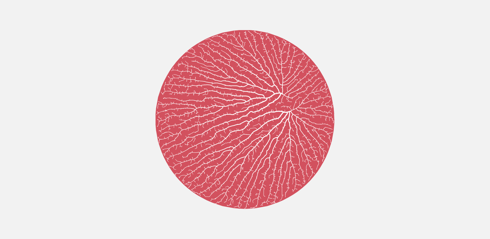
*Bounds — attractors scattered inside an arbitrary closed shape; the branching tree fills the shape from a single root. Drop an organ silhouette in for the bound and you have a vessel tree for that organ.*

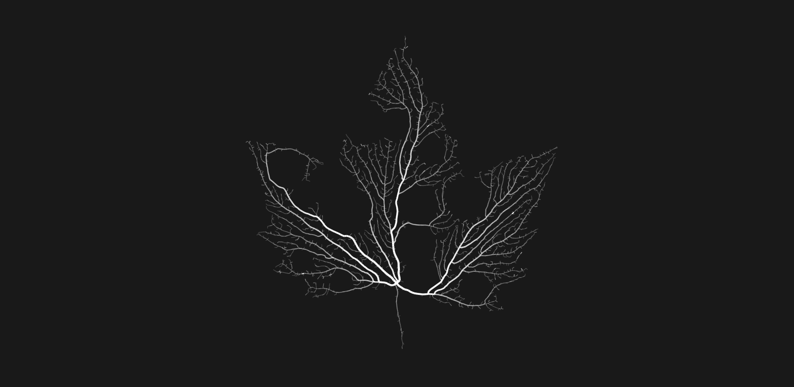
*Obstacles — same algorithm with internal exclusion zones. Useful for vessels that have to route around bone, cartilage, or large lumens.*

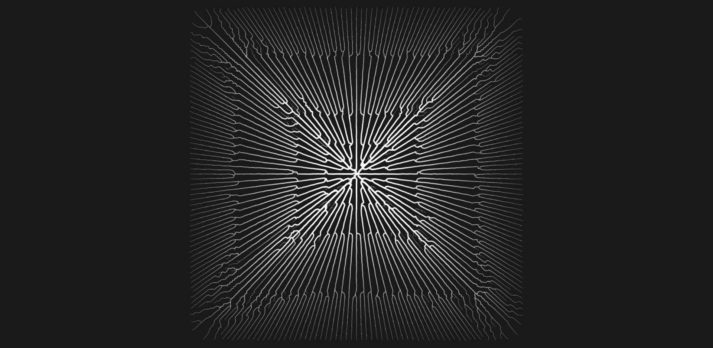
*Marginal Growth — branches grow along the boundary of the shape rather than filling it. The right primitive for coronary arteries on a heart silhouette and for surface vasculature on the brain.*

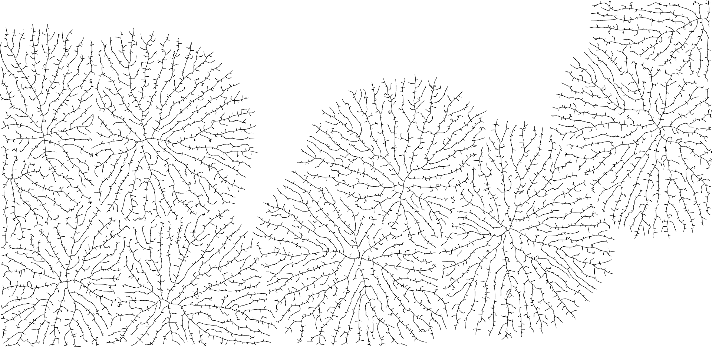
*Basic — unconstrained growth from a single root toward a free attractor cloud. Reference for the algorithm's bare behaviour before bounds, obstacles, or growth rules constrain it.*
- **`pex-space-colonization`** (Nick Nikolov). <https://github.com/nicknikolov/pex-space-colonization>. Drawing-code-decoupled JavaScript library; clean to wire to D3 / SVG.js.
- **Parametric L-systems for arterial branching.** Zamir, *Arterial Branching within the Confines of Fractal L-System Formalism* (Semantic Scholar). The classical fractal-rule approach; tunes Murray's-law branching ratios and bifurcation asymmetry.
- **"Emergence of matched airway and vascular trees from fractal rules"** (Tawhai et al, *J. Appl. Physiol.*). Fractal-rule simultaneous generation of bronchial and arterial trees in the lung. This is the right reference for the lung in the simulator.

**Inputs that drive output.** Number of attractors / iteration count; branching asymmetry ratio; vein-thickening exponent (Murray's law uses ~3); pruning threshold; bounding shape. For the simulator, **plaque-thickness** maps to a per-segment radius reduction; **age** maps to total branch count and tortuosity (older vessels are more wavy). Both are trivial post-passes on the output of either algorithm.

### 3.2 Bronchial Tree — Same Tooling, Different Constants

The lung's airway tree is the textbook example of a fractal biological structure (Hess–Murray law). The same space-colonization or L-system code that makes vessels makes bronchi: change the bifurcation asymmetry constant, change the bound to a lung silhouette, terminate at alveolar density. References: West, *The fractal geometry of bronchial trees* (J. Appl. Physiol.), and Schmidt, *Three-Dimensional Model of the Human Airway Tree Based on a Fractal Branching Algorithm*.

### 3.3 Trabecular Bone — Voronoi Tessellation

**The clean technique fit for bone density.** A Voronoi tessellation of seed points, with each cell wall drawn at a thickness controlled by a "density" parameter, produces a pattern that *is* trabecular bone to within visual tolerance. Recent academic work has formalised this — Wang et al, *An improved trabecular bone model based on Voronoi tessellation* (J. Mech. Behav. Biomed. Mater., 2023, <https://doi.org/10.1016/j.jmbbm.2023.106214>) — and pre-existing 2D libraries (`d3-delaunay`, `voronoi-edges`) plug directly into SVG.

**Inputs.** Seed-point density, Lloyd-relaxation iterations (regularity), wall-thickness function. **For osteoporosis the parameter sweep is wall-thickness multiplied by a global density factor 0.4–1.0; the simulator has its work done for it.**

### 3.4 Glandular and Soft-Tissue Outlines — Metaballs and Blobs

For organs whose outline should be a smooth, slightly variable blob (adipose lobules, lymph nodes, the pancreas in low-detail views, fat-cell groups), metaballs render perfectly to SVG via two well-documented routes:

- **Filter-based.** A `feGaussianBlur` plus `feColorMatrix` chain on a set of `<circle>` elements glues nearby circles into a single contiguous shape. <https://dev.to/antogarand/svg-metaballs-35pj>. Cheap and DOM-friendly; handles arbitrary numbers of circles.
- **Marching-squares geometric.** Compute the metaball isosurface and emit a single `<path>` with cubic-bezier or Catmull–Rom interpolation. <https://varun.ca/metaballs/>. Heavier but produces a single editable path, which the simulator wants for hover and click.
- **Static blob generators** (Blobmaker <https://www.blobmaker.app/>, ssshape <https://www.fffuel.co/ssshape/>) are useful as offline shape sources rather than live components.

### 3.5 Cellular Texture — Reaction-Diffusion (Turing patterns)

Reaction-diffusion produces the fingerprint, leopard-spot, coral-maze patterns Alan Turing predicted in 1952 — and at certain parameter values the patterns are an excellent match for *liver lobules*, *kidney medullary striations*, and *intestinal villi cross-sections*. The technique runs as a simulation (canvas-side), with the resulting pattern image-traced into SVG offline or rendered as an `<image>` overlay.

- Pmneila's Gray–Scott playground: <https://pmneila.github.io/jsexp/grayscott/>
- Jason Webb's playground: <https://jasonwebb.github.io/reaction-diffusion-playground/>
- The Coding Train walkthrough: <https://thecodingtrain.com/challenges/13-reaction-diffusion/>

For the simulator's purposes this is best regarded as a **once-offline texture generator**: bake six liver-pattern PNGs at six fat-fraction values, and slot them in as overlays.

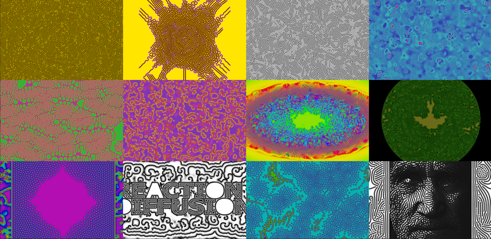
*Webb's reaction-diffusion playground showing twelve parameter presets across the Gray–Scott space. The bottom-left "coral" patterns and centre "spots" patterns are the closest visual matches for liver lobules and intestinal villi cross-sections respectively. Bake a row at six steatosis values for the liver overlay.*

### 3.6 Intestine Coiling — Open

The simulator wants the gut to coil more loosely or more tightly with body-shape changes. The biological mechanism is well-studied — Savin et al., *Gut coils with help from its elastic neighbor* (Harvard SEAS, 2011) — but no publicly available JavaScript / SVG re-implementation surfaced. Promising algorithms in the literature: differential growth on a constrained ribbon, energy-minimizing spirograph. **This is one of the genuinely open problems** for the simulator and is flagged in §7.

### 3.7 Heart Cross-Section — Open

Parametric heart cross-sections driven by, say, ejection fraction or wall-thickness exist as *3D CAD* (ParaValve, <https://doi.org/10.1016/j.cad.2025.103905>) but not as 2D SVG. ECG waveforms, by contrast, have a mature parametric synthesizer:

- **ECGSYN.** <https://physionet.org/content/ecgsyn/1.0.0/>. Three coupled ODEs; inputs are heart-rate mean, RR-interval standard deviation, LF/HF ratio, P/Q/R/S/T amplitudes. Output is a numeric trace which the simulator will feed straight into an SVG `<path>` `d` attribute. **Reuse this directly for the simulator's pulse line.** GPL licence.
- **AnyOnlineTool's ECG Generator.** <https://www.anyonlinetool.com/en/tool/ekg-generator>. Web tool; outputs SVG; useful as a UX reference for parameter exposure.

---

## 4. SVG Drawing Libraries and Tweening Tools

The libraries themselves are not anatomical — but the team will live in one of them. Notes on fit:

- **D3.js.** The default. `d3-shape`, `d3-path`, `d3-delaunay`, `d3-hierarchy` cover all the geometry the simulator needs. Mike Bostock has done force-directed body cartograms (the ProPublica body-parts chart, <https://www.propublica.org/article/five-things-i-learned-making-a-chart-out-of-body-parts>) but nothing parametric-anatomy specific.
- **Snap.svg.** Adobe-supported, mature, but development has slowed. Demos exist (<http://snapsvg.io/demos/>), none anatomical.
- **SVG.js.** Lighter than Snap, modern API. Suitable.
- **p5.js with the SVG renderer (`p5.js-svg`).** <https://github.com/zenozeng/p5.js-svg>. Lets the team write Processing-style sketches and emit SVG. Lower performance than canvas but exactly the sketch-and-export workflow that suits early experiments.
- **paper.js.** Has a metaballs example out of the box: <http://paperjs.org/examples/meta-balls/>. Good for blob-shape work.
- **two.js.** Smaller surface area; SVG / canvas / WebGL renderer pluggable.

**Path-morphing layer (the load-bearing one).** This is the single most important external dependency for the parametric body silhouette:

- **`flubber`** (Noah Veltman, MIT). <https://github.com/veltman/flubber>. The canonical solution. Best-guess interpolation between any two SVG paths *without requiring identical command sequences* — meaning hand-drawn key silhouettes can be morphed without preprocessing. The recommended starting point.

  
  *flubber demo — a circle morphs into a star morphs into a heart morphs into a hand. The point isn't the shapes, it's that the input paths have wildly different command sequences and flubber still produces a smooth morph. This is the property that lets the simulator hand-key six body silhouettes (drawn independently, in whatever path style was easiest) and still slider-morph between them.*
- **GSAP MorphSVGPlugin.** <https://gsap.com/docs/v3/Plugins/MorphSVGPlugin/>. Subdivides cubics dynamically. Very polished; commercial license required for commercial use.
- **KUTE.js SVG Morph.** <https://thednp.github.io/kute.js/svgMorph.html>. Open-source, similar to flubber.
- **`svg-path-morph`** (Minibrams, <https://github.com/Minibrams/svg-path-morph>). Lightweight; *does* require matching command sequences, which is fine when the team is hand-drawing the keys and so can enforce it.

The recipe for the body silhouette becomes: hand-tune ~6 SVG key shapes (e.g. across the body-fat axis), feed them to `flubber`, slider-drive the `t`. Same recipe per-organ for slow-axis morphs (liver darkening, vessel narrowing).

---

## 5. Generative-Art Techniques Applicable to Anatomy

Compact summary, with the best entry-point per technique:

| Technique | Best for | Best entry-point |
|---|---|---|
| L-systems | Branching with strict rules (formal vasculature, neuron dendrites) | algorithmicbotany.org papers |
| Space colonization | Branching constrained by an organ silhouette (vasculature filling a kidney, bronchi filling a lung) | jasonwebb's experiments |
| Bezier morphing | Slow-axis body-shape change (BMI, age) | flubber |
| Catmull–Rom + noise | Single organic outline that wobbles over time (a beating heart silhouette, a breathing diaphragm) | george-doescode SVG blob tutorial |
| Metaballs | Glandular and adipose blobs that merge | paper.js example or the SVG-filter trick |
| Voronoi | Trabeculae, cellular cross-sections | d3-delaunay |
| Reaction-diffusion | Surface texture (liver lobules, kidney pyramids, cortex folds) | Jason Webb's RD playground |
| Noise-driven cross-sections | Vessel walls with realistic irregularity, plaque texture | classic Perlin-noise-on-radius trick |

---

## 6. Interactive Medical and Health Visualisations in the Wild

UI references — the source is mostly closed, but the responsiveness is what we want:

- **AIDA Online.** <http://www.2aida.org>. The 30-year incumbent insulin/glucose teaching simulator. UI is dated, but the parameter→curve loop is the closest cousin to what the simulator is doing.
- **Labster Diabetes lab.** <https://www.labster.com/simulations/diabetes>. Modern Unity-based; high production value but proprietary and 3D.
- **HeartFlow Plaque Analysis.** <https://www.heartflow.com/heartflow-one/plaque/>. Clinical tool; colour-coded plaque cross-sections that the simulator's plaque view can borrow visually.
- **WebMD Pregnancy Timeline.** <https://www.webmd.com/baby/interactive-pregnancy-tool-fetal-development>. Week-slider drives a static-image-per-week stack (not parametric). Interaction model worth copying; rendering technique not.
- **MeThreeSixty / ZOZOFIT.** Body-scan apps that show a personal 3D avatar tweening across measurement check-ins. Same SMPL-derived stack as the BMI visualizers above.

The **EBI Anatomogram** (already in `background/svg-illustrations/anatomogram-homo-sapiens-male.svg` etc.) and **gganatogram** (<https://github.com/jespermaag/gganatogram>) are the cleanest open prior art for a body-region SVG with data-driven colouring. Inputs: a tissue→value table. Output: SVG. License: gganatogram is GPL3, the underlying anatomograms are Apache 2.0. **The simulator should adopt the EBI Anatomogram region IDs as its tissue-naming convention** so the existing SVGs in `background/svg-illustrations/` are usable as a baseline, and so any future cross-pollination with gene-expression tooling stays cheap.

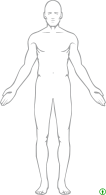
*The EBI Anatomogram (Apache 2.0) — the reference SVG for body-region IDs. Each tissue is a labelled `<path>` ready for fill-by-value. The simulator inherits the IDs.*

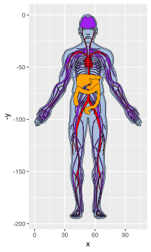
*gganatogram organPlot — every tissue at its default fill. The path catalogue, before any data is bound.*

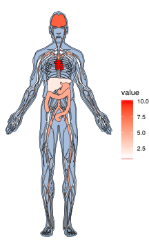
*Same SVG with a tissue→value table applied. The fills are now data-driven (a continuous colour scale across organs). This is the parametric-in-colour pattern; the underlying paths are unchanged. The simulator's substance-level overlays will look like this.*

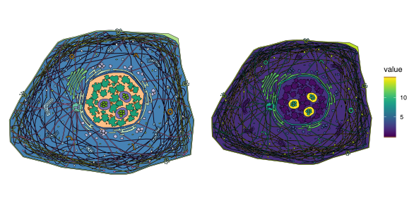
*Cell-level plot — the same machinery one nesting layer deeper. Useful for the simulator's tissue-level views (hepatocyte, alveolus, adipocyte cross-sections) once the body-level layer is settled.*

---

## 7. Gaps — What `svg-techniques/` Will Need to Build

Specific, not vague. In rough order of estimated effort:

1. **Hand-keyed body silhouette morph across body-fat fraction.** ~6 SVG key shapes (BMI 18 / 22 / 27 / 32 / 38 / 45), male and female, front view, plus flubber. No public source for the keys; they must be drawn. ~1–2 days of illustration work plus 100 lines of code.
2. **Hand-keyed body silhouette morph across age.** Same recipe, age-axis. The hand keys may be derivable by rendering Anny at five ages and tracing.
3. **Parametric vessel-with-plaque cross-section.** A circular SVG with concentric layers (lumen, endothelium, intima, media, adventitia) parameterised by plaque-thickness, plaque-composition, and lumen-diameter. ~50 lines. **No public version of this exists in SVG** — surprising given how iconic the image is.
4. **Procedural trabecular bone cross-section, density-driven.** d3-delaunay + Lloyd relaxation + a wall-thickness function. ~100 lines. Bone-density slider drives the wall-thickness factor.
5. **Vessel tree filling an organ silhouette, plaque-aware.** Space-colonization seeded inside, e.g., a heart outline; per-segment radius reduced where plaque accumulates. Borrow heavily from Jason Webb. ~200 lines.
6. **Liver darkening / texture across steatosis fraction.** Reaction-diffusion baked offline at six values; live `<filter>` overlay swap. ~50 lines runtime + offline texture bake.
7. **Intestine coiling parameterised by length.** No public reference. Two candidate algorithms: differential growth (Savin/Mahadevan) or constrained spirograph. ~200 lines, exploratory.
8. **Heart cross-section parametric over wall-thickness and ejection fraction.** Hand-keyed at two systole/diastole pairs across two wall thicknesses (= 4 keys), morph. ~150 lines.
9. **Lung bronchial tree, alveolar density-driven.** Same machinery as vessels. ~200 lines.
10. **ECG trace from ECGSYN parameters, rendered as `<path>`.** Port ECGSYN to JS; pipe to D3 line generator. ~100 lines. (The simulator already needs this for the heart-rate readout.)

Gaps two through ten are all reachable — the techniques exist, the application doesn't.

---

## 8. Implications for `svg-techniques/`

A concrete recommendation set:

**The first three experiments.** Pick the three with the most leverage and the lowest unknowns. They are:

1. **`body-silhouette-morph/`.** Hand-keyed `flubber` body morph across body-fat fraction, single sex first. Forces the team to commit to a rendering style for the body and to a label-anchor convention (where do the "liver" / "heart" / "muscle" callouts attach when the silhouette changes?). Output: a working slider that thickens and thins the figure. This is the simulator's headline feature; it has to work or the rest is moot.
2. **`vessel-cross-section/`.** Concentric-circle SVG parameterised by lumen-fraction and plaque-thickness. Smaller scope, faster to land, will validate the team's tooling and parameter-binding pattern. The output also unlocks the cardiovascular long-term view immediately.
3. **`vasculature-tree/`.** Space-colonization implementation (port from Jason Webb), seeded inside an organ outline. Validates the branching toolkit that will then power bronchi, neurons, lymphatics. Produces outputs that are genuinely surprising — the team will not have predicted the shapes, and that is the test of whether the technique earns its place.

**The fourth, if there's appetite.** `trabecular-bone/` — the cleanest pure-Voronoi exercise, useful for the bone-density slider in the long-term-state view, and a self-contained visual-literacy win.

**Library bet.** D3 + flubber + d3-delaunay. Three small dependencies, all MIT, all current. Drop in `paper.js` only if metaballs become load-bearing; otherwise the SVG-filter trick covers it.

**Asset bet.** Adopt EBI Anatomogram region IDs as the tissue-naming convention. Hand-key body silhouettes by re-rendering Anny at fixed parameter grids, tracing the silhouettes into SVG, and committing both the keys and the source render to the repo. Anny's Apache 2.0 license is the cleanest in the space.

**What to *not* attempt at first.** A from-scratch parametric mesh — that is MakeHuman's twenty-year project. The simulator wants the *appearance* of parametric anatomy from a small key-frame library plus algorithmic textures, which is a far smaller problem.

---

## 9. Sources and Methodology

**Method.** WebSearch over April 2026, ten queries spanning parametric body generators, procedural organ algorithms, SVG drawing libraries, generative-art primitives, and interactive medical apps. WebFetch into individual GitHub repos for license, technique, and image-URL detail.

**Fruitful queries** were the L-system / space-colonization / Voronoi-bone / Anny / flubber set — these returned the strong code finds. **Less fruitful** were Observable-anatomy, intestine-coiling, and CodePen-organ queries; the first two returned generic platform docs or biomechanics research with no JS implementations, the third returned mostly heart-icon CSS animations.

**Environment limit (resolved).** The first research pass could not curl out to GitHub raw and `jasonwebb.github.io`. A follow-up pass with permissive network access landed twelve images in `background/svg-illustrations/`: two from Anny (teaser grid, interactive demo), four from Jason Webb's space-colonization experiments (Basic, Bounds, Obstacles, Marginal Growth), one flubber morph GIF, four gganatogram outputs (organPlot, organPlotValue, CellPlotValueTop, AllSpeciesCellPlotValueTop), and one Webb reaction-diffusion preset grid. The static anatomy baselines that pre-existed (EBI Anatomogram, BioIcons, Wikimedia organ plates, Servier, Reactome) are referenced where their structure is the right input to a §8 experiment — they are what gets parametrically deformed, not parametric in themselves. Several promising additions (ECGSYN sample trace, Wang et al 2023 Voronoi-bone figure) were not landed: the former has no standalone PNG on PhysioNet's static tree, the latter sits behind a journal paywall. Both are documented above; neither is load-bearing.

**Onboarding reading list** for whoever opens `svg-techniques/`:

- Jason Webb's space-colonization writeup: <https://medium.com/@jason.webb/space-colonization-algorithm-in-javascript-6f683b743dc5>
- Anny launch post: <https://europe.naverlabs.com/blog/anny-a-free-to-use-3d-human-parametric-model-for-all-ages/>
- Flubber README: <https://github.com/veltman/flubber>
- gganatogram paper: <https://pmc.ncbi.nlm.nih.gov/articles/PMC6208569/>
- ECGSYN: <https://physionet.org/content/ecgsyn/1.0.0/>
- Wang et al. 2023 trabecular bone Voronoi model: <https://pubmed.ncbi.nlm.nih.gov/37852087/>

Those six links cover the bulk of what `svg-techniques/` will need to read before drawing anything.
