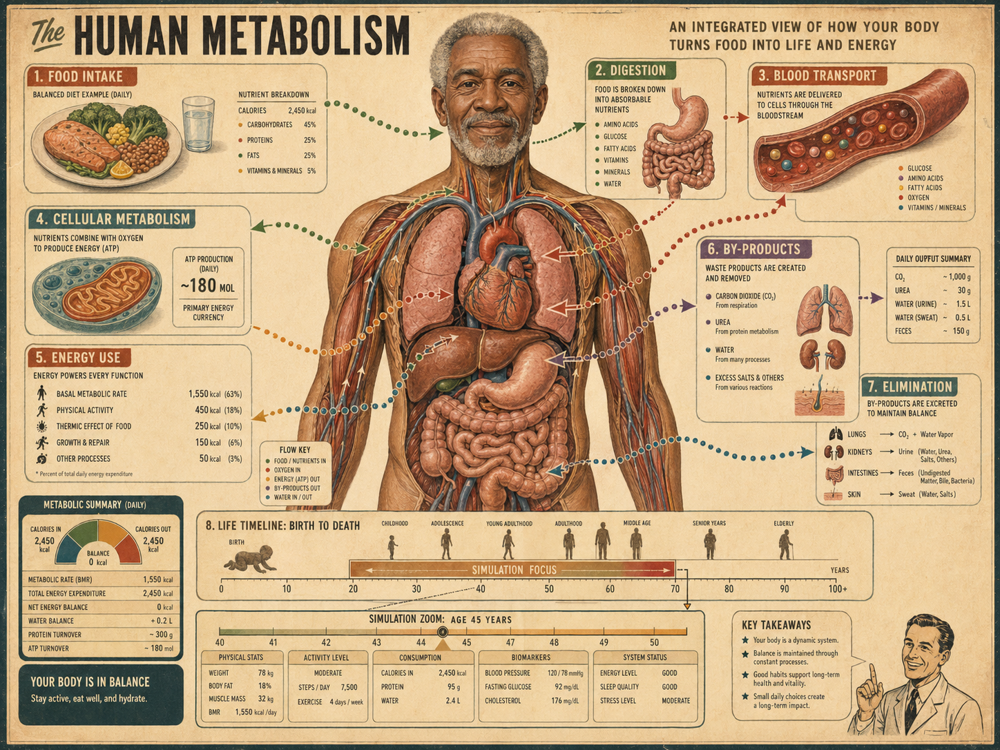
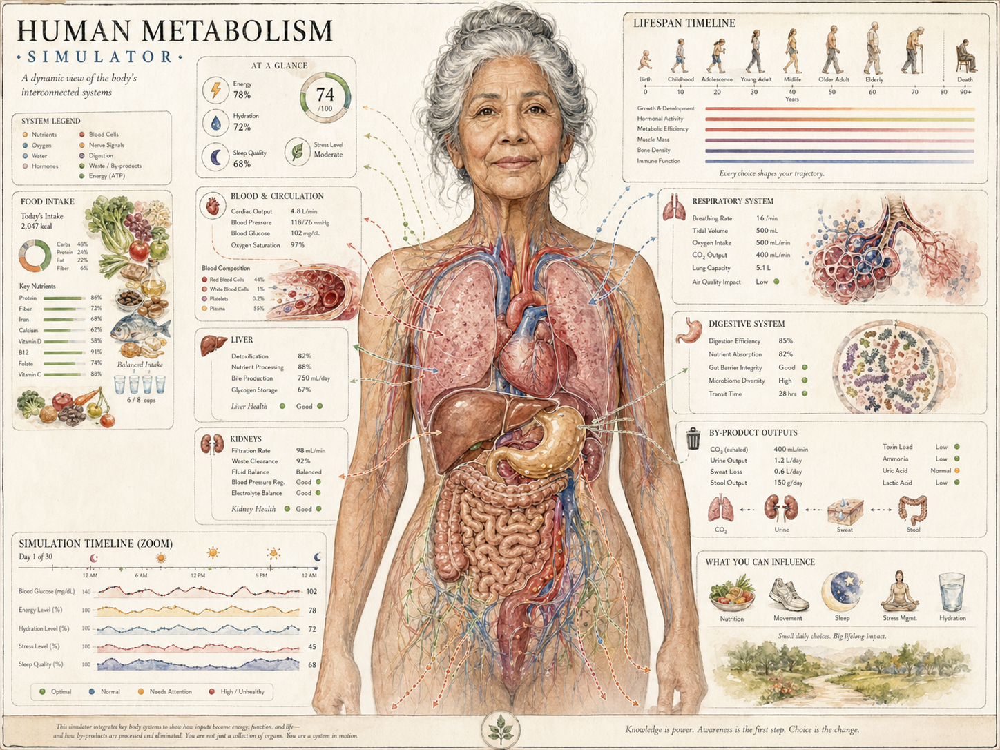
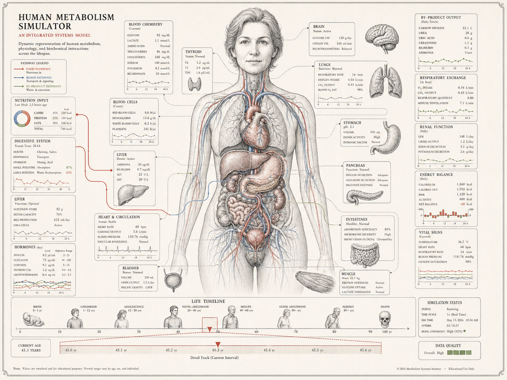
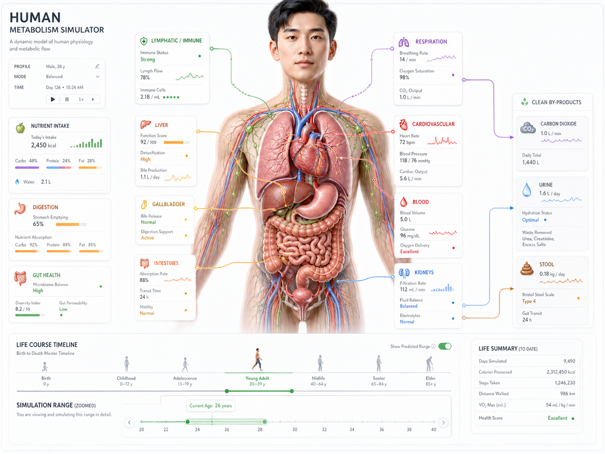
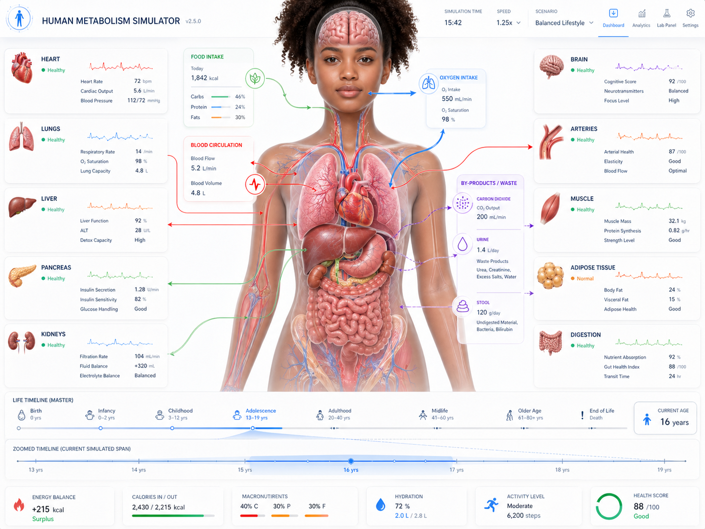
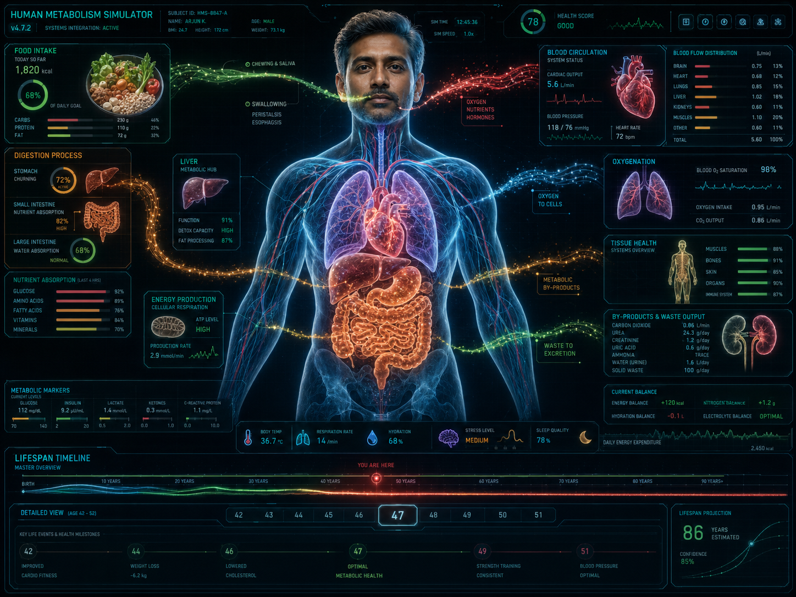
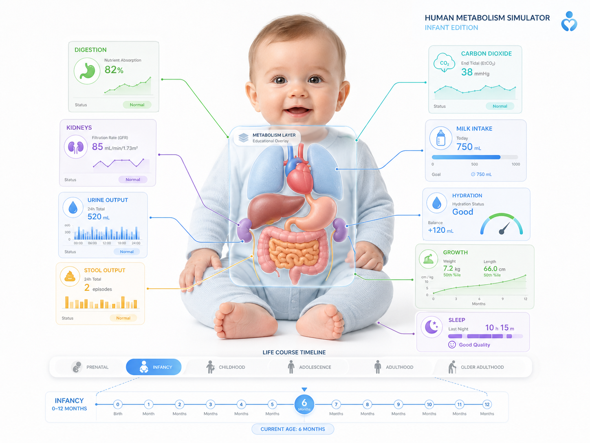
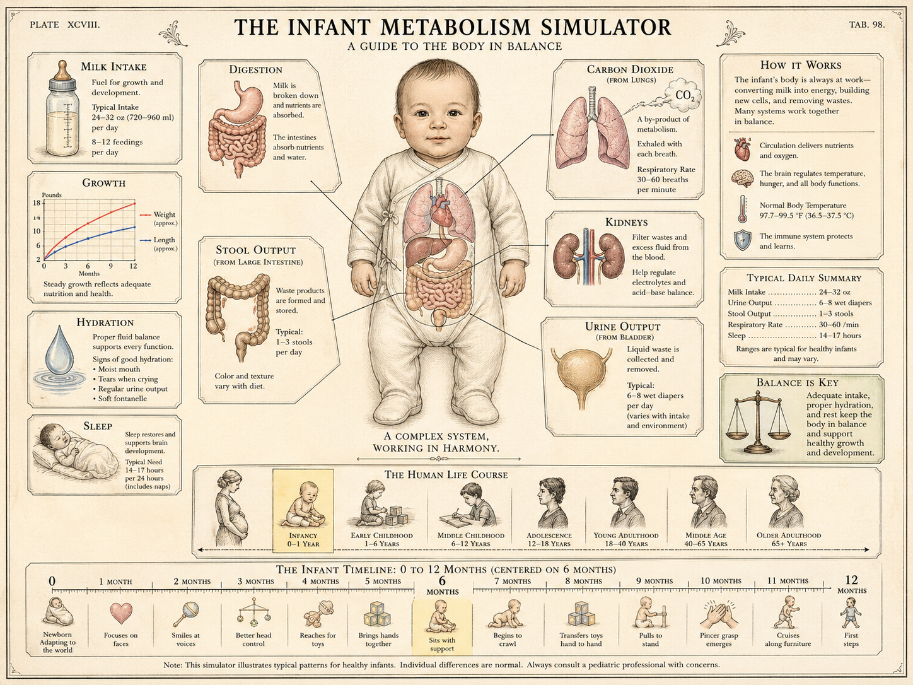
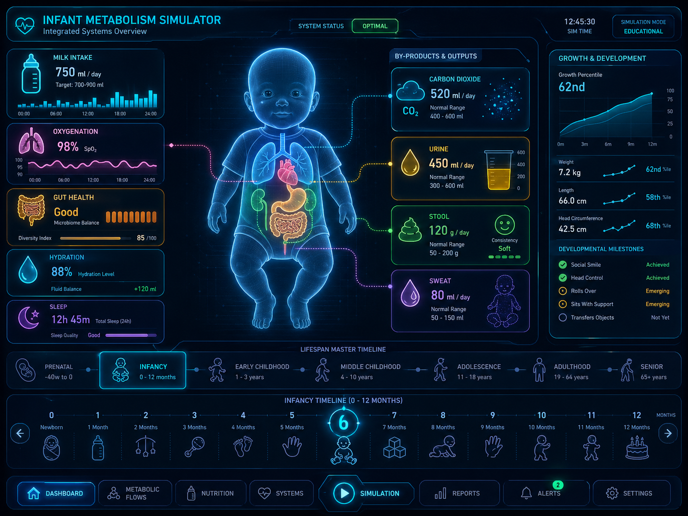

# Body-Based — second visual exploration

Six candidate treatments of the simulator built around a literal whole-body human figure as the primary subject. Where the `system-diagrams/` series asked "what does the schematic look like?", this one asks "what does it look like *when the body is the figure on the page?*" — a standing or torso-first illustration with the metabolic machinery hung off it as labels, panels, and overlays. The brief, again loosely held: produce a static frame in which the user looks at *a body* first and reads the data second.

This re-framing matters because `design/design.md` §4 is explicit that the body — heart, liver, gut, vessels, plus the §4 stylized health diagrams (vessel cross-section, body shape silhouette, liver cross-section, lung capacity panel) — is the primary visual content. The §5 **Whole Body** view and the §5 **Long-Term State** view both want a body figure as their anchor. The question this series tests: how heavy should that figure be? Painterly, anatomical-textbook, translucent x-ray, line drawing? Does it compete with the data or carry it?

The §14 mobile-first commitment is the second lens. Every entry below carries a Compact-tier (≤ 640 px) survival note, and a dedicated *Mobile-first speculation* section follows the walkthrough.

## Source

All six images are generative-AI outputs, dropped in by the user on 2026-04-25. Originating prompts are **not yet recorded** — placeholder for backfill if a reproducible record is wanted. Filenames hint at the prompt direction and have been preserved as the image identifiers.

- `gen-50s-poster.png` (3.0 MB)
- `gen-watercolor-diagram.png` (2.8 MB)
- `gen-line-dense.png` (2.5 MB)
- `gen-clean-canvas-dense.png` (1.8 MB)
- `gen-clean-canvas-dense-light.png` (1.7 MB)
- `gen-dashboard-neon.png` (2.2 MB)

Ordered below from most-illustrative / most-painterly to most-instrumental / most-data-dense, matching `system-diagrams/`.

A second batch was generated later the same day, attempting to extend the original six along their existing demographic and stylistic axes:

- `gen-clean-canvas-baby.png` (1.6 MB)
- `gen-color-baby.png` (2.8 MB)
- `gen-dashboard-baby.png` (1.9 MB)

These three are listed below as images 7, 8, 9. The shift to infant subjects was not the user's brief — the image generator declined to produce more outputs in the same demographic-and-clothing class as some of the original six (the translucent-bodied young adults, painterly nudes-as-medical-illustrations register that images 2, 4, 5, 6 occupy), and the baby-subject results are what came back instead. This is worth recording as a real-world constraint on any future visual-research run: image-gen pipelines hit content-policy boundaries around translucent-body-with-internal-anatomy renderings of adult figures, and the friction practically pushes the project toward one of two stylistic poles. *Fully diagrammatic* — no human figure at all, just organs, flows, and gauges — is uncontroversial across every generator. *Fully clothed figures* — adults dressed, no internal anatomy showing through the body — is reachable on most generators with care. The middle ground that several of the original six occupy, where a translucent or anatomically opened adult torso lets the viewer see viscera through skin, is where the policy friction lives. Future runs that want to explore that middle ground should expect to fight for it; runs that don't need to should pre-commit to one of the two poles in their prompt.

---

## 1. Vintage Educational Poster

**What it shows.** Aged-paper cream with terracotta and muted teal accents. A bearded older man stands centre-frame, anatomically opened to show the major organs in mid-century-textbook colour. Eight numbered callout boxes ring him — *Food Intake*, *Cellular Metabolism*, *Energy Use*, *Digestion*, *Blood Transport*, *By-Products*, *Elimination*, *Metabolic Summary* — each with numeric readouts (calories 2,450, ATP ~180 mol, BMR 1,550 kcal, CO₂ 1,000 g, urea 30 g) and a chart fragment. Bottom-centre: a *Life Timeline: Birth to Death* with a figure-silhouette row and a *Simulation Focus* slider. Bottom-left: a *Simulation Zoom* slider and a *"Your Body Is in Balance"* badge. Bottom-right: a 1950s teacher mascot pointing at *Key Takeaways*. Eye lands on the figure and walks the perimeter clockwise.

**Pointers for the app.** §5 **Whole Body** *and* §5 **Long-Term State** simultaneously — the lifespan slider is the §6 time-control / §7 history-scrubber made visible, and the silhouette row is a concrete §4 *Body shape silhouette*. §14 *colourful, slightly cartoon-like* at *Spacious*. Same numbered-callout convention as the matching system-diagrams poster, applied to a single body rather than an organ grid. Bias: §3 **Plain**; the mascot-and-badge tone pushes toward the §5 Kids view register.

**Strengths.**
- Body-as-anchor works: the figure pulls the eye, labels read as annotations not as a competing grid.
- *Life Timeline* row is the most direct visualisation in either series of the §7 bookmark / scrub interaction.
- Earth-tone cards on cream paper share register with the painted figure — nothing fights.
- Mascot-and-badge tone makes the §5 Kids view feel like a re-skin rather than a separate design.

**Weaknesses.**
- *Compact survival: poor.* At 360 × 640 only the figure survives; the eight cards stack into a vertical scroll that breaks the "eye walks it" composition.
- The bearded older man is one specific demographic — expensive for §8 Multiple Individuals, where any swap repaints the figure.
- Hand-lettered display type and decorative numbering bake strings; runtime §3 label-mode swaps look incongruous or require alternate art.
- Aging is handled by the silhouette row rather than the central figure: user sees "*generic* silhouette at year 10", not "*this* body at year 10."

---

## 2. Painterly Watercolour Diagram

**What it shows.** Aged-paper cream, watercolour-and-ink. A grey-haired older woman, painted from collar to hips. Torso shown anatomically — heart, lungs, liver, intestines, kidneys — in faded red and ochre wash with circulatory tracery on the skin. Surrounding panels: *At a Glance* (Energy 78%, Recovery 72%, Sleep 68%, score 74/100), *Food Intake* with painted vegetables, *Blood and Circulation* (HR 72, BP 128/82, O₂ 97%), *Liver* (function 84%), *Kidneys*, *Respiratory System*, *Digestive System*, *By-Product Outputs*, *Lifespan Timeline* (figures from infant to death), *Simulation Timeline (Zoom)* with sparklines for blood glucose / energy / fat stores / lean mass, and a bottom-right *What You Can Influence* row.

**Pointers for the app.** §5 **Long-Term State** in §14 *Anatomical* (painterly) at *Spacious*. The painterly natural-history aesthetic from `system-diagrams/gen_old_color_plate.png` carried into a body-centric composition. The strongest single argument in either series for the §4 stylized health diagrams (lung, kidney, liver) being natively at home in a watercolour register. Crucially, the §4 visible-aging commitment ("skin tone, posture, muscle definition... shift as the years pass") is *demonstrated* in the painted face: the model reads as 70, not as a tagged 25-year-old. Bias: §3 **Plain**, with **Mixed** comfortable.

**Strengths.**
- Best image in either series at showing what the simulator looks like when the body is *old*. The §10 *Aging Well* and *Years of Fast Food* arcs need this register to feel honest.
- The §4 stylized health diagrams (lungs, kidneys, liver, gut) appear as small painted insets sharing medium with the central figure — the unified visual language §14 wants.
- *What You Can Influence* row gestures at agency without becoming a wellness app.
- *Compact survival: medium.* Watercolour wash compresses better than line detail or neon glow.

**Weaknesses.**
- High asset cost. Watercolour cannot be runtime-rendered; every age × condition × sex needs pre-rendered raster. The §14 commitment that style is "a separate rendering pass" gets harder when one of the styles is paint.
- §14 flow particles on watercolour read as tacky; the metaphor wants a flatter substrate. The image avoids the issue with static dotted arrows; the simulator can't.
- Hand-lettered card titles bake strings — §3 label-mode swaps need an overlay or alternate render.
- §8 Multiple Individuals would need painted siblings of this figure across sex, age, condition.

---

## 3. Encyclopedia Line Plate

**What it shows.** Cream paper, single-weight black ink, sparing red for arteries and accent rules. A woman drawn in classical anatomical line, torso opened to show heart, lungs, thyroid, liver, intestines, pancreas, bladder, vessels traced in red and blue. Densely packed labelled blocks ring the figure — *Blood Chemistry*, *Brain*, *Thyroid*, *Lungs*, *Stomach*, *Respiratory Exchange*, *Renal Function*, *Pancreas*, *Liver*, *Heart and Circulation*, *Hormones*, *Energy Balance*, *Vital Signs*, *Intestines*, *Bladder*, *Muscle*, *Nutrition Input*, *By-Product Output*, *Blood Cells*, *Digestive System* — each with 4–8 readouts and a sparkline. Bottom band: *Life Timeline* (eight figure silhouettes) with a *Detail Track* axis. Footer: *2026 Metabolism Systems Institute — Educational Use Only*.

**Pointers for the app.** *The* reference for §14 *elegant line-drawing* applied to a body figure rather than a system rosette. §5 **Whole Body** at *Detailed* / *Spacious*. Single-weight stroke, monochrome-with-one-accent palette, SVG-friendly geometry — every §14 commitment to that style is met. Dense per-organ blocks render the §4 entity list as encyclopedia legend. Bias: §3 **Technical** by aesthetic; engraving carries scientific authority. The footer ("Educational Use Only", institute attribution) is a useful UX cue: §5 says snapshots should "read as illustrations in a slide", and that kind of caption is what makes them feel publishable.

**Strengths.**
- Lowest asset cost of the six. SVG with two stroke widths and one accent ports cleanly. Light/dark inversion is one CSS variable.
- *Compact survival: best of the six.* A line drawing of a body shrunk to 360 × 640 is still a line drawing of a body. Labels can hide; the figure remains diagnostic.
- §4 stylized health diagrams (vessel cross-section, bone density, liver, lungs) live natively here — the inset vignettes around the central figure prove it.

**Weaknesses.**
- Cold. Same critique as in `system-diagrams/`: not the right register for §5 Kids view, and "how am I doing?" feedback feels out of place in an engraving.
- One accent colour limits encoding bandwidth. §14 wants per-system palette (insulin glow, glucose tint, ketone vial colour); single-accent line-art fights that. The image gets away with red because it's only encoding *vessels*.
- Dense panel grid relies on fine type. At Compact, panels disappear; only the figure and timeline survive — fine, but almost no data is on screen.
- The detailed line figure is hard to swap demographically — re-engraving a sex/age variant is closer to drawing a new plate than to swapping a layer.

---

## 4. Clean Clinical UI — male subject

**What it shows.** A clean, light-themed product UI. Top-left: title with subject card (sex, age, height, weight, BMI). A photoreal-but-stylized male figure in his late twenties stands centre-frame, abdomen translucent so the viscera show in tasteful red. Flat callout panels with thin connector lines: *Lymph / Immune*, *Liver*, *Heart / Circulation*, *Nutrient Intake*, *Digestion*, *Gut Health*, *Respiration*, *Cardiovascular*, *Blood*, *Kidneys*, *Clean By-Products*, *Urine* — each with one-or-two readouts and a chart fragment. Bottom band: *Life Course Timeline* (childhood → senior) and a *Simulation Range (zoom)* scrubber. Bottom-right: *Life Summary*. Calm, corporate-product-shaped.

**Pointers for the app.** §5 **Whole Body** in §14 *Anatomical*-meets-*instrument-panel* hybrid at *Detailed*. Chrome already includes the subject card, life-course scrubber, and zoom range — matches §6 / §7 commitments. Comfortable across all three §3 label modes; the layout doesn't break if labels grow. Per-organ callout cards each carry one readout and a sparkline — exactly what §4 prescribes (stored amount + flow indicator).

**Strengths.**
- Closest of any image in either series to a real product UI built around a body. The figure earns its space without becoming the personality.
- Translucent-abdomen rendering exposes gut/liver/kidneys without committing to either an x-ray-wireframe or a fully painted opening — lighter than watercolour or engraving.
- *Compact survival: medium-good.* The translucent figure scales without losing legibility; figure plus bottom scrubber is a viable Compact frame.
- The *Life Course Timeline* component is reusable across all views.

**Weaknesses.**
- Photoreal-ish figure fights the otherwise-flat-vector UI — same critique as `system-diagrams/gen_clean_white_dense.png` (painted thumbnails inside flat dashboard).
- Connector-line callouts depend on horizontal real estate; at Compact the connectors die and callouts collapse to a bottom-sheet, breaking the §4 "everything visible at once" goal for that view.
- Personality is muted — wellness-app calm rather than teaching warmth. Easy to mistake for a sleep tracker if seen out of context.

---

## 5. Clean Clinical UI — female subject

**What it shows.** Same family as image 4 with a young woman as subject and more on screen. Title: *HUMAN METABOLISM SIMULATOR v1.0 — Balanced Lifestyle*. Figure centre-frame, abdomen and chest translucent, organs in reddish anatomical colour with cyan/red circulatory tracery. Denser callout cards: *Heart* (BPM 72), *Lungs* (O₂ 97%), *Liver* (fat 8%), *Pancreas* (glucose 92), *Kidneys*, *Brain*, *Arteries*, *Muscle*, *Adipose Tissue*, *Digestion*, *Blood Circulation* (5.2 L), *By-Products Output*, *Bone*. Bottom band: *Life-Time Timeline* and a *Dynamic Timeline* zoom scrubber. Bottom-right: a *Run Metabolism* CTA and an aggregate strip (energy +25 kcal, glucose 120, insulin 65%, fat 18%).

**Pointers for the app.** §5 **Whole Body** at §14 *Detailed* / *Spacious*, same family as image 4 pushed to higher density. The aggregate readout strip is the §4 substance-amount headline; *Balanced Lifestyle* sits in the title slot but should migrate per §14 to bottom-right. Bias: §3 **Plain**; all three modes comfortable.

**Strengths.**
- Demonstrates the same chrome carrying a different demographic (image 4 male, image 5 female) without re-skinning. The chrome doesn't change; only the figure does. This is the answer to the demographic-lock-in problem in images 1, 2, and 3.
- Higher density than image 4 without feeling cramped — a useful upper bound for *Detailed*.
- The cyan/red circulatory overlay reads as scenery, not data — exactly the distinction §5 wants between Whole Body and Fuel Flows.
- *Compact survival: medium-good.* Same as image 4.

**Weaknesses.**
- Same flat-UI vs photoreal-figure tension as image 4, slightly worse since the figure is closer to photoreal.
- Approaching the density limit at which the eye stops parsing cards and starts treating them as wallpaper.
- Connectors radiating to the cards will fight a §14 flow-particle layer — particles travelling along defined paths share space with the connectors.
- The *Run Metabolism* CTA reads as marketing landing page rather than running simulator. Minor, but the chrome should signal "this is on" not "click to begin."

---

## 6. Dark Neon HUD

**What it shows.** Dark theme; black-to-deep-blue background with cyan, magenta, lime, and orange neon strokes. A man in his forties stands centre-frame, torso rendered as translucent x-ray with luminous viscera (cyan lungs, magenta heart, orange intestines, deep-red liver) and crackling particle flares between organs that read as substance flows. Top-left: subject card. Dark glass-effect panels around the figure: *Food Intake* (1,820 kcal), *Digestion*, *Liver*, *Energy Production* (ATP), *Blood Circulation* (5.6 L), *Blood Sugar Regulation* (glucose 5.2, insulin 12, glycogen 67%), *Oxygenation*, *Tissue Health*, *By-Products*, *Nutrient Absorption*, *Metabolic Markers*, *Current Balance*, with an aggregate score *76* in a *Health Index* badge. Bottom: *Lifespan Timeline* — a luminous arc, current pointer at 47, plus a *Lifespan Predictor: 86 years estimated, confidence 85%* card. Eye pulled hard to centre-chest.

**Pointers for the app.** §5 **Whole Body** in §14 *Instrument-panel* at *Spacious*, dark mode. Body-figure version of `system-diagrams/gen_dashboard.png`. The crackling particle flares between organs are §14's flow-particle metaphor at maximum, and the most direct visual evidence in either series that the metaphor reads when applied *inside* a body figure rather than over a system rosette. Bias: §3 **Technical**; HUD register reads as workstation, not teaching poster.

**Strengths.**
- Dark mode as first-class peer of light, exactly what §14 demands. Strongest argument in this series for designing dark as its own thing rather than a swap.
- Particle / glow vocabulary covers §14 flow-particle, hormone-glow, and stored-quantity-fill abstractions natively. Inside-the-body particle flares bind data to anatomy in a single visual metaphor that neither series has shown elsewhere.
- The *Lifespan Predictor* readout is a §10 long-arc outcome made tangible: a single number that updates as the calendar changes. Worth lifting into the design even if this style doesn't ship.

**Weaknesses.**
- *Compact survival: catastrophic.* Same critique as `system-diagrams/gen_dashboard.png`. Neon needs pixels; thin glowing strokes smear at 360 × 640. A Compact-tier version would essentially be a different design.
- Sci-fi register biases hard against §5 Kids and §3 Plain default. A non-specialist parent dropping in to learn what insulin does feels met by image 1 or 2, not by this.
- Low-contrast neon-on-black is rough on a meaningful slice of the audience (visual impairment, colour vision differences).
- Crackling-flare particles are beautiful as a still and risk looking gimmicky at high time multipliers, when the simulator should read as orderly. Worth motion-testing before committing.

---

## 7. Clean Clinical UI — infant subject

**What it shows.** Same family as images 4 and 5, with a sitting infant as subject. Title: *HUMAN METABOLISM SIMULATOR — Infant Edition*. The baby sits cross-legged centre-frame in a pale-blue sleepsuit, with the abdomen rendered as a translucent panel showing the gut, liver, lungs, and heart in tasteful red — the same translucent-belly idiom as the adults, but small and softened. Connector-line callouts ring the figure: *Digestion* (82%), *Kidneys* (85), *Urine Output* (520 ml), *Hydration* (Good), *Stool Output* (a small bar chart), *Carbon Dioxide* (38 / breath), *Milk Intake* (750 ml), *Hydration* status, *Growth* (+25 g daily), *Sleep* (10–15 h, *Good Quality*). Bottom band: *Life Course Timeline* with seven figure silhouettes (infant → older adult, infant pinned as current life stage), and below it an *Infant Age* sub-scrubber reading *Current age 6 months* against tick marks 1–12.

**Pointers for the app.** §5 **Whole Body** at §14 *Anatomical*-meets-*instrument-panel* hybrid, *Detailed*. Same chrome as images 4 and 5; the figure has been swapped for an infant and the readouts have been re-keyed to infant-relevant quantities — *Milk Intake* in place of *Nutrient Intake*, *Stool Output* and *Urine Output* instead of *Clean By-Products*, *Growth* (per-day mass gain) instead of *Body Fat %*. The most direct evidence in either series for the §10 *From Birth* scenario actually rendered as a frame. The two-tier timeline — life-course on top, infant-age sub-scrubber below — is a concrete answer to "how does the lifespan strip behave when 0–12 months matters more than 0–80 years?". Bias: §3 **Plain**; the readout vocabulary is already plain (*Milk Intake*, *Stool Output*).

**Strengths.**
- Most direct evidence so far that the demographic-substitutability claim from images 4 and 5 holds even at the extreme: the chrome is unchanged, the figure is an infant, and the layout still reads. §8 Multiple Individuals across age extremes is now visually plausible, not just asserted.
- The §9 life-stage event-gating commitment is *visible by absence*: no alcohol, tobacco, or drug callouts anywhere. The readouts the UI offers — milk intake, stool, growth, sleep — are exactly the ones an infant body should be offering, and nothing else.
- The two-tier timeline (life course + infant-age sub-scrubber) is a small but real design contribution. §10 *From Birth* needs to be navigable at month-resolution while still showing where the user is in the larger arc; this image shows a plausible chrome for that.
- *Compact survival: medium-good.* Same as images 4 and 5 — sitting figure plus bottom-strip timeline ports cleanly to phone.

**Weaknesses.**
- Photoreal-baby-on-flat-UI tension is sharper than the adult equivalents (image 4, 5) — a baby's face draws the eye even harder than an adult's does, and the §14 commitment to a unified visual register strains.
- The translucent-belly rendering on a baby is gentler than on an adult but still novel; at small sizes the inner organs become a coloured smudge.
- *Growth* (g/day) is a metric without a clear adult counterpart, which means the per-organ callout list is *not* identical to the adult version. The chrome is the same; the data semantics are not. Worth flagging: a true demographic swap may need life-stage-conditional readout sets, not a fixed grid.
- Connector-line callouts have the same Compact problem as in images 4 and 5 — they die at 360 px wide.

---

## 8. Vintage Educational Plate — infant subject

**What it shows.** *PLATE XCVIII* / *TAB. 98* — a single bound-encyclopedia page, cream paper, terracotta and muted teal accents, the most book-like image in either series. Centre: a sitting infant in a pale onesie, abdomen anatomically opened to show stomach, liver, intestines in textbook colour. Title *THE INFANT METABOLISM SIMULATOR — A GUIDE TO THE BODY IN BALANCE*. Surrounding inset vignettes (each a small painted illustration plus prose paragraph): *MILK INTAKE* (24–32 oz / 720–960 ml/day), *DIGESTION* (small intestine and stomach drawn separately), *GROWTH* (a charted curve of weight in pounds vs. months), *HYDRATION* (a water drop, fluid balance prose), *SLEEP* (an infant sleeping on a cradle, 14–17 hours), *STOOL OUTPUT* (1–3 per day), *CARBON DIOXIDE* (lungs, 30–60 breaths/min), *KIDNEYS* (heat loss / electrolyte / acid–base), *URINE OUTPUT* (6–8 wet diapers/day), *HOW IT WORKS* (prose summary), *TYPICAL DAILY SUMMARY* (a tabular block), *BALANCE IS KEY* (a small painted balance scale). Bottom row: *THE HUMAN LIFE COURSE* — six painted figures from infancy through older adulthood, with infancy boxed as current. Below that: *THE INFANT TIMELINE: 0 TO 12 MONTHS, CENTRED ON 6 MONTHS* — a strip of twelve numbered cells, each illustrated with a developmental milestone (smiles, rolls over, brings hands to midline, reaches for toys, sits, transfers toys, pulls to stand, cruises along furniture, first steps). Footer disclaimer: *"This simulator illustrates typical patterns for healthy infants. Individual differences are normal. Always consult a pediatric professional with concerns."*

**Pointers for the app.** §5 **Long-Term State** rendered for §10 *From Birth*, in §14 *colourful, slightly cartoon-like* register at *Spacious*. Same vintage-poster register as image 1, retargeted at infancy. The strongest single image in either series for the §5 Kids view register applied to the *teaching-about-an-infant* case rather than the *teaching-a-child* case — closer to a paediatric reference plate than to a children's book. Bias: §3 **Plain**; **Mixed** comfortable. The infant-timeline-with-developmental-milestones strip is a concrete answer to "what does §10 *From Birth* look like when the calendar shifts through infant life-stage transitions?" — every cell is a labelled milestone, not a uniform tick.

**Strengths.**
- Most ambitious life-stage-aware chrome in either series. The two-tier *Life Course* / *Infant Timeline* split renders the §10 commitment that *From Birth* shifts the calendar through infant feeding, childhood growth, and so on — and it does so in a register where the milestones look like ordinary plate-illustration content, not extra UI.
- The disclaimer footer (*"consult a pediatric professional"*) is a UX cue worth lifting: any life-stage-specific built-in scenario probably wants a footer that cabins the simulator's claims to "typical patterns", since real infant variation is wide and the user is not a clinician.
- The §4 stylized health diagrams (lungs, kidneys, intestines, bladder) appear as small painted insets sharing medium with the central figure — the unified visual language §14 wants, here demonstrated for the infant case.
- Same earth-tone palette as image 1; argues that the vintage-plate style scales across life stages without needing a different art direction for each.

**Weaknesses.**
- Asset cost is enormous. Each life stage in this register needs its own painted plate — the infant plate, the child plate, the adolescent plate, the adult plate, the older-adult plate. The §14 "style is a separate rendering pass" commitment becomes painful when each life stage is also a separate pass.
- *Compact survival: poor.* This is a single bound page; on a phone the user reads one panel at a time, not the whole plate. The plate-as-composition is the point of the style and does not survive the shrink.
- Hand-lettered titles bake strings into the art, same as image 1.
- The painted infant face is highly specific — one baby, one ethnicity, one skin tone. §8 Multiple Individuals across infants needs as many painted plates as there are infant variants, and they are not interchangeable layers the way clean-clinical figures are.

---

## 9. Dark Neon HUD — infant subject

**What it shows.** Dark theme; same black-to-deep-blue background and cyan-magenta-orange neon palette as image 6, retargeted to an infant. Title: *INFANT METABOLISM SIMULATOR — Integrated Systems Overview*. Centre-frame: a sitting infant rendered as translucent x-ray with luminous viscera (cyan lungs, magenta heart, teal/red intestines, deep liver), surrounded by the same glassy dark panels: *Milk Intake* (750 ml), *Lungs / O₂* (98%), *Heart Rate* (130 bpm), *Gut Health* (Good), *Sleep* (12 h 45 m), *By-Products & Outputs* (CO₂ 520, Urine 450 ml, Stool, Sweat 80 ml), and a *Growth & Development* card (height, weight, head circumference, plus a *Weekly Milestones* progress chart). Bottom: *Lifespan Master Timeline* — a luminous arc with life-stage segments labelled *Prenatal / Infancy / Early Childhood / Middle Childhood / Adolescence / Adult / Mid-Life / Senior*, infancy pinned, plus a sub-strip *Infant Timeline: 0 to 12 Months* with twelve glowing cells annotated with milestone icons (smiles, rolls, sits, crawls, stands, first steps). Bottom-left: a tab-bar reading *Dashboard / Fuel Flows / Hormones / Long-Term* and a play-state badge.

**Pointers for the app.** §5 **Whole Body** in §14 *Instrument-panel* at *Spacious*, dark mode, retargeted to §10 *From Birth*. Same chrome as image 6 with the same swap pattern as image 7 — figure replaced, readouts re-keyed for infant relevance, the lifespan strip has gained a sub-scrubber for month-resolution navigation. Bias: §3 **Technical**; the HUD register reads as paediatric NICU monitor more than as workstation, which is an interesting tonal shift for the same style. The tab-bar across the bottom is the only image in either series that surfaces the §5 view-switcher (*Dashboard / Fuel Flows / Hormones / Long-Term*) as visible chrome.

**Strengths.**
- Strongest evidence so far that the demographic substitutability claim extends through the most stylistically aggressive register too: image 6's chrome carries an infant subject without adjustment beyond the readout swap.
- The *Lifespan Master Timeline* with named life-stage segments (*Prenatal / Infancy / Early Childhood / ... / Senior*) is a more concrete realisation of the proposed *Lifespan Timeline* chrome element than image 6's plain arc — life-stage segments are *labelled and visible*, not derived. Worth lifting into the design even if this style doesn't ship.
- The infant-age sub-scrubber with milestone icons is the Compact-friendly form of the developmental-milestones row in image 8, rendered in HUD vocabulary.
- The visible tab-bar (*Dashboard / Fuel Flows / Hormones / Long-Term*) is a small but useful chrome cue: §5's view-switcher is bottom-mounted and persistent.

**Weaknesses.**
- *Compact survival: catastrophic.* Same as image 6. Neon strokes smear at 360 px; glass panels turn to grey rectangles; the milestone-icon strip needs more pixels per icon than Compact has to spare.
- Sci-fi register on an infant subject reads slightly clinical-uncanny — a NICU-monitor mood the user may or may not want. §10 *From Birth* is meant to be an arc of growth and development, not a critical-care image. The aesthetic is doing tonal work the design hasn't decided on.
- The translucent-figure-with-glowing-viscera idiom is the policy-friction zone the user observed; the generator's willingness to produce it for a baby but not (apparently) for adults of the same shape it produced earlier suggests the friction point is not anatomy-through-skin per se but the combination of *adult body + opened figure*. Documented above; not strictly a weakness of the image, but a relevant constraint.
- Same low-contrast accessibility issue as image 6.

---

## Cross-cutting themes

**The same three families found in `system-diagrams/`** — illustrative/teaching, diagrammatic/authoritative, instrumental/dashboard — appear here too, each compressed into one or two images. The test is whether centring a body figure changes the trade-offs.

1. **Illustrative / teaching** — `gen-50s-poster`, `gen-watercolor-diagram`. Warm, organ-aware, body-as-anchor. §14 *colourful, slightly cartoon-like*. Body-centric framing strengthens these styles in §5 Long-Term State (where visible aging is headline) and weakens them in §5 Whole Body (where the figure costs space the data needs).
2. **Diagrammatic / authoritative** — `gen-line-dense`. Single representative of the §14 *elegant line-drawing* family, denser than the system-diagrams equivalent because the body figure now occupies the centre. Strongest Compact survivor.
3. **Instrumental / dashboard** — `gen-clean-canvas-dense-light`, `gen-clean-canvas-dense`, `gen-dashboard-neon`. Tile-grid + body-figure hybrids. The two clean-canvas variants are the same chrome with male and female subjects — strong evidence that chrome separates cleanly from figure.

**What this series adds beyond `system-diagrams/`.**
- **Visible aging is rendered, not implied.** Images 2 and 3 render an older central figure. The §4 commitment that "skin tone, posture, muscle definition... shift as the years pass" was abstract before; here it has visual evidence. Painterly and engraving render aging credibly; clean-clinical (25-year-olds) and neon-HUD (numbers only) do not yet prove they handle 75-year-olds.
- **Demographic substitutability is shown.** Images 4 and 5 are the same UI with different bodies — the answer §8 Multiple Individuals needs. Painterly and engraving fail this test (each figure is a one-off); clean-clinical and HUD pass.
- **Lifespan timeline as headline interaction.** Five of six images put a *Life Timeline* strip at the bottom. None of `system-diagrams/` did. Centring a body forces "what age is this body?" forward, and the lifespan scrubber is the natural answer.
- **Particle-inside-body metaphor.** Image 6 is the only image in either series that puts §14's flow particles *inside* the figure. Binds substance flows to organs visually in a way between-organ arrows never quite achieved.

**What clusters tightly.** Images 4 and 5 — same UI, different demographics — strongest evidence that chrome is figure-independent. Images 2 and 3 — cream paper, inset vignettes, bottom lifespan row, museum-publication tone — argue for the same §5 Long-Term State view rendered in two art directions.

**What the sample under-covers.** Compact / phone-shaped framings (still the most important next series). Multiple Individuals grid layouts. Animation (all six are static). Bookmark before/after pairs (lifespan timeline shown, but year-0-vs-year-10 toggle is not). §4 stylized health diagrams at the size §4 commits to. Kids view.

**Design-relevant observations.**
- Visible aging has *only* been demonstrated by the painterly registers. Clean-clinical and neon-HUD need an explicit aging-art plan or §10 *Aging Well* and *Years of Fast Food* will look hollow in those styles.
- The Lifespan Timeline strip recurs in five of six images — deserves to be a named first-class chrome element, not derivable fallout from the time-multiplier slider.
- The particle-inside-body metaphor is the cleanest answer in either series to "where do §14's flow particles live?" — inside the body, not just on arrows between organs.
- The §4 detail-panel-on-click commitment is well-served by the per-organ callout cards in images 1, 4, 5, 6 — every entity already has a bordered card. Watercolour and line styles need to invent that affordance separately.

**The infant batch (images 7, 8, 9) stretches the demographic axis without opening a fourth visual-style family.** Image 7 (clean-clinical baby) belongs to the instrumental/dashboard family with images 4, 5, 6 — same chrome, swapped figure, readouts re-keyed. Image 8 (vintage plate baby) belongs to the illustrative/teaching family with image 1 — same earth-tone palette, same perimeter-cards-around-figure composition, same mascot-and-disclaimer tone. Image 9 (HUD baby) belongs to the instrumental/dashboard family with image 6, in dark mode. The infants slot into the existing three families rather than constituting a fourth.

What they *do* add is a stress-test of the demographic-substitutability principle — and the principle largely holds. Images 4, 5, 7 share a chrome and exchange figures across young-adult-male, young-adult-female, and infant; image 6 and image 9 do the same in HUD register. The chrome survives the swap. What does *not* survive untouched is the readout vocabulary: *Milk Intake* replaces *Nutrient Intake*, *Stool Output* replaces *Clean By-Products*, *Growth* (g/day) replaces *Body Fat %*, and the calorie / BMR / ATP numbers most adult-subject images foreground are absent. So demographic substitutability is real at the chrome level, partial at the data-semantics level: each life stage carries its own readout set, even when the layout is invariant. This is consistent with §9's life-stage event-gating — alcohol, tobacco, and most drugs are absent from every baby-subject UI in the batch, exactly as §9 prescribes.

Image 8 and image 9 also surface a chrome element that was hinted at in image 1 but not foregrounded: a *life-stage-aware* lifespan timeline. Both use a two-tier strip — the full life-course on top with the current life stage pinned (infancy, in this case), plus a finer sub-scrubber zoomed to the active life-stage's natural resolution (months 0–12). §10 *From Birth* needs this kind of dual scrubber: years are the wrong unit when development is happening in months, and a child-age scrubber alongside the life-arc one is the natural answer.

**Hold-up of the existing five proposed `design.md` edits.** The babies *strengthen* the second proposal (demographic substitutability across chrome) — they push the claim from "two adults" to "two adults plus one infant", which is the genuine span the simulator must cover. They strengthen the first proposal (Lifespan Timeline as named chrome) by adding the life-stage-segment refinement and the life-stage-conditional sub-scrubber. The fourth proposal (aging-art requirement) needs a small expansion: aging is not the only style-dependent rendering challenge — *life stage in general* is. An infant body, a child body, an adolescent body, and an older-adult body all test whether a style can render that life stage credibly. Painterly and clean-clinical have now shown infants; HUD and watercolour have not shown children; line plate has not shown anything but a young-adult woman. The proposal already names this question; it should be reworded slightly to cover all life stages, not only the older end.

The third proposal (particles inside the body) and the fifth proposal (Lifespan Predictor as a first-class outcome) are unaffected by the babies — neither image 9 nor image 7 contradicts them, neither extends the case for them.

§14 commits to a Compact (≤ 640 px) baseline that must be runnable end-to-end. None of the six is shaped like a phone. This section asks, image by image, what the Compact version of each style would actually look like — what scales, what stacks, what drops, where touch targets land. Touch targets must be 44 × 44 px minimum.

**1. Vintage Educational Poster — Compact.** The eight callout boxes cannot survive intact. Keep the figure (upper ~55%, with hand-painted detail simplified to a stylized silhouette in the same palette), collapse the perimeter cards into a bottom-sheet drawer reachable via a numbered chip-row (the eight numbers as touch targets), keep the *Life Timeline* as a thin scrub-strip above a play/pause button, fold the mascot and *Key Takeaways* into a single info icon. The aged-paper substrate ports cleanly. *Verdict: Compact-viable but stylistically compromised* — perimeter-cards is the point of the style, and at Compact the user reads one card at a time, not the whole poster.

**2. Painterly Watercolour Diagram — Compact.** The painted figure survives at ~320 × 420 px (upper two-thirds). The dozen surrounding panels collapse into a tabbed strip — *Vitals / Liver / Kidneys / Lungs / By-Products* — each tab opening one panel below the figure. Lifespan row becomes a thumb-sized scrubber; *What You Can Influence* migrates to a hamburger menu; the painted-vegetable food card dies, meals become a button. Touch targets are easy (paint is forgiving). *Verdict: Compact-viable, asset-cost prohibitive* — every age × condition × sex needs its own painted asset.

**3. Encyclopedia Line Plate — Compact.** Best survival of the six. Single-weight strokes at 50% remain single-weight strokes; the inset vignettes live happily as per-organ tap-throughs; dense legend blocks collapse to an indexed list via tabs; the bottom *Life Timeline* keeps its strip form factor; single-accent red ports without modification. The plate looks intentional at any size. Only worry is touch precision: each labelled region needs an invisible 44 × 44 hit-box. *Verdict: Compact-native* — could be designed mobile-first without losing what makes it itself.

**4. Clean Clinical UI (image 4) — Compact.** Translucent figure scales; connector-line callouts have to die. Compact stack: subject card top, figure centre (~40% of vertical space), horizontal-scroll tile-strip of organ status pills (each ~100 × 100 with a sparkline and status colour), lifespan scrubber across the bottom, play/pause/scenario in a fixed bottom toolbar. Detail panels open as bottom-sheets on tap. The figure is legible small; the radiating-callouts gestalt does *not* port. *Verdict: Compact-viable, stylistically diluted* — what ships is figure plus status strip.

**5. Clean Clinical UI (image 5) — Compact.** Same as image 4 with marginally higher desktop density, so *more* cards drop. The aggregate-readout strip (energy / glucose / insulin / fat %) is the headline content and survives. The cyan/red circulatory overlay may need muting at small sizes. *Verdict: same as image 4, slightly worse.*

**6. Dark Neon HUD — Compact.** Catastrophic. Glow strokes smear; particle flares blur; dense glass-panels become rectangles of grey on grey. A Compact version would throw out the glow rendering for a high-contrast solid-fill — at which point it isn't this style. The lifespan-arc and *Lifespan Predictor* card could survive as a chunky bottom-strip. *Verdict: not Compact-survivable as drawn* — would require a separate phone-first art direction that happens to share the dark palette.

**Summary.** Of the six, only the line plate (3) survives Compact with its identity intact. The painterly registers (1, 2) survive as compromised single-card-at-a-time experiences. The clean-clinical pair (4, 5) survives as figure-plus-tile-strip — usable but recognisably stripped. The neon HUD (6) does not survive at all. The §14 mobile-first commitment effectively pre-selects styles 3 and (with effort) 4 as the Compact-tier candidates.

**Infants and Compact.** The baby-subject framings (7, 8, 9) are marginally easier to pack into Compact than the adult versions, for two reasons. First, a sitting infant is roughly square in framing where a standing adult is tall and narrow — the figure occupies less vertical real estate, leaving more room for a tile-strip beneath. Second, the baby-relevant readout set is smaller (milk in, stool / urine / CO₂ out, sleep, growth, hydration) than the full adult readout set (full digestive, hormonal, vascular, hepatic, renal, respiratory, by-product breakdown), so fewer panels need to live on screen. Image 7 (clean-clinical baby) plausibly survives Compact in better shape than image 4 (clean-clinical adult). Image 9 (HUD baby) suffers the same neon-doesn't-shrink problem as image 6. Image 8 (vintage plate baby) survives Compact no better than image 1 — single-page-as-composition is the point of the style, and shrinking it concedes that point either way. The infant case does not change the overall ranking but does suggest that life-stage-conditional readout subsetting could be one tool for shrinking the adult versions toward Compact survivability — a Compact adult chrome could legitimately show fewer panels if life-stage-conditional vocabularies are accepted at the design level.

---

## Pointers for the next visual-research run

1. **Mobile / Compact framings of styles 3 and 4.** Generate at 360 × 640 portrait, designed phone-first rather than scaled-down. The line plate and the clean-clinical are the two styles where the phone-first version is plausibly recognisable as the same style — verify that. Most important next run because §14 says Compact is the baseline.
2. **§8 Multiple Individuals grid in clean-clinical.** Two to six bodies at thumbnail size, same chrome, varying along sex / age / condition / fitness. Images 4 and 5 hint that chrome separates from figure cleanly; the grid layout proves it.
3. **Painterly aging arc as a §7 bookmark-toggle pair.** Same body painted at year 0 and year 10 (or year 30 and year 60), identical layout, same scenario, only the body changed. Image 2 suggests this is the natural home for visible aging.
4. **§4 stylized health diagrams as a focused set.** Vessel, bone, body silhouette, liver, lung, muscle, skin, at four-to-six health-and-age states each. Images 2 and 3 demonstrate the inset-vignette idiom; the next run should produce them at the size §4 commits to.
5. **Animation tests.** Take the neon HUD (image 6) and the watercolour (image 2) and produce 5–10 second loops with flow particles actually moving. The two will read very differently in motion than as stills.
6. **Kids view candidates.** Still missing across both series. Simplified body-centric figure with two-to-three readouts and stronger animation, in a register that feels welcoming rather than instructive.
7. **Pre-commit to a stylistic pole when prompting.** The baby batch (images 7, 8, 9) came back because the generator declined to produce more in the translucent-bodied adult class of the original six. Future runs should specify *fully diagrammatic* (no human figure, only organs / flows / gauges) or *fully clothed* (adults dressed, no internal anatomy through the body) up front, rather than leaving the prompt open and discovering at output time which middle-ground variants the generator will refuse. The *fully clothed* pole is comparatively under-explored in either series and is the better next target — image 7 hints at it for the infant case, but no adult clothed-figure variant exists yet. Mobile-shaped 360 × 640 framings remain the largest gap across both series.

---

## Proposed `design.md` edits

Six proposed edits. Each is grounded in specific images from this series; each names an existing commitment and proposes a change. The user reviews and applies.

**1. §14 — promote *Lifespan Timeline* to a named chrome element.**

*Existing.* §14 commits to "active simulated time and date are always visible in the top bar" and "current scenario name is always visible in the bottom-right." The lifespan scrubber is implicit at best — derivable fallout from the §6 time multiplier and §7 history scrubber.

*Proposed addition.* *"A **Lifespan Timeline** strip sits along the bottom of every Whole Body and Long-Term State view, showing the body's life arc from birth to projected end-of-life with current simulated age marked, life-stage segments labelled and visibly demarcated (prenatal / infancy / early childhood / middle childhood / adolescence / young adult / adult / middle age / older adult), and bookmarks (§7) pinned along it. When the active life stage's natural resolution differs sharply from the lifespan-arc resolution — most obviously infancy, where development is paced in months not years — a second sub-scrubber appears beneath the lifespan strip, zoomed to that life stage and labelled with its developmental milestones. For runs spanning years the lifespan strip is the §7 history scrubber; for runs spanning hours or days it collapses to a thin band and the §6 time-multiplier slider takes the foreground. The scrubbers are stacked, not alternative."*

*Triggered by.* All six original images put a lifespan strip at the bottom; `system-diagrams/` did not. Images 8 and 9 add the life-stage-segments-with-sub-scrubber refinement, surfaced specifically by §10 *From Birth*'s month-resolution needs. The convergence is design evidence.

**2. §4 — make demographic substitutability an explicit commitment.**

*Existing.* §4 lists organs, §8 describes Multiple Individuals as varying along sex / age / body composition / condition. Chrome invariance under those swaps is implied, not stated.

*Proposed addition* at the end of §4's *"Layout stability is non-negotiable"* paragraph: *"The body figure itself is a swappable layer over the chrome. Sex, age, life stage, body composition, and condition determine which figure the simulator renders and which life-stage-relevant readout vocabulary appears in the per-organ callouts; they do not change which organs sit where, which gauges sit where, or which callouts attach to which anatomical regions. The chrome is invariant across the swap; the data semantics adapt — an infant subject shows Milk Intake, Stool Output, Growth, and life-stage-appropriate norms; an adult subject shows Nutrient Intake, By-Products, Body Fat %, and adult norms. Section 9's life-stage event-gating (alcohol, tobacco, and most drugs not offered for a child body) is the calendar-side counterpart of this readout-side life-stage adaptation. The Multiple Individuals view (§8) and the From Birth scenario (§10) both depend on this layered architecture — the chrome reads identically across two adults of different sex, across the same body at year 0 and year 10, across an infant body and an older-adult body, and across the six panels of a multi-body comparison."*

*Triggered by.* Images 4 and 5 (adult sex swap), now joined by image 7 (infant in the same chrome) and image 9 (infant in HUD chrome). The principle holds at the chrome level across the full demographic span the simulator must cover; the readout-vocabulary refinement is what the babies forced into the open.

**3. §14 — expand the flow-particle commitment to "particles travel inside the body."**

*Existing.* §14: "Flow animations use small particles travelling along defined paths. Density of particles encodes flow rate."

*Proposed addition* to that sentence: *"Paths run inside the body figure as well as between system nodes — particles travel along the digestive tract from stomach through small intestine, along the bloodstream from gut through portal vein to liver to systemic circulation, and along the lymphatic ducts from gut through thoracic duct to bloodstream. Particle paths are part of the §4 fixed layout and read as the body's plumbing made visible."*

*Triggered by.* Image 6 — the only image in either series that puts particles inside the figure.

**4. §14 — add a life-stage-art requirement to the visual-style commitment.**

*Existing.* §14 commits to "each style is a separate rendering pass over the same simulation state and the same anatomical layout."

*Proposed addition.* *"Each visual style must answer 'what does this body look like at every life stage the simulator runs across — infant, child, adolescent, young adult, adult, middle-aged, older adult?' before it ships. The §4 commitment to visible aging — skin tone, posture, muscle definition, vessel wall thickness, organ silhouettes shifting as years pass — is one face of this; rendering an infant body credibly for the §10 From Birth scenario is another. Painterly, line-drawing, and vintage-plate styles render life stages natively (the body itself is drawn at that stage). Instrument-panel and dashboard styles render life-stage shifts through the §4 stylized health diagrams, the readout vocabulary (which is itself life-stage-conditional, see §4), and the central figure, where one is shown — each style must have a life-stage-art plan covering every stage the From Birth scenario passes through and every age the Aging Well and Years of Fast Food arcs reach. A style without a credible answer to either end of this question is not yet ready to be the simulator's main visual register."*

*Triggered by.* Images 2 and 3 (older subjects rendered credibly), images 4, 5, 6 (young adults only — haven't proved they handle 75-year-olds), images 7 and 9 (infant subjects rendered credibly in clean-clinical and HUD), image 8 (vintage-plate infant rendered credibly). The full life-stage span is the real gap; aging is one half of it, and §10 *From Birth* is the other half.

**5. §4 — add a *Lifespan Predictor* readout as a first-class outcome.**

*Existing.* §4 specifies a whole-body Health score; §10 scenarios run for years or decades. There is no projected-life-expectancy readout.

*Proposed addition* under whole-body Health in §4: *"A **Lifespan Predictor** sits beside the whole-body Health score: a projected end-of-life age, with a confidence band, derived from the body's current trajectory of Health scores and the active hypothesis selections (§13). The number updates continuously as the simulation runs and as the calendar changes — eating differently or starting a medication shifts it visibly. The Lifespan Predictor is one of the simulator's central headline outcomes; it makes the §10 long-arc scenarios (Years of Fast Food, Aging Well, Twenty Years of Smoking) compare quantitatively with one number."*

*Triggered by.* Image 6, bottom-right *"Lifespan Predictor: 86 years estimated, 85% confidence."* Answers the user's most natural question — *so what does all this add up to?* — in one number.

**6. §14 — name the figure-rendering policy choice.**

*Existing.* §14 lists three example visual styles (*colourful slightly cartoon-like*, *lean instrument-panel*, *elegant line-drawing*) but does not say what the *figure* in each style looks like — clothed, unclothed, opened, translucent, absent. The original six images of this series occupy a middle ground (translucent torso showing internal anatomy through skin) that the second batch of three confirmed is *content-policy-fragile*: image generators decline to extend that middle ground reliably, and visual-research runs that depend on it will hit friction.

*Proposed addition* at the end of §14's *Visual style* paragraph: *"Each visual style commits to one of two figure-rendering poles, decided when the style is selected: **fully diagrammatic** (no human figure on screen, only organs, vessels, flows, and gauges in the §4 layout) or **figure-present** (a body figure is rendered, with the internal anatomy shown through a deliberate visual device — anatomical opening, translucent skin, x-ray glow — chosen by the style). Mixed or undecided figure-rendering is not a third option. This commitment is partly aesthetic and partly practical: image-generator pipelines and stock-illustration sources both treat the diagrammatic and figure-present poles as routine and the middle ground as content-policy-sensitive, so the choice has direct consequences for asset production. A style's figure-rendering pole is recorded alongside its name in the visual-style manifest so future visual-research runs can prompt for the right pole rather than discovering the friction at output time."*

*Triggered by.* The user's observation during generation that the image generator declined to produce more outputs in the same demographic-and-clothing class as some of the original six (translucent-bodied young adults, anatomically opened figures) and returned the infant batch instead. A real-world constraint that any future visual-research run will hit; better to surface it as a design commitment than to keep discovering it. Note that this is a proposal about *style design discipline*, not a claim that any one pole is preferable — both poles are represented in the existing six (line plate is figure-present-with-anatomical-opening; the system-diagrams series is fully diagrammatic). The proposal asks the design to name the choice, not to make it.
