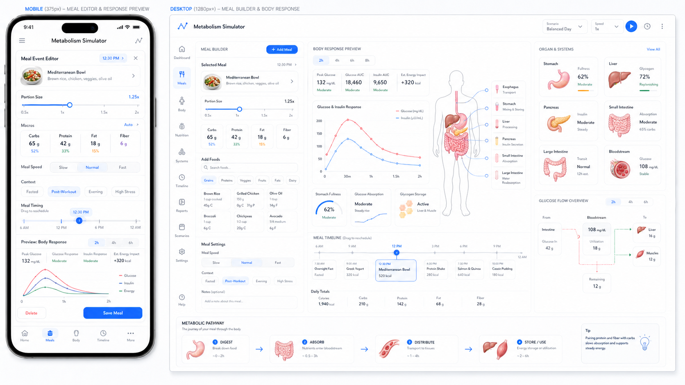
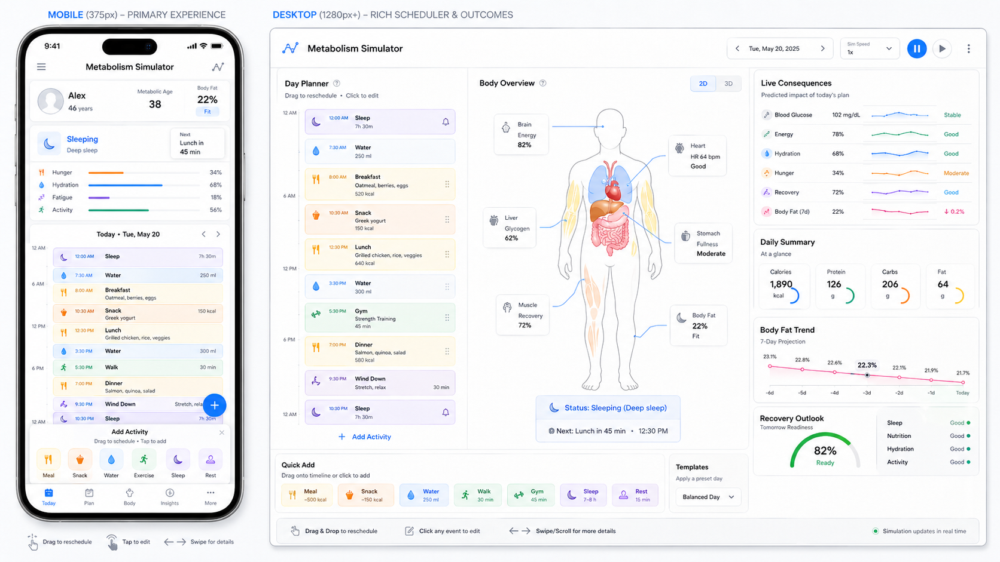
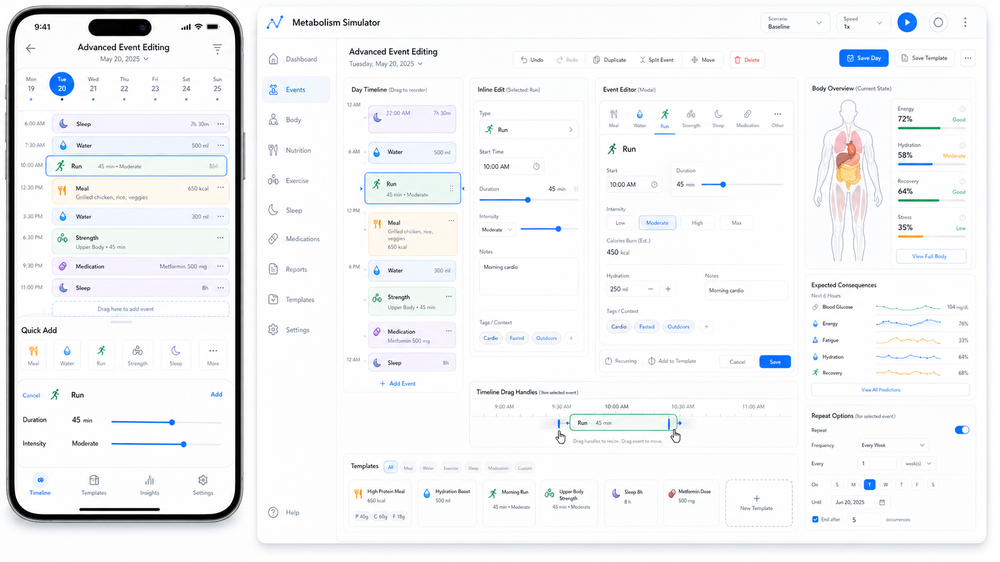
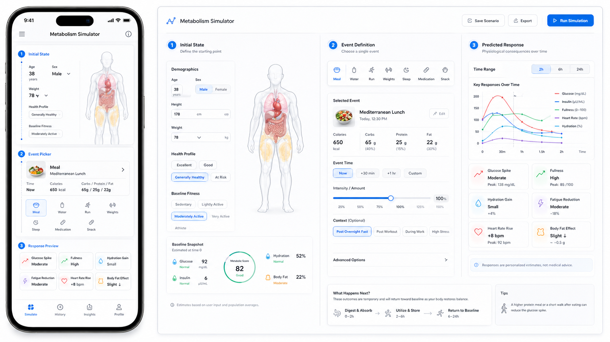
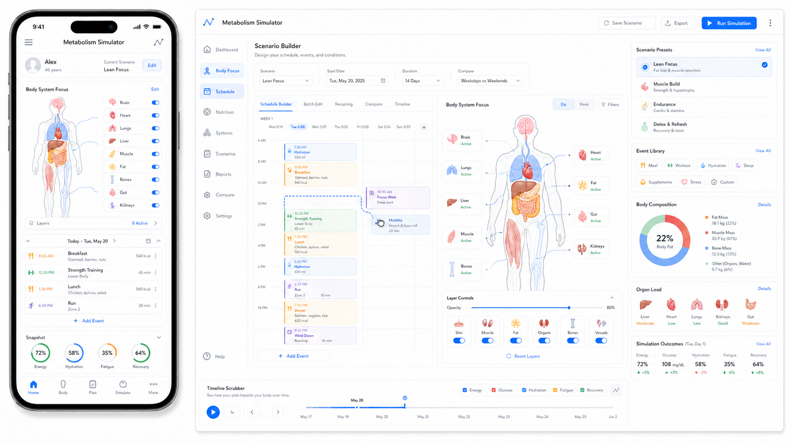
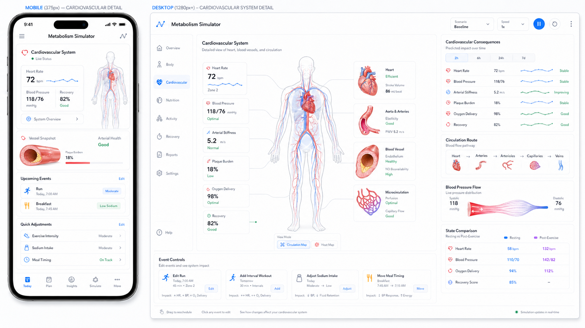
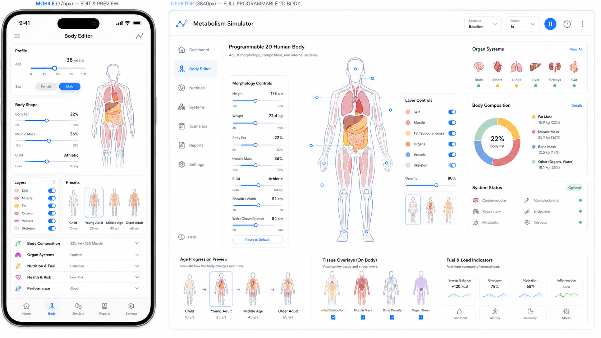
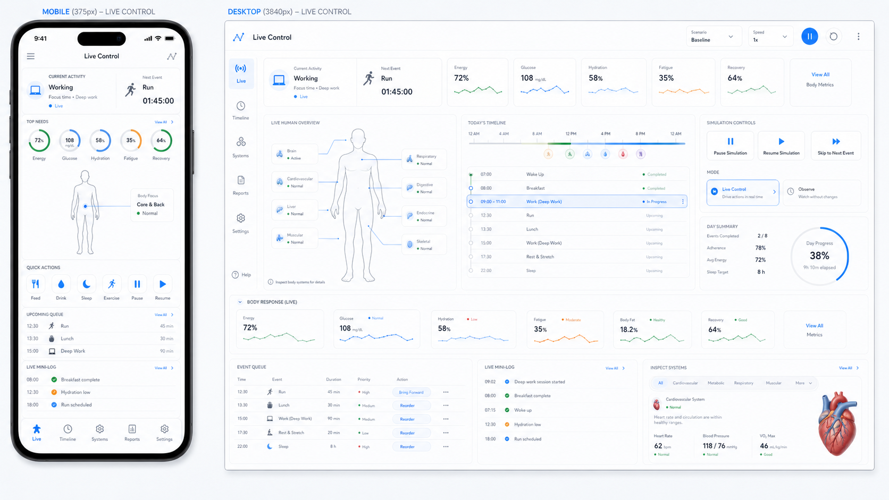

# Controls — fourth visual exploration

Eight candidate treatments of the simulator's *entry surfaces* — the parts of the UI the user touches when they assemble a meal, lay out a calendar, define an event, configure a scenario, or drive a live run — and of the question the previous three series left open: **can the central human figure be rendered as a hand-tuned SVG diagram rather than as an illustrative painting or a generative-AI raster asset?** The first three series asked what the simulator's *output* looks like (the schematic, the body view, the phone framing). This series shifts to what its *input* looks like, and to whether the figure that anchors the output can be redrawn in a vector idiom that scales across density tiers and life stages without an asset library behind it.

The user has flagged `controls2.png` as the key reference for the SVG-renderable-diagramming-style question. It gets the deepest treatment below, in its own focused subsection.

Every image pairs a phone framing with a desktop framing at the same scale of detail — implementing §14's *Style-selection validation* requirement that styles be rendered at two density tiers (Compact + Standard at minimum) before adoption. This is the first series in which every image is a paired phone-plus-desktop, which makes desktop ↔ phone parity its own first-class question.

## Source

All eight images are generative-AI outputs, dropped into the folder by the user on 2026-04-25 (file mtime). Originating prompts are **not yet recorded** — placeholder for the user to backfill. Filenames are sequential (`controls1.png` through `controls8.png`) rather than descriptive, so each entry below assigns a short title for cross-reference.

- `controls1.png` (1.4 MB) — Scenario Builder
- `controls2.png` (1.5 MB) — Cardiovascular Detail Console *(focal image for the SVG-style question)*
- `controls3.png` (1.3 MB) — Meal Editor and Daily Response
- `controls4.png` (1.4 MB) — Advanced Event Editor
- `controls5.png` (1.4 MB) — Initial State and Event Definition
- `controls6.png` (1.5 MB) — Day Planner with Rich Outcomes
- `controls7.png` (1.3 MB) — Programmable 2D Human Body
- `controls8.png` (1.3 MB) — Live Control Console

The walkthrough is grouped by what each image shows: meal / day editing, scheduling, scenario / body setup, live-control and detail. Stylistic clustering is handled in the cross-cutting closer.

---

## 1. Meal Editor and Daily Response — `controls3.png`

**What it shows.** Phone (*MOBILE — MEAL EDITOR & RESPONSE PREVIEW*) leads with a *Meal Score Editor* card titled *Mediterranean Bowl* (painted thumbnail, *Small / Medium / Large* portion slider, three nutrient bars: carbs 45 g, protein 18 g, fat 12 g), a *Snack* slot, *Meal Timing* pill chips (*Breakfast / Lunch / Dinner / Snack*), a tiny *Body Response* preview chart, *Save Meal* CTA, five-icon bottom-nav. Desktop adds a wider chrome: same meal card top-left; central *Body & Health Tracker* sparkline overlaying blood glucose, energy expenditure, and fat-burning curves; a centred line-drawing torso with intestines highlighted and a *47%* digestion-progress panel; *Meal Timing* row, *Activity / Exercise* row with intensity slider, *Time Range* radio chips (*1h / 6h / 12h / 24h*); bottom *Inferred Metabolic Effects* carousel of five painted food illustrations (mixed greens, whole grain, protein, healthy fats, fibre) with named effects.

**Pointers for the app.** §5 **Timeline** as a meal-editor surface, central torso inheriting §5 **Whole Body**. §14 *Compact* on phone, *Detailed* on desktop. Bias: §3 **Plain**. The desktop response chart is the §9 *immediate preview* commitment as live feedback. Central torso shares the vector idiom of `controls2.png` / `controls7.png`.

**Strengths.** Cleanest *meal entry → immediate consequence* loop in the series. *Inferred Metabolic Effects* is a teaching device the design hasn't articulated. Central torso shares the SVG-renderable idiom.

**Weaknesses.** *Mediterranean Bowl* is treated as a single entry, not as a §9 composite — no expand-and-edit-ingredients path. *Cooked vs uncooked* (§9) not addressed. *Familiar units* surface as *Small / Medium / Large* — the §9 antipattern. Painted food carousel is *raster*, not SVG. Lifespan Timeline absent.

---

## 2. Day Planner with Rich Outcomes — `controls6.png`

**What it shows.** Phone (*MOBILE — PRIMARY EXPERIENCE*): *Today, May 10* header, Health-summary chip, vertical day-planner of stacked event cards (*Sleeping*, *Breakfast — toast + eggs*, *Walk — 6,500 steps*, *Lunch — chicken Caesar*, *Coffee + biscuit*, *Dinner — pasta*, *Supplement*), bottom action-chip toolbar (*Sleep / Eat / Drink / Exercise / Drug / Quick Add*), five-tab bottom-nav. Desktop: three columns. Left — full-day vertical timeline with sliders inside cards (portion, intensity, dosage); *Quick Add* chip row. Centre — translucent-skin body figure with luminous heart (red) and lungs (cyan), inset *Sleeping* card. Right — *Live Consequences* (~9 sparkline cards), *Daily Summary* (calories / protein / carbs / sleep score), *Body Fat Trend*, *Recovery Outlook* gauge, *Sleep* weekly bar chart. Eye reads *plan → body → outcome*.

**Pointers for the app.** §5 **Timeline** as the simulator's headline interaction. §14 *Detailed* on desktop, *Compact* on phone. Bias: §3 **Plain**. The action-chip row is §9's *event kinds* as a tap-target row — and the cleanest realisation in the series of §9's life-stage event-gating (chips drop out for child bodies). The three-column layout *is* §9's calendar-as-input model rendered spatially.

**Strengths.** Strongest single-day calendar surface in the series. *Plan → body → outcome* three-column layout binds calendar editing to live response on one screen. Compact survival good.

**Weaknesses.** *Recurrence is invisible.* §9 specifies five shapes; this image shows none. Composite editing is shallow (one-liner cards, no expand-to-ingredients). Central figure uses translucent-skin-with-glow — *not* in `controls2`/`controls7`'s SVG-renderable idiom. Lifespan Timeline absent.

---

## 3. Advanced Event Editor — `controls4.png`

**What it shows.** Phone shows *Today's Schedule* as a vertical event list (*Breakfast / Walk / Run / Lunch / Coffee / Snack / Workout*), each row icon + time + title + mini-graph; bottom *Quick Add* card with sliders. Desktop: left rail event list; centre-left *Day Overview*; centre-right *Event Detail — Run* with slider+number controls (intensity, duration, distance, recovery rate), tag chips, notes; right rail centred line-drawing torso, *Day Response*, *Expected Consequences* sparklines, and a **Repeat Options** pill chip row reading *None / Daily / Every 2 Days / Weekly Pattern*.

**Pointers for the app.** §5 **Timeline** as a single-event detail surface, with §9's recurrence model finally explicit. §14 *Detailed* on desktop. Bias: §3 **Plain** with **Mixed** within reach. Right-rail torso in the vector idiom of `controls2.png` / `controls7.png`.

**Strengths.** *Only image in any of the four series that surfaces §9 recurrence as visible UI.* Slider-rich event-detail with explicit numeric values matches §9's *never "small / medium / large"* commitment. Tag chips + notes hint at user-defined event templates.

**Weaknesses.** Recurrence row is desktop-only — phone loses the most load-bearing element. §14-parity-violation. No composite-meal handling. Lifespan Timeline absent. Phone top-bar omits simulated time / scenario name.

---

## 4. Initial State and Event Definition — `controls5.png`

**What it shows.** Phone: three stacked cards — *Initial State* (small body silhouette + age 32 + sex/weight/height), *Event* (*Meal — Mediterranean Lunch*, calorie/macro fields, portion slider), *Mapping Steps*. Desktop: four columns. (1) *Initial State* — demographics, *Health Profile* sliders, *Baseline Plates*, small line-drawing torso. (2) *Event Definition* — meal card *Mediterranean Lunch* with painted thumbnail, macros (calories 480 / carbs 45 g / protein 28 g / fat 22 g), digestion-rate slider, *Quality* slider. (3) *Time Range* chip group + *Predicted Response* multi-line sparkline (blood glucose, insulin, energy, fat oxidation). (4) *Key Responses Over Time* — five named small charts. Bottom-centre: *Health Score 82* circular gauge; *What Happens Next?* row of three icon cards (*Digest & Absorb / Insulin Surge / Recovery Begins*); *Run Scenario* CTA.

**Pointers for the app.** §10 **Scenario** assembly surface — body + event + predicted-response + run on one frame; the closest the series gets to scenario JSON rendered as UI. §14 *Detailed*. Column-1 torso in the SVG-renderable vector idiom. *What Happens Next?* is a candidate UX pattern for §4's cross-entity-linkage in detail panels — the simulator narrates the upcoming chain in plain language. Macro readouts (calories / carbs / protein / fat as numeric fields) are §9's *composition fields* commitment rendered visibly.

**Strengths.** Most complete scenario-builder shape in the series. *Health Score 82* gauge is §4's whole-body Health aggregate as first-class chrome. *What Happens Next?* is cross-entity-linkage as plain-language narration.

**Weaknesses.** Body figure decorative in column 1. Single meal, no composite breakout, no *cooked vs uncooked*, no *familiar units*. *Recurrence* absent. Phone loses predicted-response chart and *Key Responses Over Time* — the editor's main value. Lifespan Timeline absent.

---

## 5. Scenario Builder — `controls1.png`

**What it shows.** Phone: *Body System Focus* card with centred line-drawing torso (heart, lungs, liver, kidneys subtly tinted), vertical system-name list with toggle chips, *Today: Thu, May 10* day-card with three meal entries, *Supports* row of three coloured pills (*Strength Training / Endurance / Recovery*). Desktop: *Scenario Builder* with a centrally placed and quite detailed line-drawing body figure — among the most prominent in the series. Left of figure: scenario-config card (sex / age / weight / conditions sliders), *Body System Focus* picker. Right: *Scenario Presets* (*Sedentary Knowledge Worker / Endurance Athlete / Years of Fast Food*), *Body Composition* (*22%* fat ring), *Major Organs* (row of stylized organ insets in the same vector idiom as the figure), *Inflammation Sensitivity* spectrum. Bottom: a *Trip-line Schedule* horizontal day-cell strip with play-pause.

**Pointers for the app.** §10 **Scenario** + §8 **Multiple Individuals** axis-picker, with §4 stylized-health-diagrams as small inset panels. §14 *Spacious* on desktop. Named *Scenario Presets* are exactly the §10 built-in scenarios. *Body System Focus* picker hints at a §5 view-switcher.

**Strengths.** Strongest evidence in the series that scenario-presets, body-axes, and body-system-focus live on one surface. *Major Organs* row is §4's stylized-health-diagrams pattern as a tappable strip. Central figure and organ insets share visual language — clean SVG-renderable register.

**Weaknesses.** *Trip-line Schedule* is per-day, not per-life — *Years of Fast Food* needs a multi-year arc this can't carry. *Recurrence* absent. One-accent-colour limits per-system bandwidth. Phone *Body System Focus* picker scrolls. Demographic substitutability of central figure unproven (one figure). Lifespan Timeline absent.

---

## 6. Cardiovascular Detail Console — `controls2.png` *(focal image)*

**What it shows.** Phone (*MOBILE — CARDIOVASCULAR DETAIL*) and desktop (*DESKTOP — CARDIOVASCULAR DETAIL — DEEP-DIVE SYSTEM-DETAIL*) at matched scale. Phone leads with a *Cardiovascular System* header, large *72 bpm* heart-rate readout, *119 / 78* blood-pressure readout, then a centred standing line-drawing body figure with the cardiovascular tree picked out: red arterial trunk descending from a chambered heart, branching to upper and lower limbs, with venous return rendered in a paler red / dusty pink. Below the figure: an *Upcoming Events* card and a *Quick Adjustments* row of small system chips. Five-icon bottom-nav.

The desktop renders the same standing figure roughly four times the size, in the centre of a three-column dashboard. The figure is a single hand-tuned vector body silhouette — head, neck, torso outline, limbs in soft pale grey-tan; on top of that silhouette, the entire cardiovascular tree is drawn in single-weight red strokes. The heart sits at chest centre with its four chambers visibly drawn (small enough to read as a stylized organ, large enough to read as anatomically informative); aorta arcs left, descending aorta runs down, branching to limb arteries; capillary fields are suggested by tighter stroke clusters at hands, feet, and head; venous return is drawn as a parallel branching tree in paler red. The figure stands centred — left arm relaxed, right arm slightly raised, head facing forward — and reads as *one composition*, not as *body-with-anatomy-pasted-in*.

To the figure's left: a column of stylized organ-icon cards in the same vector idiom — *Heart*, *Aorta*, *Body Vessel Health* (*5.2 L*), *Circulation* (*38 L/min*), *Capillaries* (*60%*), *Vein Compliance* (*78%*) — each a small organ illustration plus numeric readout. To its right: another column of stylized inset cards — *Heart*, *Arteries* (cross-section + pulse line), *Aortic Arch*, *Vessel Health*, *Veins*, *Circulation* (small charts), *Blood Pressure Trend* (sparkline), *Capillaries* (vessel branching). Top-right: a *Heart Rate / Blood Pressure / Circulation Trend* stacked sparkline column. Bottom: a *Quick Controls* row — *Run Test*, *Add Workout*, *Adjust Sodium Intake*, *Microbial Drug*.

**The figure-rendering technique (the load-bearing question).** What is the rendering technique? It is **not** anatomical-opening (no sectioned torso, no cutaway). It is **not** translucent-skin (no attenuated skin layer; no gradient body fill). It is **not** x-ray glow (no luminosity, no dark substrate). It is **not** painted natural-history (no watercolour, no shading). What it *is* is closer to a *vector medical illustration* idiom: a single body silhouette holding an internal anatomical system drawn directly on top of the silhouette, in the same drawing medium as the silhouette. The cardiovascular tree is *inside* the figure but rendered without any concealment device — no skin layer being looked through. The convention is *the body as a transparent stage*, with the system being studied drawn front and visible. This is the convention of pre-1970 medical-textbook plates and the *Encyclopædia Britannica diagram* style — the body is a frame, the system is the figure.

Crucially, this is exactly what hand-tuned SVG can render. The components are: one body silhouette path (a few dozen Béziers); the heart as a small grouped shape; the arterial tree as stroked paths with branch-and-taper; the venous tree as parallel paler paths. No gradients are load-bearing for the diagrammatic content (the silhouette has a soft fill but the arteries and veins are flat colour). No raster textures. No glow filters. No drop shadows. Single-weight stroke discipline throughout (with a slightly heavier weight on the heart for emphasis).

**Per the four §14 figure-rendering techniques.** §14 names *anatomical opening*, *translucent skin*, *x-ray glow*, *line engraving*. `controls2.png`'s figure does not match any of those exactly — it sits closest to *line engraving* but with a soft body-fill, no engraving hatching, and a deliberately limited colour palette. **The series is implicitly proposing a fifth technique — *vector overlay* / *transparent-stage diagram*: a flat body silhouette with the active anatomical system drawn directly on it in flat-colour vector strokes, no concealment device.** That technique is the closest of the five to being trivially SVG-renderable.

**Is it consistent? Does it scale? Is it Compact-ready?** The phone framing answers in three ways. (a) *Consistency*: the small phone figure uses the same body silhouette, the same vector arterial tree, the same single-weight strokes. The shrink works because everything is vector and flat. (b) *Density-tier scaling*: desktop large, phone small, both read. No asset swap visible. (c) *Compact-ready*: the phone figure shows the cardiovascular tree intact at perhaps 220 × 380 px — well within the §14 360 × 640 baseline. Nothing depends on glow, gradient, or pixel-density.

**Does it scale across life stages?** Untested in this image — only an adult. But the technique strongly suggests yes: a body silhouette is a small set of curves, and an infant / child / older-adult silhouette is a different set of curves over the *same* anatomical-system overlay. The cardiovascular tree itself does not change topology with age; what changes is *condition* — vessel-wall thickness, plaque, calcification — which is fill / stroke modulation. The technique is inherently demographically substitutable in §4's sense: swap silhouette, keep system overlay; or swap system overlay (cardiovascular → respiratory → digestive → hepatic), keep silhouette. `controls7.png`'s *Age Progression Preview* row corroborates this directly.

**Does it work in both figure-rendering poles?** §14 names *fully diagrammatic* (no figure) and *figure-present* (figure with reveal device). `controls2.png` is *figure-present-with-vector-overlay* — figure as transparent stage. The same SVG infrastructure could render *fully diagrammatic* by hiding the silhouette layer and showing only the anatomical-system overlay against the page background. **One asset, two rendering passes** — exactly what §14's *each style is a separate rendering pass* commitment wants.

**Honest read on the other images.**

- `controls7.png` (Programmable 2D Body) carries the same idiom — vector body silhouette, anatomical-system overlay drawn directly on it, flat colour, single-weight stroke. **Most consistent with `controls2.png` of any image in the series.** Section 7 below.
- `controls1.png` (Scenario Builder) carries a smaller version of the same idiom in its central figure and *Major Organs* insets — *almost* SVG-renderable, with some painted shading on the *Body Composition* fat-ring that borders on raster.
- `controls3.png` (Meal Editor) — central torso in idiom; food-illustration carousel at the bottom is *raster art*.
- `controls4.png` (Advanced Event Editor) — small right-rail torso in the same vector idiom. Consistent.
- `controls5.png` (Initial State) — small body silhouette in column 1 in the same vector idiom; meal-card thumbnails are painted illustrations (raster).
- `controls6.png` (Day Planner) — figure rendered with **glow on heart and lungs** (cyan / red) and a translucent-skin treatment. **Not in the same idiom as `controls2.png`.** Closer to `body-based/gen-clean-canvas-dense`. Hard to ship as pure SVG without complex gradients, multi-stop fills, and luminous bleed.
- `controls8.png` (Live Control) — small left-rail body silhouette in the SVG-renderable idiom; the cardiac-detail inset at bottom-right is a painted-anatomical heart — *not* SVG-renderable.

**Implications for §15's SVG-for-diagrams commitment.** §15 commits SVG for diagrams and Canvas only for high-density particle animations. `controls2.png`, `controls7.png`, and `controls4.png` are evidence that the §15 commitment can carry the central figure if the project picks the *vector overlay* idiom — a fifth figure-rendering technique that should be added to §14's list. `controls6.png` is evidence that the moment a style chooses translucent-skin-with-glow, the §15 SVG-for-diagrams commitment becomes very strained. **The series's strongest finding is that one of the figure-rendering techniques in §14 is meaningfully more SVG-friendly than the others, and it isn't currently named in the list.**

**Pointers for the app.** §5 **Whole Body** subsystem-zoom (cardiovascular focus) — exactly the *specialised subsystem view* §5 names as future-but-designed-for. §14 *Detailed* on desktop, *Compact* on phone. Bias: §3 **Plain** with **Mixed** workable.

**Strengths.**
- *Cleanest SVG-renderable figure in the series.* Every component achievable in hand-tuned SVG with single-weight strokes and flat colour.
- *Compact survival: excellent.* Vector body + vector cardiovascular tree shrinks losslessly.
- Demographic and life-stage substitutability is structurally easy — silhouette and system overlay are independent layers.
- Figure-rendering pole is flexible — same SVG renders both *figure-present* and *fully diagrammatic*.
- Cross-system consistency — the same body silhouette can carry respiratory, digestive, lymphatic, hepatic overlays.

**Weaknesses.**
- *One accent colour limits per-system bandwidth.* Combined views (Whole Body simultaneously showing cardiovascular + respiratory + digestive) need a colour discipline that doesn't degrade.
- Heart anatomical detail (chambers visible) is non-trivial in SVG — achievable but each organ at this level is hours of hand-tuning.
- *Aging unproven.* §14's life-stage-art requirement asks how this body looks at 70; only one age shown.
- Phone *Quick Controls* labels are tight — *Adjust Sodium Intake* and *Microbial Drug* lose labels and become icons.
- *Lifespan Timeline absent.* Both tiers omit the §14-required band — recurs across the series.

---

## 7. Programmable 2D Human Body — `controls7.png`

**What it shows.** Phone (*MOBILE — BODY EDIT & PREVIEW*): *Body Editor* with body-shape sliders, *Body Shape* radio chips (*Ectomorph / Mesomorph / Endomorph*), centred line-drawing body silhouette in `controls2.png`'s vector idiom, *Layers* chip toggle (*Skeleton / Organs / Vessels / Muscle / Fat / Skin*), *Process* slider; bottom row of life-stage thumbnails (*Infant / Child / Young Adult / Middle Age / Older Adult*). Desktop: large standing body silhouette centre with internal organs / vessels as overlay layers (heart red, intestines pinkish-orange, kidneys, lungs). Left: *Morphology Controls* (sliders height / weight / body-fat % / muscle mass / posture; sex / ethnicity tag chips; *Body Type* pills). Right: *Organ Systems* (stylized organ-icon grid in the same vector idiom), *Body Composition* (*22%* fat ring), *System Status* readouts. Bottom: three filmstrip rows. Row 1: *Age Progression Preview* — five silhouettes from *Child* through *Older Senior*, each progressively shifted in proportion and posture. Row 2: *Tissue Overlays (On Body)* — same standing body shown five times with one overlay each (*Skeleton / Organs / Vessels / Muscle / Skin*). Row 3: *Fat & Load Indicators* — five silhouettes at increasing fat percentage.

**Pointers for the app.** §4 **demographic substitutability** + §14 **life-stage-art requirement** + §15 **SVG-for-diagrams** rendered as one editor. §14 *Spacious* on desktop. Bias: §3 **Plain**. The *Layers* picker on phone and *Tissue Overlays* row on desktop directly answer *"is the figure built as a stack of independent layers?"* — yes.

**Strengths.** *Most direct evidence in any series that the central figure is a layered SVG asset.* The *Tissue Overlays* row shows the body silhouette with one layer at a time — the SVG architecture made into a UI. *Age Progression Preview* directly addresses §14's life-stage-art requirement. *Fat & Load Indicators* is §4's *Body Shape Silhouette* stylized diagram as a five-step row.

**Weaknesses.** *Asset cost question* — five-to-seven silhouettes per sex (and probably per ethnicity); real library, just a vector one. Tissue overlays are stylized (skeleton shows ribs as bars), not anatomically rigorous — consistent with §4 but worth flagging. No animation visible — §4 commits aging as visible *in the simulation itself*; image shows snapshots, not interpolation. Lifespan Timeline absent. Multi-individual not demonstrated.

---

## 8. Live Control Console — `controls8.png`

**What it shows.** Phone (*MOBILE — LIVE CONTROL*): *Currently Active* card with duration *01:45:00* and three coloured circular gauges (heart-rate, oxygen, energy); small body silhouette anchor; *Quick Switch* action chips (*Eat / Drink / Move / Stress / Drug / Pause*); transport row (play / pause / step / scrub). Desktop: top-left *Currently Active — Walking* status card; top centre row of large numeric readouts (*HR 72*, *BP 119/78*, *Energy 36*); top-right *Live KPI* row of six gauges; centre-left centred body silhouette in the vector idiom; centre-right *Event List*; below figure a wide row of ~8 *Live Sparklines* (blood glucose, insulin, lactate, oxygen); bottom-right *Cardiac Detail* inset with a painted-anatomical heart (the only non-vector element).

**Pointers for the app.** §6 **Time Control** + §5 **Charts** + §5 **Whole Body** as a single live-driving cockpit. §14 *Detailed* on desktop, *Compact* on phone. *Quick Switch* row is §9's event-kinds vocabulary; transport row is §6 made first-class.

**Strengths.** Most explicit live-control surface in the series — user is *driving*, not editing. *Live Sparklines* row is §6 **Charts** rendered inline. Action-chip row honours §9's event-kinds and §3 plain naming.

**Weaknesses.** *Cardiac Detail inset is painted, not SVG* — either redraw in `controls2`'s vector idiom or accept as raster asset. Calendar / scheduling absent — path between *plan a day* (`controls6`) and *run that day live* (here) is implicit. Lifespan Timeline absent. No multi-individual support.

---

## Meal editor — focused analysis

Three images carry meal-and-food entry: `controls3` (Meal Editor and Daily Response), `controls5` (Initial State and Event Definition), and `controls6` (Day Planner). `controls4` is event-editor scaffolding.

**Search / picker.** None of the three shows an explicit *food search* surface. `controls3` and `controls5` lead with a meal already named (*Mediterranean Bowl*, *Mediterranean Lunch*); `controls6` lists day-cards with one-line summaries. The series has no image of the §9-prescribed library picker — a user typing *salmon* and getting cooked-salmon, raw-salmon, canned-salmon entries. **Single largest gap in the series's meal-editor coverage.**

**Familiar units (§9).** `controls3` exposes *Small / Medium / Large* — the §9 antipattern. `controls5` shows numeric macros without familiar-unit input. `controls6` summarises meals. **None honours §9's *familiar units, metric truth* commitment** (handfuls, cups, slices, *medium apple*, 330 ml bottles with metric alongside).

**Cooked-vs-uncooked (§9).** Not addressed in any image.

**Composite foods (§9).** §9 commits hamburgers, pizzas, cocktails as composites. **None of the meal-editor images shows the composite-as-tree affordance.** *Mediterranean Bowl* is treated as a single entry with one portion slider. No UI to expand into *grain + greens + protein + olive oil + tomato + feta*, adjust constituents, save as new composite, or nest a smaller composite inside a larger. Cocktails / alcohol-entry surface absent. **§9's composite-foods commitment is essentially unaddressed in this series.**

**Desktop vs phone.** `controls3` reduces to meal card + portion slider on phone, losing the inferred-effects carousel and most of the response chart. `controls5` reduces to stacked cards on phone, losing the predicted-response chart and *Key Responses Over Time* — the editor's main value. `controls6` reduces three-column to one, losing live-consequences and daily-summary.

**Single best meal-editor flow across the series.** None is shippable as is — composite-and-familiar-units gaps are central. **`controls5`'s desktop event-definition column is the strongest base** (macro-readout fidelity at the level §9 prescribes), with `controls3`'s preview-loop and `controls6`'s in-day-context as the two extensions. The missing surface adds: an *ingredients* drawer with per-component familiar-unit sliders; a *cooked / uncooked* toggle per ingredient; a *save as new composite* CTA; a *nesting* indicator for composites inside composites.

---

## Calendar / timetable — focused analysis

Three images carry calendar surfaces: `controls6` (Day Planner — most complete), `controls4` (Advanced Event Editor — most explicit on recurrence), `controls8` (Live Control — running end of the calendar).

**Day-resolution rendering.** `controls6` renders one day as a vertical stack of event cards with time, type, summary — most legible day-of-life surface in the series. `controls4` renders the same day as a denser list with mini-graphs. `controls8` shows the day as an event list firing live as time advances.

**Week-resolution.** Not shown anywhere. None offers a seven-day grid, a weekly-pattern editor, or a week-summary. **§9's *weekly-pattern* recurrence (heavier eating on weekends) cannot be assembled in any image.**

**Recurrence (§9).** §9 names five recurrence shapes. **`controls4` is the only image in the series that surfaces recurrence as visible UI** — a four-pill chip row *None / Daily / Every 2 Days / Weekly Pattern* — on desktop only. Phone loses it. *Multiple-times-per-day* missing entirely; sub-pickers (which days, what time, how many) not shown.

**Built-in event kinds.** All three images show §9's event-kind row (*Sleep / Eat / Drink / Exercise / Drug*) as a tap-target chip strip — strong cross-image pattern the design can lock in.

**Illness, alcohol, smoking, medication.** `controls4` and `controls6` surface *Drink* and *Drug* as chips. **No image shows an illness-event entry surface** for §9's acute-conditions (pneumonia, gastroenteritis, influenza, common cold). Smoking is not differentiated from generic *Drug*.

**Calendar-as-input model (§9).** **`controls6`'s desktop *plan → body → outcome* three-column layout is the cleanest realisation in the series**: planner left, body-state-now middle, live consequences right. Editing a calendar cell visibly changes the body and outcome cells on the same screen.

**Single best calendar/timetable flow across the series.** **`controls6`'s desktop three-column *plan → body → outcome* layout is the headline calendar surface.** It shows the full daily-life loop spatially, supports inline edits, and is the only image where editing a calendar cell visibly changes body / outcome on the same screen. Its weakness — recurrence and week-resolution — is solvable by adopting `controls4`'s recurrence-chip row inside each event card, plus a week-tab above the day timeline.

---

## Desktop ↔ phone parity — focused analysis

Every image pairs phone and desktop — the first series to do so universally. §14 commits a layered architecture: each tier *adds* to the previous, never reorganises; the same anatomical layout sits underneath.

**Density tiers per desktop image.** `controls1` is §14 *Spacious*; `controls7` is *Spacious*; `controls2` is *Detailed*; `controls3`, `controls4`, `controls5`, `controls8` are *Detailed*; `controls6` is *Detailed*-bordering-*Spacious*.

**What survives.** Body figure in every image (vector idiom shrinks losslessly; translucent-skin-with-glow in `controls6` requires a different rendering pass at small size). Bottom-nav (5 icons, every image). Action-chip row for event kinds (`controls4`, `controls6`, `controls8`). One primary card on the phone — whatever the image is centrally about.

**What gets restructured.** Multi-column desktops collapse to single-column phone stacks (`controls5`'s four columns become three; `controls6`'s three become one; `controls7`'s centre-flanked-by-rails becomes a centre+vertical-stack). Slider-rich detail panels become bottom-sheets-on-tap. Sparkline strips become swipe-to-reveal panels.

**What gets dropped.** *Lifespan Timeline* — not present on either tier in *any* image. Eight for eight. The single most reliable failure pattern across all four series. *Recurrence row* survives only on `controls4`'s desktop. *Inferred-effects carousel*, *daily-summary metric pile*, *tissue-overlay filmstrip rows* all desktop-only.

**Parity vs compromise.** §14: *Larger viewport sizes add density and panels; they do not introduce features that aren't reachable on the phone.* Tested:

- `controls1` Scenario Builder — **compromise.** Scenario presets and *Inflammation Sensitivity* not reachable on phone.
- `controls2` Cardiovascular Detail — **parity.** Every desktop element has a phone equivalent.
- `controls3` Meal Editor — **near-parity.** Inferred-effects carousel desktop-only.
- `controls4` Advanced Event Editor — **compromise.** Recurrence-chip row desktop-only — the most load-bearing thing on the desktop.
- `controls5` Initial State — **compromise.** Predicted-response chart and *Key Responses Over Time* desktop-only — the editor's main value.
- `controls6` Day Planner — **near-parity.** Live-consequences sparkline column desktop-only; loop survives partially via swipe-to-reveal.
- `controls7` Programmable 2D Body — **compromise.** Tissue-overlay filmstrip and age-progression preview desktop-only.
- `controls8` Live Control — **near-parity.** Live-sparklines strip desktop-only.

**Verdict.** *Five of eight images are **compromise** rather than **parity**.* The series shows some features (recurrence, predicted response, scenario presets, age-progression preview, tissue overlays) reachable only on desktop. This is a §14-violation pattern. The design either needs to relax the strict-parity commitment for editor surfaces (defensible — editors differ from viewers) or fight harder to surface the missing controls on phone via bottom-sheets, full-screen modals, swipe-to-reveal. The series is honest about the trade-off but does not resolve it.

---

## SVG-renderable diagramming style — focused analysis (with `controls2.png` at the centre)

This is the architectural question the user named as the focal point. Treated above in the per-image entry for `controls2.png` (Section 6); summarised here for the design-level readout.

**The proposed technique.** `controls2.png`'s central figure is **a flat body silhouette with the active anatomical system drawn directly on it in flat-colour vector strokes, no concealment device.** The body is a transparent stage; the system is the figure. Single-weight strokes, flat fills, no glow, no gradient, no raster.

**Consistency within the image.** Yes. Desktop figure and phone figure share the idiom. Flanking organ-icon cards (heart, aorta, vessel-health, capillaries) share the idiom. The whole image is internally consistent.

**Consistency across the series.** Mostly yes for figures: `controls7`, `controls4`, `controls5`, `controls1`, and `controls8` carry figures in the same vector idiom. `controls6` breaks the idiom with translucent-skin-and-glow. `controls3` is mixed — central torso in idiom but food-illustration carousel raster. **6/8 consistent on the central figure; 4/8 if every supporting illustration must share the idiom.**

**SVG-feasibility.** The core idiom — body silhouette + system overlay + flat-colour single-weight strokes — is trivially SVG-renderable. A few dozen Béziers for the silhouette, a stroked tree for the cardiovascular system, small grouped paths for each organ. Asset count small (one silhouette per body type per life stage; one overlay per anatomical system); per-asset complexity moderate (hours, not days). No raster textures, no glow filters, no drop shadows — exactly what §15's *SVG for diagrams; Canvas for high-density particle animations* commitment expects.

**Density-tier scaling.** Single-weight vector strokes shrink losslessly. Phone framing of `controls2.png` shows the cardiovascular tree at perhaps 220 × 380 px and remains legible. Standard, Detailed, Spacious tiers add panels around the figure rather than redrawing it.

**Life-stage scaling.** `controls7.png` directly addresses this with *Age Progression Preview* — five silhouettes from child to older senior, all in the same vector idiom. The technique scales by replacing the silhouette layer (different curves for an infant, child, older adult) while keeping the anatomical-system overlay layer intact. The cardiovascular tree itself doesn't change topology with age; what changes is *condition* — vessel-wall thickness, plaque, calcification — which is fill / stroke modulation. **Inherently life-stage-portable, more so than any other technique in §14's list.**

**Both figure-rendering poles.** §14 names *fully diagrammatic* and *figure-present*. Vector overlay answers both with one asset: render silhouette layer for *figure-present*; hide it for *fully diagrammatic*. The anatomical-system overlay carries the data either way. Closest the four series have come to a single rendering technique that handles both poles natively.

**Asset-cost realism.** Honest accounting: the technique is cheap *per image* and *per density tier* but the asset matrix is *organ × life-stage × condition state*. A reasonable estimate: ~12–15 organs × ~5 life-stage silhouettes × ~3 condition states × 2 sexes = **360–450 vector assets**, with significant component reuse. Real library, but the kind §15 expects in `app/public/` as a versioned set of SVG files.

**Implication for §14.** §14's four named techniques (anatomical opening, translucent skin, x-ray glow, line engraving) do not exactly describe this idiom. The series is implicitly proposing a fifth — *vector overlay* / *transparent-stage diagram* — which is the most SVG-friendly of the five. **It deserves to be added to §14's list.**

**Implication for §15.** If the simulator picks vector overlay, §15's SVG-for-diagrams commitment becomes load-bearing rather than aspirational — the central figure *is* SVG, the anatomical-system overlays *are* SVG, the §4 stylized health diagrams (vessel cross-section, bone density, body silhouette, liver, lung, muscle, skin) are SVG. Canvas reserved for the §14 flow-particle animation layer travelling along SVG paths. The architecture becomes clean and obvious: a fixed SVG layer (the §4 layout) + a dynamic Canvas layer (particles) + a DOM/HTML layer (chrome, charts, controls).

**Honest read on viability.** **The vector-overlay technique in `controls2.png` looks viable as a foundation for the simulator's central figure and body parts.** It is consistent within the image, carried by 6 of 8 images in the series, achievable in hand-tuned SVG without raster fallback, scales across density tiers losslessly, scales across life stages by silhouette replacement, handles both figure-rendering poles with one asset, and aligns with §15's existing commitment. Principal risks: (a) one-accent-colour-per-system limits combined-view colour bandwidth; (b) per-organ anatomical detail (chamber-visible heart) is hours of hand-tuning per organ; (c) aging is unproven in this image — `controls7`'s age-progression row is the proof, but `controls2`'s figure has not been shown at 70.

---

## Cross-cutting themes

**Entry surfaces are under-represented in the prior three series.** The first three asked what the simulator's *output* looks like; this one shifts to its *input*. Every prior series begs the question of how the user gets the body / calendar / scenario into the simulator. Eight images is a small sample for that question.

**The vector-overlay figure idiom emerges as the cross-image consistent answer.** Six of eight images carry a body figure in the same idiom: flat silhouette + anatomical-system overlay + single-weight vector strokes + flat fills. The two outliers are `controls6` (translucent-skin-with-glow) and `controls8` (figure fine but cardiac-detail inset reverts to raster). Convergence is design evidence — a fifth figure-rendering technique should be named in §14.

**The Lifespan Timeline is missing from every image in the series.** Eight for eight. Continues mobile-first's most reliable failure pattern. Defence: input surfaces don't necessarily need a multi-year scrubber. Counter: `controls8` (live control) and `controls6` (day planner) reasonably do. The §14 commitment that the timeline is *non-negotiable at Compact* is structurally violated by every phone in this series.

**§9's most demanding commitments are unaddressed.** Composite foods (hamburger as bun + patty + cheese + lettuce + tomato + ketchup), familiar units (handfuls, cups, slices, *medium apple*, 330 ml bottles), cooked-vs-uncooked toggling, cocktails — none of these is rendered in any image. The series shows meal editors but treats meals as opaque library entries with portion sliders. **§9's food-input vocabulary needs its own dedicated visual-research run.**

**Recurrence is shown only once, on `controls4`'s desktop.** §9's five recurrence shapes get a four-pill chip row in one image; phone loses it. The series is barely-aware of recurrence as a calendar-input commitment.

**Bottom-nav and action-chip row are convergent patterns.** Every phone has a five-icon bottom-nav for §5 view switching. `controls4`, `controls6`, `controls8` carry an action-chip row above it for §9 event-kind injection. These patterns are now well-supported across `mobile-first/` and `controls/` — the design can lock them in.

**Desktop ↔ phone *parity* is mostly *compromise*.** Five of eight images put a load-bearing control on desktop only. The series surfaces a real tension between §14's parity commitment and the practical reality of editor surfaces.

**Stylistic family.** All eight images sit in the *clean light-themed product UI* family, with figures in the vector-overlay idiom or close to it. The series does not visit painterly, line-engraving, dark-neon, or vintage-poster families. Appropriate for a focused exploration but means the SVG-renderability finding is style-conditional: only the clean-light family demonstrably supports the vector-overlay technique without modification.

**No multi-individual surfaces.** §8 commits 2–6 bodies side by side; no image shows a multi-individual editor or live console. Compounds the mobile-first gap.

---

## Pointers for the next visual-research run

1. **Composite-meal assembly surface.** A dedicated meal-editor mock at phone and desktop showing a hamburger expanded into bun + patty + cheese + lettuce + tomato + ketchup, each ingredient with its own familiar-unit picker, *cooked / uncooked* toggle, *save as new composite* CTA, and nesting (salad dressing inside a salad). Single most under-served §9 commitment in any of the four series.

2. **Familiar-units picker.** Focused micro-mock — input accepting *3 slices*, *2 handfuls*, *1 cup*, *330 ml*, *1 medium apple* with metric alongside as the user types.

3. **Calendar-recurrence editor.** §9's five recurrence shapes at phone and desktop with sub-pickers visible. Build on `controls4`'s pill-chip row.

4. **Lifespan Timeline at every input surface.** Re-render the eight controls images with a 64–80 px Lifespan Timeline above the bottom-nav. Confirm whether the strip can survive in input surfaces.

5. **Vector-overlay figure across life stages, in actual SVG.** Focused mock of the `controls2`/`controls7` idiom at infant, child, adolescent, young adult, middle-aged adult, older adult — same overlay, different silhouette. Produced as actual SVG so the feasibility claim is *evidenced* rather than asserted.

6. **Multi-individual editor and console.** §8's 2–6 bodies side by side with shared and per-individual calendars in the clean-light + vector-overlay idiom.

7. **Illness, alcohol, smoking, medication entry surfaces.** §9's life-event chips opened as full editors — what does *cigarettes-per-day* look like? *Acute pneumonia, severity 6/10, day 3 of 14*?

8. **Painterly-style and line-engraving-style controls re-render.** Re-render `controls2`, `controls6`, `controls7` in the painterly and line-engraving idioms from `body-based/`. Tests whether the SVG-renderability finding generalises.

---

## Proposed `design.md` edits

Six proposed edits, each grounded in specific images. Capped at six per the brief.

**1. §14 — add a fifth figure-rendering technique: *vector overlay* / *transparent-stage diagram*.**

*Existing.* §14 lists four figure-rendering techniques: *anatomical opening*, *translucent skin*, *x-ray glow*, *line engraving*. None describes the idiom in `controls2.png` and `controls7.png`.

*Proposed addition* to the technique list: *"**Vector overlay** (transparent-stage diagram) — a flat body silhouette with the active anatomical system drawn directly on it in flat-colour vector strokes, no concealment device. The body is a transparent stage; the system is the figure. Single-weight strokes, flat fills, no glow, no gradient, no raster. Most demographically and life-stage-portable of the five techniques (silhouette is one layer, system overlay is another, swap either independently); handles both figure-rendering poles with one asset (render silhouette for figure-present, hide it for fully diagrammatic); and is the most SVG-friendly. The technique's principal limit is colour bandwidth: combined views (a single Whole Body view showing cardiovascular and respiratory and digestive simultaneously) need a colour discipline that doesn't degrade to everything-is-red-and-blue."*

*Triggered by.* `controls2.png` (focal image), `controls7.png` (explicit layered structure), supported by `controls4`, `controls5`, `controls1`, `controls8`.

**2. §15 — name SVG as the load-bearing rendering layer for the central figure, with Canvas reserved for the particle layer.**

*Existing.* §15: *"SVG for diagrams; Canvas for the high-density particle animations where SVG would be too heavy."* Currently a guideline; the controls series promotes it to architecture.

*Proposed strengthening* of the SVG bullet: *"The central body figure, the anatomical-system overlays (cardiovascular, respiratory, digestive, hepatic, renal, lymphatic), the Section 4 stylized health diagrams (vessel cross-section, bone density, body silhouette, liver, lung, muscle, skin), and all per-organ icon insets are hand-tuned SVG. Canvas is reserved for the Section 14 flow-particle animation layer that travels along the SVG paths. The DOM/HTML layer carries chrome (top bar, bottom-nav, lifespan timeline, side panels), charts (sparklines, full-resolution time-series), and controls. This three-layer architecture — fixed SVG schematic + dynamic Canvas particles + reactive HTML chrome — is what every visual style renders into; only the SVG layer's drawing pass changes between styles."*

*Triggered by.* The vector-overlay finding from `controls2.png` and `controls7.png`. SVG-renderability is no longer hypothetical; it can be made architectural.

**3. §9 — require composite-food editing as a visible, expandable affordance.**

*Existing.* §9 commits composite foods as first-class library entries from v1: *"a hamburger is a bun + a beef patty + cheese + lettuce + tomato + ketchup."* The commitment is structural; the UI surface is unspecified.

*Proposed addition* immediately after the *Composite foods* paragraph: *"In the meal-editor UI, every composite food is expandable in place: tapping the composite reveals its component ingredients as an indented list, each with its own portion control in familiar units (Section 9 *familiar units, metric truth*) and its own cooked-vs-uncooked toggle where the library distinguishes them. The user can adjust component quantities, swap a component for another library entry, remove a component, or add a new one. Edited composites can be saved back to the library as new named entries; nested composites (a salad dressing inside a salad) render as nested expandable rows. The composite tree is the editor's primary affordance for the commitment that meals are assembled, not picked."*

*Triggered by.* `controls3.png` and `controls5.png` both treat *Mediterranean Bowl* / *Mediterranean Lunch* as opaque entries with one portion slider. None of the eight images surfaces composite-as-editable-tree.

**4. §9 — render the calendar-as-input model as a *plan → body → outcome* three-column layout at Detailed and above.**

*Existing.* §9 names the calendar as the simulator's input but does not specify how it is rendered relative to the rest of the chrome.

*Proposed addition* near the start of §9: *"At Section 14 *Detailed* and above, the calendar lives in a left-column day (or week) timeline of stacked event cards. The body figure occupies the middle column, animated against the calendar. The right column carries live consequences — sparklines of the body's substances, a daily-summary metric pile, recovery and trend gauges. This *plan → body → outcome* three-column layout is the calendar-as-input model rendered spatially: editing a calendar cell visibly changes the body and the outcomes on the same screen, without a separate run-and-view step. At *Compact* the three columns collapse to a single column with the body and outcomes available behind a swipe-to-reveal panel."*

*Triggered by.* `controls6.png` desktop renders this layout most cleanly; `controls4.png` and `controls8.png` carry compatible but less complete versions.

**5. §9 — make recurrence visible chrome, not a hidden modal.**

*Existing.* §9 names five recurrence shapes (one-off, daily fixed-time, multiple-times-per-day, every-N-days, weekly-pattern). The UI surface is implicit.

*Proposed addition* immediately after the *Recurrence* bullet list: *"Recurrence is selected from a visible pill-chip row inside the event editor — *None / Daily / Every N Days / Weekly Pattern / Multi-Daily* — with the chosen chip's sub-options (which days of the week, what times of day, how many per day) opening below the chip row. At Compact, the pill row sits above the event-detail bottom-sheet rather than being hidden inside it; the user must see what recurrence shape is active without a tap. Recurrence is what turns a one-off into a scenario, and a scenario is what the simulator is for."*

*Triggered by.* `controls4.png` is the only image in the series that surfaces recurrence as UI, and it does so on desktop only — the phone loses it. §14-parity-violation that the design should resolve at the spec level.

**6. §5 — name the *Plan* and *Run* interaction modes as first-class peers inside the Timeline view.**

*Existing.* §5 lists Whole Body, Fuel Flows, Hormones, Long-Term State, Timeline, Charts, Multiple Individuals. The Timeline view *contains* day-planner and live-control surfaces but they are not first-class.

*Proposed refinement* of the Timeline entry: *"The Timeline view splits into two interaction modes that the user toggles between: **Plan** (the day-planner / week-planner / multi-year scenario-assembly surface) and **Run** (the live-control cockpit — transport, status, live readouts, and quick-event injection while time is advancing). Both modes share the same calendar and the same body state; they differ only in whether the user is editing the future or driving it. The *plan → body → outcome* three-column layout (Section 9) belongs to **Plan** mode; the live-sparkline cockpit belongs to **Run** mode. Switching between them does not restart the simulation, does not reload, and does not change which calendar is active — it changes which controls are foregrounded."*

*Triggered by.* `controls6.png` (the day-planner pole) and `controls8.png` (the live-control pole) are clearly two different interactive modes of the same calendar / same body. Treating them as peer interaction modes inside Timeline rather than as separate views matches what the images show.
