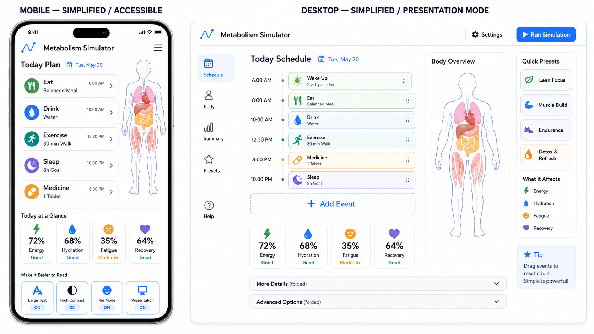
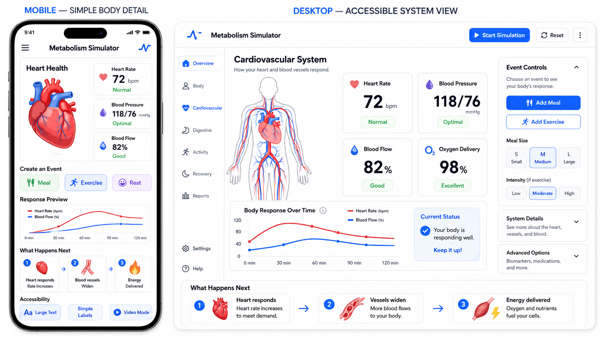

# Low-density — fifth visual exploration

Two deliberate *low-density* mockups — phone-and-desktop pairs — proposed by the user as the deliberate counterpoint to the kitchen-sink density of the previous four series. Where `system-diagrams/`, `body-based/`, `mobile-first/`, and `controls/` push the question *how much can fit on one screen?*, this series pushes the opposite: **what is the minimum that has to fit, for the simulator to still be the simulator?** The user's note on first looking at these images: *"When I look at them I find myself hoping we can start there and build the more complex out over time."*

That framing makes the analysis below a two-headed exercise. First, what is on screen — every element matters when there are this few. Second, what is *not* on screen — and of those absences, which are *deferred* to later expansion layers and which are *not essential at all*. The series is implicitly nominating a starter density and a progressive-disclosure design principle, both surfaced as proposed `design.md` edits at the end.

## Source

Both images are generative-AI mockups, dropped into the folder by the user on 2026-04-25 (file mtime). Originating prompts are **not yet recorded** — placeholder for the user to backfill. Filenames are sequential rather than descriptive, so each entry below assigns a short title for cross-reference.

- `lowdensity1.png` — Today Plan and Body Overview (the *home / today* surface)
- `lowdensity2.png` — Heart Health and Cardiovascular System (the *single-system detail* surface)

Both pair a phone framing with a desktop framing at matched scale and matched information density — implementing §14's *Style-selection validation* requirement to render at two density tiers. Both are explicit in their corner labels: *MOBILE — SIMPLIFIED / ACCESSIBLE* / *DESKTOP — SIMPLIFIED / PRESENTATION MODE*; *MOBILE — SIMPLE BODY DETAIL* / *DESKTOP — ACCESSIBLE SYSTEM VIEW*. The series is self-aware — these are not under-specified mocks, they are *deliberately spare* mocks, and the labels say so.

This series is the user's nominated *baseline candidate* — the place a build might begin, with the prior four series mapping the destination it grows into.

---

## 1. Today Plan and Body Overview — `lowdensity1.png`

**What it shows.**

*Phone (Compact).* Top bar: *Metabolism Simulator* with a wave-line logo. Header: *Today's Plan* with day pill *Tue, May 10*. Five-row event list (*Eat / Balanced Meal / 8:00 AM*, *Drink / Hydration / 10:00 AM*, *Exercise / 30 min Walk / 12:30 PM*, *Sleep / 8 hours / 10:00 PM*, *Medicine*), each row a coloured icon + label + time. To its right a small line-drawing body silhouette with stomach and intestines tinted. *Today at a Glance* — four percentage tiles (*Energy 72% / Hydration 68% / Fatigue 45% / Recovery 82%*). *Make it Easier to Read* — three accessibility chips (*Large Text / High Contrast / Voice Reader*). No bottom-nav icon-row visible. Visible tap-targets ~9–11.

*Desktop (Standard).* Header: app title, *Settings*, *Run Simulation* CTA. Left rail: six-icon vertical nav. Centre-left: *Today Schedule* card with day pill and a vertical event list (Wake Up, Breakfast, Walk, Lunch, Exercise, Medicine), *+ Add Event*, then two accordion rows explicitly labelled *More Details (hidden)* and *Advanced Options (hidden)*. Centre-right: *Body Overview* — a near-full-height line-drawing body figure with internal organs picked out, in the same vector idiom as `controls/`'s figures. Below: four-stat row matching the phone's. Right rail: *Quick Events* chip-strip (*Walk / Muscle Build / Hydrate / Detox X / Recovery*); *What It Affects* — three small badges; a yellow *Tip* callout.

**Pointers for the app.** §5 **Whole Body** + §5 **Timeline** as a single home / today surface, leading with the calendar rather than with the simulation. §14 *Compact* on phone, *Standard* on desktop (deliberately *Standard*, not *Detailed* or *Spacious*). Bias: §3 **Plain**. The *(hidden)* accordions are an explicit progressive-disclosure surface — the screen *names* what is hidden, rather than burying it. The four-tile row is §4 *Health* aggregate readouts at headline level. The *Quick Events* strip is §9 event-kinds vocabulary at low density.

**Strengths.** Genuine first-glance legibility. Calendar-first framing — events lead, body anchor supportive, not central; **no prior series did this**. Explicit progressive-disclosure chrome — *(hidden)* labels make expansion visible without navigation.

**Weaknesses.** *No bottom-nav on the phone.* §14 commits a four-to-five-icon tab strip; this phone replaces it with the accessibility chip-row. **Largest §14-violation in the series.** *Lifespan Timeline absent on both tiers.* *No simulated time / time-multiplier visible* — day pill is calendar-day, not simulated time-of-day. *Scenario name absent.* *Body figure decorative on phone* — no flow particles, no fill levels. *Stat-row inconsistency between tiers* (phone 68%, desktop 35% on Hydration — AI artefact, but the design must lock the stat-set down).

---

## 2. Heart Health and Cardiovascular System — `lowdensity2.png`

**What it shows.**

*Phone (Compact).* Top bar: app title with wave-logo, small heart-and-pulse icon top-right. Header: *Heart Health*. Centre-left: a stylised soft-red heart illustration. Centre-right: three large numeric readouts — *HR 72 / BP 118/76 / Blood Flow 82%* — no gauge rings. *Response Preview* — small thin sparkline, one series, no axis labels. *Create an Event* — three chips (*Eat / Exercise / Rest*). *What Happens Next* — two callout cards (mislabelled in the AI mock with accessibility cues). Five-icon bottom-nav. Visible tap-targets ~10–12.

*Desktop (Standard, bordering Detailed).* Header: app title, *Start Simulation* CTA, *Reset*. Left rail six-icon nav. Centre: *Cardiovascular System*, with a tall line-drawing body silhouette in the `controls2.png` *vector overlay* idiom — single silhouette holding the cardiovascular tree drawn directly on it in red and pink. Top of centre column: four-tile KPI strip — *Heart Rate 72 / Blood Pressure 118/76 / Blood Flow 82% (Good) / Oxygen Delivery 98% (Excellent)* — large numerics with one-word qualitative bands. Below figure: *Body Response Over Time* — one time-series curve with a *Current Status* callout (*"Your body is responding well. Keep it up!"*). Bottom band: *What Happens Next* — three icon cards narrating *Heart responds → Vessels widen → Energy delivered*. Right rail: *Event Controls* (*Add Meal / Add Exercise*); *Meal Type* chips (*Light / Medium / Heavy*); three stacked collapsed accordions (*System Details (hidden)*, *Event Log (hidden)*, *Advanced Options (hidden)*).

**Pointers for the app.** §5 **Whole Body** subsystem-zoom (cardiovascular focus, the same view as `controls2.png`) at deliberately reduced density. §14 *Compact* on phone, *Standard* on desktop. Bias: §3 **Plain**. The desktop figure carries the *vector overlay* idiom — the fifth figure-rendering technique the controls series proposed for §14. The *What Happens Next* row is **§4's cross-entity-linkage rendered as plain-language narration** — arguably the cleanest realisation across all five series.

**Strengths.** Single subject per screen. Big legible numbers, named qualitatively (*82% (Good)*, *98% (Excellent)*) — pairs naturally with §3 **Plain** and is friendly to accessibility framings. *Plain-language consequence chain* (*What Happens Next*) — could carry this row as the lowest-density rendering of §4's entity-graph neighbourhood. Bottom-nav present on the phone — §14 commitment honoured here (unlike `lowdensity1.png`). Vector-overlay figure on desktop — SVG-renderable. *Compact survives at the highest fidelity in this series.*

**Weaknesses.** No simulated time / scenario name on either tier. Lifespan Timeline absent. Phone heart illustration decorative — no beat animation, no per-chamber readout. *What Happens Next* on phone is repurposed for accessibility chrome (mismatch between header and contents — desktop's pattern is the right one). Single-series chart, no axis labels. Right-rail event-injection sits next to a system-detail focal subject — small contradiction between *this screen is cardiovascular* and *Add Meal / Add Exercise*.

---

## Essential features on screen — focused analysis

**On screen across both images.** App identity (title + logo); a primary CTA (*Run Simulation* / *Start Simulation*); a left-rail desktop nav and (mostly) a phone bottom-nav; a focal subject named in a header; a body figure (decorative on phone, vector-overlay on desktop); ~3–4 numeric readouts as tiles; ~3–5 event-kind chips; at least one consequence surface (sparkline or *What Happens Next* chain); explicitly labelled *(hidden)* expansion accordions.

**The minimum essential set — the union, justified.**

1. **App identity.** Users must know what they are in.
2. **A primary CTA to run the simulator.** Without this it is a static page.
3. **A view-switcher** — left-rail desktop, bottom-nav phone. §14's stable structural reference. `lowdensity1.png` phone omits it; the omission is a mistake the baseline should not import.
4. **A focal subject named in a header** — the screen says what it is about.
5. **A small body figure**, even at baseline; the vector-overlay idiom is the right register.
6. **Three-to-four health-aggregate tiles** — *Energy / Hydration / Fatigue / Recovery* or system-specific (*HR / BP / Blood Flow / Oxygen Delivery*). §3 **Plain** with optional qualitative bands.
7. **A small set of event-kind chips** — three to five, not the eight of `controls/`.
8. **At least one consequence surface** — a sparkline or a three-step *What Happens Next* chain. The simulator's whole point is *show me what happens*.
9. **Visible-but-collapsed expansion affordances.** *(hidden)* labels make the architecture readable without navigation.

**Present from §4 / §5 / §7 / §14.** §4 health-aggregate tiles; §5 **Whole Body** + **Timeline**; §3 **Plain**; §14 *Compact* with the vector-overlay figure; §14 event-kind chip-row honouring §9.

**Absent because deferred to expansion** (essential, but not at first contact): Lifespan Timeline; time-multiplier ladder (§6); hormone gauges (§14 Standard+); Multiple Individuals (§8); recurrence chrome, composite-meal trees, illness/alcohol/smoking/medication editors (§9 heavier event kinds); Charts / Hormones / Long-Term State / Fuel Flows views (§5); bookmarks and history scrubber (§7).

**Absent because not essential at all** (genuinely *not* part of the minimum):
- *Top-bar simulated date and time-of-day on first load.* §14 commits this as always-on; the series shows screens without it that read coherently. **The §14 commitment may be over-strong for the *first-run* / *home* surface — calendar-day is sufficient until the simulation is running.**
- *Active scenario name as always-visible chrome.* §14 commits this. At first run there is no scenario yet. *Visible once a scenario is chosen, app-title-only before.*
- *Per-organ Health badges on the home surface.* The four headline tiles aggregate; per-organ scoring is over-information for baseline.

This last list matters as much as the first. The series shows that two of §14's *always* commitments may want to be *always-once-the-simulation-is-running* commitments. That distinction is what makes a baseline a baseline.

---

## The expansion path — focused analysis

The user's *start simple and build the more complex out over time* framing asks for an explicit progressive-disclosure ladder from this baseline up to the kitchen-sink mocks in `controls/`, `mobile-first/`, `body-based/`, and `system-diagrams/`. Tracing it:

- **Layer 0 — first contact.** What `lowdensity1.png` phone shows, plus the bottom-nav it currently omits. App title, day pill, today's event list, small body silhouette, four headline stats. No simulated-time chip, no scenario, no Lifespan Timeline. *Goal: the user understands this thing is about a body running through a day.*
- **Layer 1 — first run.** User taps *Run Simulation*. Day pill becomes simulated-time chip. Stat tiles begin updating. *Pause* control appears, *Time Multiplier* chip joins the top bar (×1 default, tap-to-expand ladder per §14). Lifespan Timeline strip appears at the bottom of the body view, single dot at *today*.
- **Layer 2 — first event injection.** User taps an event-kind chip (*Eat*). A bottom-sheet rises with the §9 food-library picker (search + recent + favourites). The chip becomes a card on the day's event list.
- **Layer 3 — first consequence inspection.** User taps the meal card. Detail panel: §9 composition fields, digestion-rate factor, cooked-vs-uncooked toggle, and — borrowed from `lowdensity2.png` — a *What Happens Next* three-step chain.
- **Layer 4 — first system zoom.** User taps the body figure. View becomes `lowdensity2.png` — single-system focus, four KPI tiles, *Body Response Over Time* sparkline, *What Happens Next* row, vector-overlay cardiovascular tree.
- **Layer 5 — recurrence and second day.** Long-press on the meal card. Recurrence pill-row: *Once / Daily / Every N Days / Weekly Pattern / Multi-Daily*. (The §9 commitment that `controls4.png` is the only image in any series to surface.)
- **Layer 6 — second view.** Bottom-nav switch to *Charts* or *Long-Term State*. Body figure stays; chrome reorganises. Lifespan Timeline persists across views. Where the prior four series's primary screens render at full density.
- **Layer 7 — bookmarks and before/after.** Run forward a year (raised time-multiplier), drop a bookmark, run another year, toggle. §7's *bookmark before/after* commitment lands here.
- **Layer 8 — Multiple Individuals.** Add a second body with a different lifestyle. View becomes the §8 grid.
- **Layer 9 — kitchen-sink density.** *Detailed* / *Spacious* on a wide screen. Three-column *plan → body → outcome* (`controls6.png`). Hormone gauges (`controls8.png`). Stylised health-diagram inset row (`controls1.png`). Where the prior four series's images live.

**What this ladder costs.** Roughly 9 layers, each adding at most one or two new pieces of chrome. **No layer asks the user to learn an entire new screen.** Each new piece is reached by a deliberate user action. This is the discipline the series is implicitly proposing.

**Coherence.** The ladder ends at `controls/`'s density on the desktop side, at `mobile-first/`'s framings on the phone side, passing through the system-zooms `system-diagrams/` and `body-based/` explored. **Every prior-series image fits somewhere on this ladder.** The hierarchy is not forced; the prior series mapped the destination, this series is mapping the entrance.

The ladder implies that **density-tier transitions are not strictly viewport-driven — they are *user-progression-driven*.** A user on a 4K display in their first thirty seconds is on layer 0–1 regardless of pixels. The viewport tier sets a *ceiling*; user progression sets the *floor* and *current level*. A meaningful refinement of §14, surfaced below.

---

## Desktop ↔ phone parity

Both images pair phone and desktop. The phone framings are *Compact*; the desktops are *Standard* (`lowdensity1.png`) and *Standard*-bordering-*Detailed* (`lowdensity2.png`). **First series to put both tiers at the *low end* of §14's tier ladder** — the prior series anchored desktops at *Detailed* or *Spacious*.

**What translates.** Body figure (vector-overlay idiom shrinks losslessly); four headline stats; event list; event-kind chip-row; *(hidden)* labels in `lowdensity1.png` desktop, with the equivalent compression on phone being the four-stat tile row standing in for un-collapsed details.

**What doesn't.** Right-rail *Quick Events* + *What It Affects* + *Tip* on `lowdensity1.png` desktop has no phone equivalent. Right-rail *Event Controls* + *Meal Type* + three accordions on `lowdensity2.png` desktop has no phone equivalent. **Both desktop right-rails are pure additions.** Consistent with §14's *larger viewports add density and panels*.

**The deeper question — does *less density on a phone* look different from *less density on desktop*?** Yes:

- *On phone, low density means a shorter list and a single focal subject.* The user scrolls vertically; the screen tells them one thing at a time. The phone is naturally low-density because there's no room for high.
- *On desktop, low density means whitespace.* The desktop framings here use roughly half their canvas for breathing room. **The harder discipline.** Most of the prior four series's desktops fill the canvas; this series leaves it deliberately empty.

The implication: **the phone Compact tier is naturally low-density-by-default; the desktop tier requires *active* low-density discipline**, because the canvas is large enough to permit fill. The starter baseline on desktop is therefore not *the phone scaled up* — it is *the desktop with most of its canvas left as breathing room and the chrome explicitly labelling what is hidden*. Worth saying in §14.

---

## Cross-cutting themes

**Stylistic family.** Both images sit in the *clean light-themed product UI* family — the same as `controls/` and the lighter half of `mobile-first/`. Pastels, soft fills, single-weight strokes, white background, minimal shadow. The vector-overlay figure idiom (the `controls2.png`-proposed fifth §14 technique) carries through `lowdensity2.png`'s desktop directly. The series does not visit painterly, line-engraving, dark-neon, or vintage-poster families. **The low-density framing is style-conditional** — the demonstration is for the clean-light family only.

**Progressive-disclosure as visible chrome.** The series's most novel contribution. Both images label hidden content explicitly (*More Details (hidden)*, *System Details (hidden)*, etc.). **No prior series did this.** The user sees that expansion exists without navigation. Worth promoting to a §14 commitment.

**Plain-language consequence chain.** `lowdensity2.png`'s *What Happens Next* row is the cleanest realisation of §4's cross-entity-linkage pattern across all five series. Worth promoting to a §4 commitment.

**Calendar-first vs. body-first framing.** `lowdensity1.png` leads the phone with *Today's Plan*, calendar at the centre and body in the margin. **None of the prior four series did this.** The simulator may want to default to calendar-first home rather than body-first home. Until the user has put something on the calendar, the body has nothing to do.

**What the series is missing — same things missing across all five.** Lifespan Timeline (5/5). Top-bar simulated time on a non-running simulator. Active scenario name as visible chrome. Multi-individual surface (none of the five series mocks one). Composite-meal editing.

**Tap-target budget.** §14's 10–14 visible-tap-target budget at Compact is honoured by both phone framings (~9–11 and ~10–12). **First series to comfortably stay inside the budget.**

---

## Pointers for the next visual-research run

1. **First-run / empty-state study.** Render *first contact*, *first run + 5 minutes*, *first run + 1 hour* — render layers 0, 1, 2, 3 of the expansion ladder explicitly.

2. **Progressive-disclosure walkthrough.** Same body / same scenario at five density tiers — Layer 0, Layer 3, Layer 5, Layer 7, Layer 9. Phone and desktop. Makes the expansion path *evidenced*, not just argued.

3. **Settle-on-a-style synthesis.** Five series of generative-AI mockups have produced a converging vocabulary — clean light-theme, vector-overlay figures, plain labels, four-tile aggregate readouts, plain-language consequence chains. **A focused exercise locking this down as the simulator's first style — rendered in actual SVG and HTML, not in generative AI — would close the visual-research phase.**

4. **Lifespan Timeline at low density.** Five for five series have omitted it. A focused mock putting the §14-required band into both phones in this series tests whether the band can survive at baseline.

5. **Calendar-first vs body-first home-screen comparison.** `lowdensity1.png` is calendar-first; `lowdensity2.png` is body-first. A side-by-side at first-contact would settle which the simulator should default to.

6. **Composite-meal editing at low density.** The single largest §9 gap in all five series. A `lowdensity3.png` rendering of a meal-card expanding into its components — no recurrence, no scheduling, just the composite tree — closes the gap at the level the baseline can carry.

---

## Proposed `design.md` edits

Six proposed edits, each grounded in specific images. Capped at six.

**1. §14 — introduce a *Starter* sub-tier under *Compact*, and clarify that density tiers are user-progression-driven, not strictly viewport-driven.**

*Existing.* §14 names four tiers (Compact / Standard / Detailed / Spacious), each *adding* to the previous, auto-selected by viewport with user override.

*Proposed addition* after the four-tier list: *"**Starter** is a sub-tier under *Compact* — the first-contact and first-run rendering of any tier. Starter strips back even Compact: visible-tap-target budget drops to 8–10; the chart strip collapses to a single series or to a three-step plain-language consequence chain (the *What Happens Next* pattern); hormone-gauge corner hidden; multi-individual entry-point hidden; Section 5 view-switcher foregrounded. Starter is reached not by viewport size but by user progression — a user on a 4K display in their first thirty seconds is in Starter, not Spacious. The viewport tier sets a *ceiling*; user progression sets the *floor* and *current* level. As the user runs, edits, bookmarks, and switches views, the chrome promotes itself toward the viewport's ceiling. The user can pin back to Starter at any time."*

*Triggered by.* `lowdensity1.png` and `lowdensity2.png` both demonstrate a tier below the current Compact baseline. The user's *start simple and build out* framing is what *user-progression-driven density* names directly.

**2. §5 — name the simulator's first-load default view as a *Today* / calendar-first home, with the body figure supportive rather than central.**

*Existing.* §5 names *Whole Body* as default view; no commitment for first-load behaviour or pre-scenario state.

*Proposed addition* after the *Whole Body* entry: *"**First-load default — Today.** When the simulator loads with no scenario active, the first screen is calendar-first: a *Today* surface showing the day's planned events as a vertical stack, with a small supportive body figure off to one side, four health-aggregate stats below the events (Section 4), and a primary *Run Simulation* CTA. The body figure carries no flow particles or live data overlay until the simulation is running — it is the user's reference for *what we are about to act on*, not yet an instrument. As soon as the user runs the simulation or chooses a scenario, the screen promotes to *Whole Body* at the user's current density tier. The Today surface is reachable at any time as the simulator's *home* destination on the bottom-nav."*

*Triggered by.* `lowdensity1.png` puts the calendar at the centre and the body in the margin — a framing not present in any prior series.

**3. §4 — name the minimum-on-screen health-aggregate set as four named tiles, and promote the plain-language consequence chain to a first-class commitment.**

*Existing.* §4 commits per-organ and whole-body Health aggregates; cross-entity-linkage is a detail-panel commitment; no top-level rendering is named.

*Proposed addition* after the *whole-body Health score* paragraph: *"**Headline aggregates.** First-load and Compact-tier renderings carry a **four-tile health-aggregate row**: Energy, Hydration, Fatigue, Recovery (or life-stage-equivalent labels). Each tile is a numeric percentage with an optional one-word qualitative band (*Good / Strong / Low / Excellent*) — aggregations over per-organ Health and current state. **Cross-entity-linkage as plain-language narration.** Detail panels carry connection lists; the *What Happens Next* row is the same connection-graph rendered as a three-step plain-English chain — *X responds, Y changes, Z follows* — appropriate for first-load and Compact-tier renderings where a list of clickable entities would be too dense. The *What Happens Next* pattern is the public face of the entity-graph; the connection list is its expert face."*

*Triggered by.* `lowdensity1.png` (four-tile *Today at a Glance*) and `lowdensity2.png` (four-tile KPI strip with qualitative bands; three-card *What Happens Next* chain).

**4. §14 — promote *visible-but-collapsed expansion affordances* to a Compact-tier commitment, and refine the *always-visible top-bar* commitment so it applies once the simulation is running, not on first load.**

*Existing.* §14: *"the active simulated time and date are always visible in the top bar. The current scenario name is always visible in the bottom-right."* No commitment on how progressive disclosure is rendered.

*Proposed.* (a) Top-bar refinement: *"Once the simulation is running, the active simulated time and date are always visible in the top bar. Before the simulation runs, the top bar carries the app title and a calendar-day chip; the simulated-time chip appears on first run. The scenario name is visible once a scenario is active (bottom-right at Standard and above; chip-row above the lifespan timeline at Compact); before any scenario is chosen, the chrome carries the app title only."*  (b) New commitment: *"**Visible-collapse pattern.** Where chrome is hidden behind a tap, the affordance is rendered as a labelled-but-collapsed accordion — *More Details (hidden)*, *Advanced Options (hidden)*, *System Details (hidden)*, *Event Log (hidden)*. The user sees that expansion exists without navigating for it. Mandatory at the *Starter* sub-tier; recommended through *Compact* and *Standard*."*

*Triggered by.* Both images omit the simulated-time chip pre-run and both render visible-collapsed accordions explicitly.

**5. §10 / §9 — name the simulator's default-on-load scenario as a *Today, no-events-pre-loaded healthy adult* setup, distinct from the named built-in scenarios.**

*Existing.* §10 lists 17 named scenarios, none named as *the default*. §9 names a calendar of events as input but does not specify what the calendar looks like at first load.

*Proposed addition* near the start of §10: *"**Default-on-load setup.** The simulator opens, before any scenario is chosen, with a single body — healthy adult, age 30, default sex, default body composition — and a calendar showing today's date with no events yet planned. The user's first action is either to pick one of the named built-in scenarios (replacing the default) or to tap an event-kind chip and inject the first event. The default-on-load is not one of the named built-in scenarios — it is the empty-state from which any scenario is assembled. The four headline aggregate tiles read at their healthy-adult baseline values; the body figure is at-rest; the simulation clock is paused at today's wake-time."*

*Triggered by.* `lowdensity1.png` shows a non-empty default day's plan with no scenario named — a state the design has not formally specified.

**6. §14 — name *active low-density discipline* on desktop as a deliberate commitment, distinct from the natural low-density of phone Compact.**

*Existing.* §14's tier ladder describes how density grows from Compact upward; no commitment around *desktop-side restraint*.

*Proposed addition* near the *Responsive layout* paragraph: *"The Starter and Compact tiers behave differently on phone and on desktop. On phone the tier is naturally low-density — there is no room for more. On desktop the tier is **actively low-density**: most of the canvas is breathing room, chrome leaves wide margins and generous gutters, the centre column carries one focal subject, and the right rail (where present) is restrained — three or four labelled-collapsed accordions, a small chip-row, an optional *Tip* callout. *Active low-density* is the harder discipline; without it, the desktop will fill itself with chrome the user has not yet asked for. A desktop Standard rendering at Starter or Compact is shipped with deliberate whitespace and explicit *(hidden)* labels, not auto-promoted-to-Detailed chrome."*

*Triggered by.* Both desktop framings use roughly half their canvas as whitespace and explicitly label what is hidden. The prior four series's desktops mostly filled their canvases.
