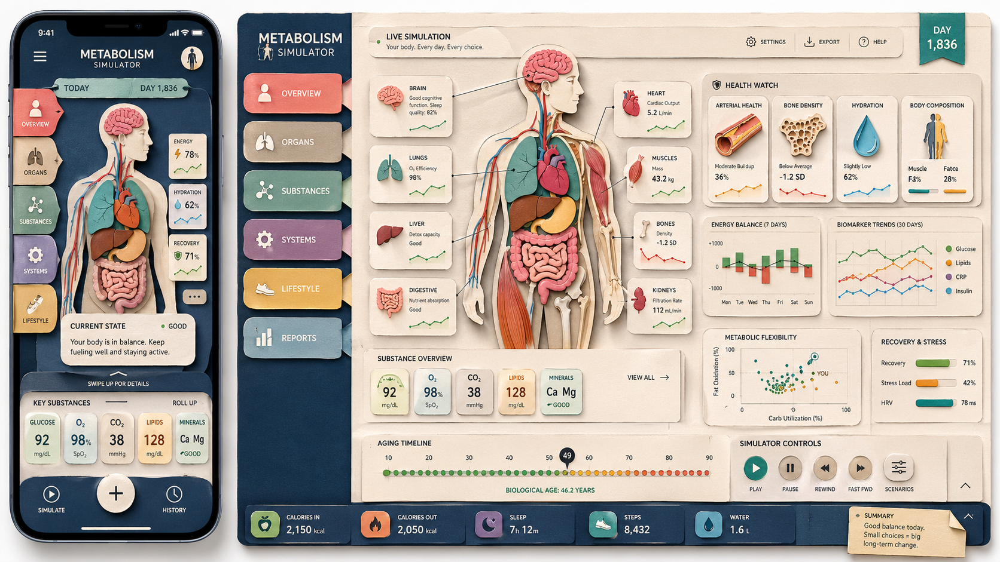
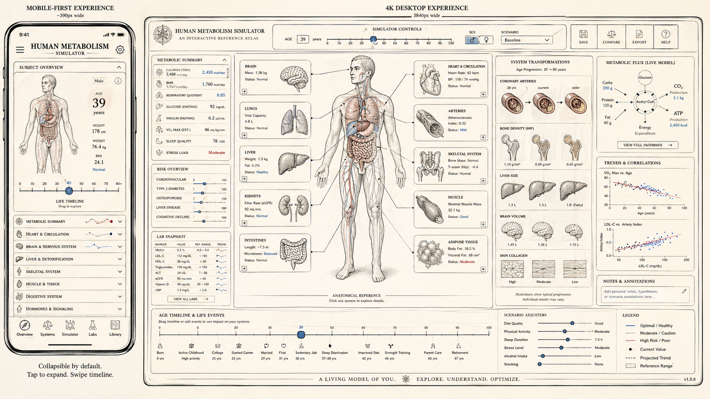
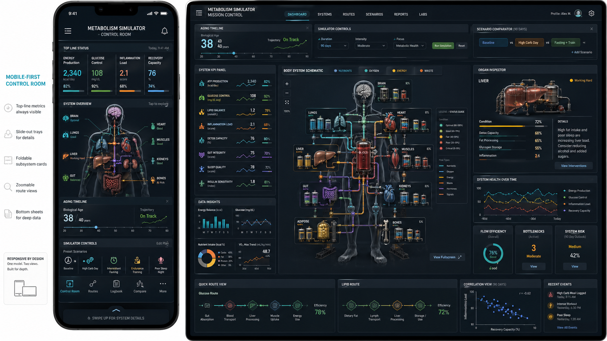
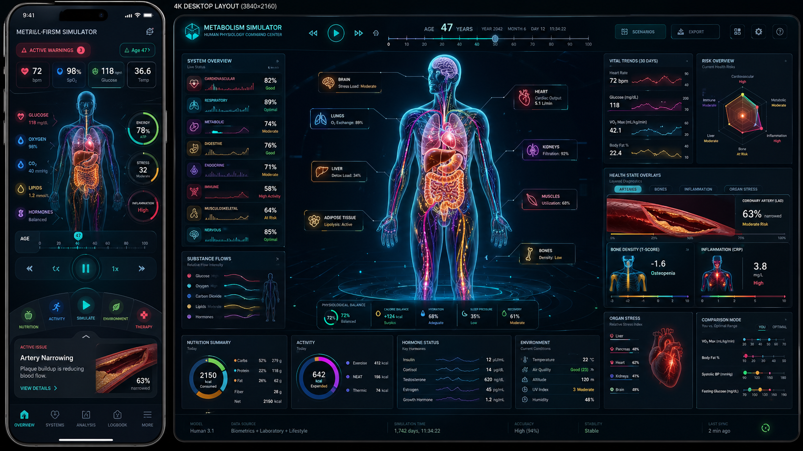
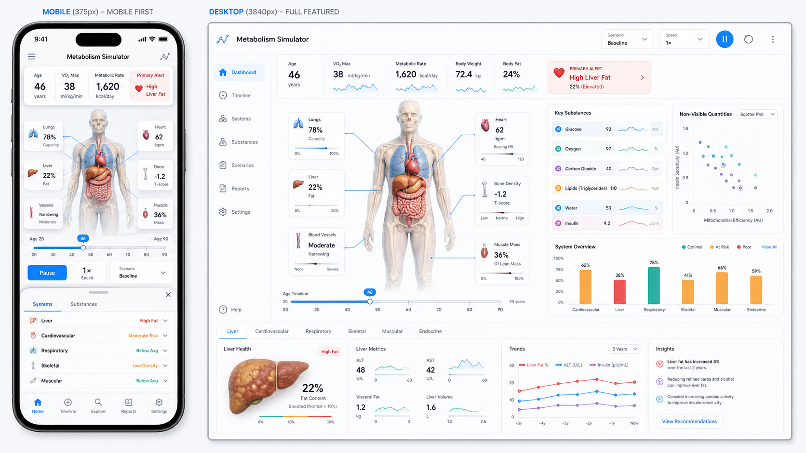
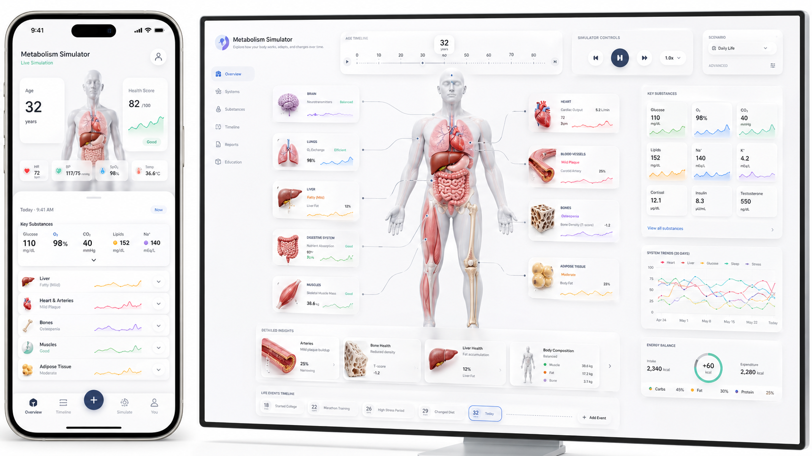

# Mobile-First — third visual exploration

Six candidate treatments at the form factor `design/design.md` §14 names the *baseline*: a 360-pixel-wide phone screen on which every scenario must be runnable end-to-end. The first two series (`system-diagrams/`, `body-based/`) both flagged Compact survival as the largest unaddressed question. This series flips the brief: the image is *shaped like a phone*, with the simulator chrome arranged for the form factor; any larger viewport is the secondary panel. The bar is no longer survival but *fitness* — does this work *as* Compact?

## Source

All six images are generative-AI outputs, dropped in by the user on 2026-04-25. Originating prompts not recorded. This series exists specifically to close the Compact-tier gap both prior series flagged as the most important next run, and implements §14's *Style-selection validation* requirement — side-by-side rendering at Compact and Standard at minimum. Five of six pair the phone with a tablet or 4K desktop in the same render.

Files:

- `gen-cardboard.png` — paper-craft / layered-cardboard relief (illustrative pole)
- `gen-old-textbook.png` — encyclopedia line plate (diagrammatic pole)
- `gen-dashboard.png` — dark neon HUD, first variant (instrumental, dense)
- `gen-dashboard-2.png` — dark neon HUD, second variant (instrumental, lifecycle-aware)
- `gen-white-flat.png` — clean white product UI, first variant (instrumental, light)
- `gen-white-flat-2.png` — clean white product UI, second variant (instrumental, anatomically richer)

Ordering runs most-illustrative through most-diagrammatic to most-instrumental — the same axis as the prior series.

---

## 1. Cardboard Paper-Craft Relief

**What it shows.** Phone and tablet/desktop, both as layered cream cardboard with terracotta, teal, and mustard accents. Phone: *Metabolism Simulator* header, hamburger menu opening a five-tab side rail (*Today*, *Day 1,834*, etc), an opened-torso figure with painted heart, lungs, liver, intestines, a *Current State* pill *+200 — Your body is in balance*, a bottom row of four KPI tiles (92, 98, 38, 128 in mg/dL, %, °C, mmHg), play-pause-clock. Desktop adds *Health Watch* (*Arterial Health*, *Bone Density*, *Hydration*, *Body Composition*), a 7-day energy-balance bar chart, an *Aging Timeline* strip, *Substance Overview*, *Metabolic Flexibility*, *Recovery & Stress* gauges.

**Pointers for the app.** §5 **Whole Body** in §14 *colourful, slightly cartoon-like* at *Compact* / *Detailed*. Paper-craft idiom — the relief from `system-diagrams/gen_2.5d_wall_chart` re-shaped for phone. Bias: §3 **Plain**; warm tone and tile grid would carry the §5 Kids view register. Figure-rendering pole: *figure-present-with-anatomical-opening*.

**Strengths.**
- *Current State* sentence is the most direct attempt at narrative summary at Compact — §3 Plain made tangible.
- Four-tile bottom KPI strip: large numbers, finger-sized cells.
- Cardboard texture compresses well — drop-shadow reads as depth at 360 px.

**Weaknesses.**
- *Compact judgement: passable but stylistically diluted.* Desktop's eight perimeter cards don't appear on phone; what ships is figure + bottom KPI + status sentence, with perimeter content reachable only via side-rail.
- Four bottom tiles use four different units without readable labels — reader squints to learn what each measures.
- Painted-cardboard organs will render as coloured smudges at real 360 px.
- No lifespan timeline on the phone. Desktop has *Aging Timeline*; phone lost it. Most serious omission given §14.

---

## 2. Old-Textbook Encyclopedia Plate

**What it shows.** Phone (captioned *MOBILE-FIRST EXPERIENCE — 390px wide*) and 4K desktop, both cream-paper engraving. Phone: serif title, a *Subject Overview* card (age 39, 174 cm, 76.4 kg, BMI 24.1), centred line-engraved torso, a *Life Timeline* horizontal slider with year ticks and age 39 marked, then a vertical accordion of seven labelled sections — *Vital Summary*, *Body Composition*, *Liver & Metabolism*, *Skeletal System*, *Muscle & Power*, *Hormones & Metabolism*, *Activity & Output*. Footer: *"Collapsible by default. Tap to expand. Swipe timeline."* Desktop is the fully laid-out plate with every section as its own bordered card plus a *Tissue Correlations* matrix and an *Age Timeline & Life Events* row.

**Pointers for the app.** §5 **Whole Body** in §14 *elegant line-drawing* at *Compact* / *Detailed* / *Spacious*. The body-based series flagged the line plate as the only style that survived Compact with identity intact; this goes further and treats Compact as a *different layout of the same plate* — accordion-driven, not shrink-driven. Bias: §3 **Technical** by aesthetic, with **Plain** and **Mixed** equally serviceable.

**Strengths.**
- *Most legible Compact frame in the series.* The accordion handles the §4 entity list without crowding — seven full-width tappable sections. Figure ~30% vertical without competing with data.
- The *Life Timeline* slider with year ticks is the only image in the series placing a horizontally-scrubbable age timeline above the fold on the phone — §14's Lifespan Timeline rendered correctly at Compact.
- Footer caption naming the interaction model in the image itself — a discipline the design should adopt.
- Single-weight strokes plus one accent port to SVG cleanly; light/dark inversion is one CSS variable.

**Weaknesses.**
- *Compact judgement: best of the six but cold.* §5 Kids view is not at home and §3 Plain "how am I doing?" feedback feels under-served.
- The accordion means *one of seven* panels visible at once. §4's "everything visible at once" is structurally violated at Compact regardless of style.
- One accent colour limits per-system encoding (insulin glow vs glucose tint vs ketone vial).

---

## 3. Dark Neon Dashboard — Variant 1

**What it shows.** Phone (captioned *MOBILE-FIRSM CONTROL ROOM*) and desktop in dark cyan-magenta-orange neon HUD. Phone: thin top bar of six metric chips (2,340 / 105 / 24 / 76 / two more), anatomical line-with-glow figure centred, three labels (*MUSCLES*, *LIVER*, *KIDNEYS*) with glowing dots, a small *38* gauge, a *See Trip* CTA, a thin bottom track. Desktop shows three large body-system pucks ringed with substance chips, a *Lifecycle* timeline arc, bar-chart panels.

**Pointers for the app.** §5 **Whole Body** in §14 *Instrument-panel* (dark neon) at *Compact* / *Spacious*. Direct descendant of `system-diagrams/gen_dashboard` and `body-based/gen-dashboard-neon`. Bias: §3 **Technical**.

**Strengths.**
- Dark mode treated as first-class on the phone — strongest argument in the series for the §14 dark-mode-as-peer commitment.
- Top metric strip reaches the highest density-per-pixel of the phones in the series.

**Weaknesses.**
- *Compact judgement: weakest on legibility.* Thin glowing strokes will smear at real 360 px — body-based flagged this and it's still here.
- Phone has lost most of the §4 entity list; only three organ labels survive (heart, brain, lungs, pancreas, gut absent).
- No visible lifespan timeline on phone — only a thin track without year markers.
- Six unlabelled top-bar chips is a memory test.
- Low-contrast neon-on-black is rough on a meaningful slice of the audience.

---

## 4. Dark Neon Dashboard — Variant 2

**What it shows.** A more developed dark-neon design at phone and 4K desktop. Phone: *METABOLISM SIMULATOR* / *ACTIVE SIMULATION 09:41*, vertical translucent x-ray figure with luminous viscera (cyan lungs, magenta heart, ochre intestines), eight gauges on the left rail (HR 72, BP 118, Energy 36.6 etc) and four on the right (Glucose 78%, Insulin, Metabolic, Inflammatory), play-pause-skip transport, an *Artery Narrowing* detail card with inset vessel cross-section + *63%* + *MORE DETAILS →*, and a four-icon bottom nav. Desktop carries a top *47 YEARS* lifespan-timeline slider with life-stage segments visibly demarcated and labelled (*Prenatal / Infancy / Childhood / Adolescence / Adult / Mid-Life / Senior*), figure at large size, organ-detail cards on both sides, *Health Index Simulator*, *Vital Trends*, *Substance Flows*, *Bone Health History*, *Inflammation Curve*.

**Pointers for the app.** §5 **Whole Body** in §14 *Instrument-panel* at *Compact* / *Spacious*. Bias: §3 **Technical**, **Mixed** workable.

**Strengths.**
- *The desktop is the single best demonstration in any series of §14's Lifespan Timeline with life-stage segments labelled and visibly demarcated.* The stage names are *on the chrome*, not derived. Body-based image 9 showed this for an infant; here it's a 47-year-old, the more common case.
- Phone packs ~12 organ readouts in rails — highest organ-readout density of any phone in the series.
- The *Artery Narrowing* card is the §4 stylized health diagrams idea visible on a phone.
- Four-icon bottom nav and clear thumb-zone transport.

**Weaknesses.**
- *Compact judgement: visually richer than variant 1, same shrink problem.* Glowing strokes still smear at real 360 px.
- Eight + four rail gauges crowd the figure — each rail ~50 px wide; sparkline + value + label cannot all be legible.
- The phone's lifespan timeline is *not* the labelled life-stage strip the desktop carries — phone shows a thin track. Design's most important component sacrificed at Compact.
- Translucent-x-ray requires per-life-stage art; only an adult shown, §14's *Life-stage-art requirement* unmet.

---

## 5. Clean White Flat — Variant 1

**What it shows.** Phone (captioned *MOBILE (375px) — MOBILE FIRST*) and desktop (*DESKTOP (1240px) — FULL FEATURED*) in clean light product UI. Phone: *Metabolism Simulator* header, KPI strip across the top (age 46, BMR 1,620, weight 72.4, body fat 24%), centred translucent-skin figure with restrained reveal of liver and gut, four small organ icons orbiting (lungs 76%, heart, kidneys, brain — each colour-coded), a *Pause* CTA, a scenario chip strip, five-icon bottom nav. Desktop has the full chrome — a left rail (*Dashboard / Cardiac / Renal / Endocrine / Neural / Insights / Recommendations*), *Key Parameters* tile group, substance bar-chart, sparkline-rich *Trends and Insights* row.

**Pointers for the app.** §5 **Whole Body** in §14 *colourful*-meets-*instrument-panel* at *Compact* / *Detailed*. Phone-form descendant of `system-diagrams/gen_clean_white_dense` and `body-based/gen-clean-canvas-dense-light`. Bias: §3 **Plain**; calm wellness-app register.

**Strengths.**
- *Cleanest figure-plus-orbiting-organs Compact composition in the series.* Four organ icons with percentages give a working §4 four-readout layout.
- Top KPI strip honours §14's always-visible-numbers commitment without needing a separate timeline.
- *Translucent-skin figure ports cleanly across life stages* — works at any age, unlike anatomical-opening which gets unsettling on a child.

**Weaknesses.**
- *Compact judgement: good but informationally light.* Six visible numbers total. The §4 entity list (foreign substances, hormones, conditions, full per-organ Health) is not on screen.
- *No visible lifespan timeline on the phone.* Most serious omission across the series.
- Wellness-app register undersells the simulation — *Pause* is the only button visible; user might not realise they can scrub, bookmark, change scenario, or compare individuals.
- Orbital organ icons at ~32 × 32 require the user to have already learned which icon is which.

---

## 6. Clean White Flat — Variant 2

**What it shows.** Phone and desktop, same clean-light family but figure opened anatomically rather than translucent. Phone: *32 / 82* twin big-numbers in the header, centred figure with painted heart, lungs, intestines through anatomical opening, left-side stack of organ tile-cards (*Key Parameters*, *Lungs 98%*, *Heart 85*, *Insulin Sensitivity 74*, *Vital Health 92*), play-pause transport, five-icon bottom nav. Desktop is denser — figure centred with organ-detail cards on both sides (*Lungs / Heart / Liver / Pancreas / Kidneys / Adrenal / Stomach / Intestines / Muscles / Adipose / Bones*), each with painted thumbnail, two readouts, sparkline; plus *Substance Levels*, two large gauges, *Lifestyle Plan* CTA.

**Pointers for the app.** §5 **Whole Body** in §14 *colourful*-meets-*instrument-panel* at *Compact* / *Detailed*. The *Key Parameters* stack is a useful contrast with variant 5's orbiting-icon model — same family, two solutions to the per-organ-readout question. Bias: §3 **Plain**.

**Strengths.**
- *Most readouts on a single phone screen of any clean-light variant.* Five tile-cards plus figure plus twin-number header — roughly twice the data density of variant 5.
- Painted-organs figure recognisably the same idiom as the desktop's painted thumbnails — visual register holds across tiers without two sets of art.
- Bottom-icon nav with centred play-pause is the cleanest mobile-app pattern in the series.

**Weaknesses.**
- *Compact judgement: dense to the point of cramped.* Five tile-cards along the left edge force the figure into a narrow strip.
- Painted-anatomy-through-opening is the §14 *figure-present-with-anatomical-opening* style the body-based series flagged as content-policy-fragile and a per-life-stage art problem.
- *Same lifespan-timeline absence as variant 5.* Recurs across four of six and is the most reliable failure pattern.
- Twin big-numbers in the header (32 / 82) without inline labels — same problem as variant 3's six-number strip.

---

## The narrow interface — focused analysis

A 360 × 640 phone gives ~230,400 pixels; Standard (1280 × 720) gives ~921,600 — four times more, and the aspect ratio inverts. Each image makes four decisions to handle this.

**(a) Vertical stacking vs side-by-side.** Every phone here stacks vertically — none attempts a side-by-side body-and-data-rail layout. *The body figure occupies the upper-middle band* (rows 2–4 of an imagined 6-row layout) and *everything else stacks above and below*. Variant 4's left-and-right rails of gauge-chips are the boundary case — they read side-by-side but each rail is 48–60 px wide.

**(b) Touch targets.** §14 commits to 44 × 44 px minimum. Cardboard's four-tile KPI: ~80 × 70 per cell — comfortable. Old-textbook accordion rows: full-width × ~56 px — comfortable. Dark-neon 1's top six chips at ~60 px each: edge of comfortable, with overlap risk. Dark-neon 2's left rail of eight gauges in 56-tall × 50-wide cells — *below* the minimum on the gauge graphic even if the touch zone covers the full cell. Clean-white 1's orbiting icons at ~36 × 36 — *below* the minimum; read decorative more than tappable. Variant 6's tile-cards at ~120 × 60 — comfortable.

Counted visible tap targets: cardboard ~12, old-textbook ~12, dark-neon 1 ~10, dark-neon 2 ~22, clean-white 1 ~12, clean-white 2 ~14. Variant 4 has the most by a clear margin — and is the most likely to confuse a user about what is tappable.

**(c) Top-bar chrome.** Each image solves §14's "always visible time and date" differently. Cardboard puts only title and hamburger in the top — date migrates to the side-rail. Old-textbook puts title + subject overview + lifespan timeline above the figure — date implicit in the timeline. Dark-neon 1 packs six metrics in the top, omitting an explicit date. *Dark-neon 2 has the cleanest top* — *ACTIVE SIMULATION 09:41* — with status indicator and clock. Clean-white 1's top is a four-KPI strip displacing date / scenario. Clean-white 2's twin big-numbers displace everything else. **Verdict: only dark-neon variant 2 honours §14's commitment that simulated time is always visible.**

**(d) What gets sacrificed.** Cardboard sacrifices the perimeter cards, lifespan timeline, and most of the §4 entity list. Old-textbook sacrifices simultaneous-reading (one section at a time) but keeps timeline and entity coverage. Dark-neon 1 sacrifices the entity list and timeline. Dark-neon 2 sacrifices the labelled-life-stage timeline and clarity of touch-target priority. Clean-white 1 sacrifices entity-list completeness and the timeline. Clean-white 2 sacrifices figure vertical real-estate and the timeline. **Pattern: five of six sacrifice the Lifespan Timeline at Compact.** Only old-textbook honours it. Most important finding of this analysis.

---

## Timeline control — focused analysis

§14's *Lifespan Timeline*, §6's time-multiplier, and §7's bookmark scrubber all want bottom-of-screen real estate. On a phone these three want the same band of pixels.

**Cardboard** — no lifespan timeline visible on phone; desktop has *Aging Timeline*. Time-multiplier and bookmarks not visible. *Lost at Compact.*

**Old-textbook** — lifespan timeline *above* the accordion with year ticks and age 39 marked, plus a footer caption naming the swipe interaction. No life-stage segments. Bookmarks not pinned. *Survives; segments and bookmarks need adding.*

**Dark-neon 1** — thin track at bottom, no labels. *Degraded to ambient; insufficient.*

**Dark-neon 2** — *desktop has the best lifespan-with-life-stage rendering of any image in any series* (*Prenatal / Infancy / Childhood / Adolescence / Adult / Mid-Life / Senior* labelled along the arc with age 47 marked). Phone has only a thin track that loses the segment labels. Transport clear. Bookmarks not pinned. *Right at desktop, lost at Compact; urgently needs a phone-shaped rendering of the labelled life-stage strip.*

**Clean-white 1 and 2** — no lifespan strip on phone. Bookmarks and time-multiplier absent. *Major design gap, both variants.*

**Pattern.** On a phone, the lifespan timeline wants the *bottom band above the bottom-nav* — about 64–80 px. Old-textbook's positioning *above* the accordion (immediately below the figure) is also workable. Dark-neon 2's desktop pattern — a scrubbable arc with named life-stage segments — is ideal but needs redrawing for 360 px wide; the segment names will not fit in full and should compress to first-letter abbreviations (Pn / In / Ch / Ad / Ad / Mi / Sn) with the active segment named in full above the strip. Bookmarks pin as small dots with tap-to-jump. The time-multiplier ladder lives in a collapsed bottom-sheet with current rate visible as a chip in the top bar.

**Single biggest finding.** Five of six dropped the Lifespan Timeline at Compact. The form factor is at war with §14 unless the design promotes the strip to *always-visible chrome that survives every layout*. Dark-neon 2's desktop labelled-segment design is the right *content*; old-textbook's positioning is the right *placement*; no image combines them at phone width.

---

## Callouts — focused analysis

On a desktop poster, callouts are dot-and-line annotations radiating from organs to perimeter cards. On a phone that pattern collapses — a connector crossing 200 px eats most of the screen. Each image proposes a different replacement.

**Cardboard.** *No visible per-organ callouts.* Status arrives via the bottom KPI strip and the *Current State* sentence. *Strategy: implicit-tap.*

**Old-textbook.** *No callouts on the figure; the seven-section accordion is the callout system.* Every per-organ readout sits in its named accordion row. Full-width, label-bearing. Figure is iconic, not informative. *Strategy: separated-accordion.*

**Dark-neon 1.** *Three labelled callouts* (MUSCLES / LIVER / KIDNEYS) with glowing dots on the figure. Heart, brain, lungs, gut, pancreas absent. *Strategy: minimal radiating.*

**Dark-neon 2.** *Side-rails of gauge-chips.* Eight left, four right. Each chip self-contained: organ name, value, sparkline. The *Artery Narrowing* bottom-sheet is a stylized-diagram detail panel inline. *Strategy: rail-of-chips + bottom-sheet detail.*

**Clean-white 1.** *Four orbiting organ icons with percentages* just outside the figure. Each ~36 px, percentage the entire data payload. *Strategy: orbiting-icon.*

**Clean-white 2.** *Left-side stack of tile-cards.* Five tiles, each ~120 × 60 with name, percentage, icon. *Strategy: vertical-stack-of-tile-cards.*

**Comparing.** Dark-neon 2's rail-of-chips packs the most data per pixel but only because the dark substrate carries the load. Clean-white 2's vertical-stack is the most legible *in light mode* and is the runnable pattern for §14's *colourful, slightly cartoon-like* family. Old-textbook's accordion is the most accessible — full-width targets, clear labels, no spatial-memory load. Dark-neon 1 and clean-white 1 are the most spatially anchored (callouts on the figure) but lowest data density. Cardboard's no-visible-callouts is the worst — user can't see what's tappable.

**The right Compact answer is probably hybrid.** Six radiating dots-on-figure for the most load-bearing organs (heart, lungs, liver, kidneys, brain, gut) each opening a bottom-sheet detail panel; an accordion below the figure for the long tail (foreign substances, hormones, conditions). Combines spatial anchoring with information completeness without crowding the figure.

**Single biggest finding.** Connector-line callouts do not work at Compact. Every image dropped, replaced, or pulled them off entirely. Body-based predicted this; this series confirms it across six styles.

---

## Depictions — focused analysis

The body figure at phone size — what survives, what compromises.

**Cardboard.** Painted-cardboard torso with anatomical opening. At ~250 × 350 px painted detail simplifies to coloured shapes — recognisable but losing tissue texture. Figure ~50% vertical. Lossy but identity preserved. Life-stage handling unproven.

**Old-textbook.** Single-weight line engraving. Lines stay sharp at any scale. Figure ~30% vertical (accordion eats more). Near-lossless port. Re-engraving for life stages is closer to drawing a new plate than swapping a layer.

**Dark-neon 1.** Translucent x-ray with luminous viscera, minimal detail. Glow softens, lines feather at 360 px. Figure ~50% vertical. Lossy on glow.

**Dark-neon 2.** Same family, more anatomically detailed. Viscera compress to coloured smudges; rails compete for the same band. Worse than variant 1 because the design tried to keep more detail.

**Clean-white 1.** Translucent-skin figure with restrained liver/gut reveal. Clarity holds at 360 px because line work is flat-vector and fills are areas not gradients. *The translucent-skin idiom ports to all life stages without body-based's content-policy friction. Most life-stage-portable figure in the series.*

**Clean-white 2.** Painted-anatomy with anatomical opening. Figure ~40% vertical, displaced by left-rail tile-cards. Anatomical-opening is the content-policy-fragile zone.

**Figure-rendering pole at phone size.** §14 commits each style to *fully-diagrammatic* or *figure-present*. None of the six is fully diagrammatic. A line-drawing-without-figure phone framing — organs floating in their fixed §4 positions — would be a useful next target, particularly for §5 *Fuel Flows* and *Hormones* which are explicitly node-and-edge.

**Does fully-diagrammatic look right at phone size?** Untested. Speculation: probably yes, because removing the figure frees ~40–50% of vertical for the §4 entity list to be visible without accordion-collapse.

**Does figure-present-with-translucent-skin still work at 360 px?** *Yes*, demonstrated by clean-white variant 1. Strongest finding: a flat-vector translucent-skin figure with restrained organ reveal renders cleanly at phone size and is the most life-stage-portable. Other idioms (painted-cardboard, x-ray-glow, anatomical-opening, line engraving) each have content-policy friction, glow-feathering at small size, or demographic-swap problems.

**Single biggest finding.** Translucent-skin is the most Compact-friendly *figure-present* technique across life stages and content-policy regimes.

---

## Cross-cutting themes

**Same three families, with re-balancing.** Illustrative (cardboard); diagrammatic (old-textbook); instrumental (the four others). The instrumental family is over-represented — four of six. Phones bias toward instrument-panel idioms because data-density-per-pixel is at a premium. The illustrative pole is under-represented; the §5 Kids view and body-based's vintage-poster / watercolour warm-teaching tone are not represented at phone width at all.

**Desktop-alongside-phone is a useful methodological choice.** Five of six pair the phone with a tablet or 4K render. This makes §14's responsive-tier commitment legible: the user sees what *adds* on the larger tier, not just what disappears at Compact.

**Lifespan Timeline is the most-dropped chrome element.** Five of six sacrifice it at phone width — consistent across visual styles, which suggests the issue is layout-priority, not stylistic, and needs to be resolved at the spec level.

**Touch-target discipline varies wildly.** 22 visible targets in dark-neon 2 vs ~12 in cardboard and clean-white 1. Compact-tier needs an explicit budget — ~10–14.

**Four-icon bottom-nav is the convergent §5 view-switcher.** Variants 4, 5, 6 all carry one; body-based's image 9 too.

**What the sample under-covers.** Fully-diagrammatic phone framing. Kids view at phone width. Multi-individual at Compact. Watercolour / painterly at phone width. Bookmark before/after toggle at phone width. Detail-panel overlay at full size. Snapshot output at Compact.

---

## Pointers for the next visual-research run

1. **Fully-diagrammatic phone framing.** 360 × 640, no body figure — only §4 organ layout, flows, gauges in fixed positions. Highest-leverage gap: the current six all spend 40–50% of vertical on the figure.
2. **Lifespan Timeline at Compact, designed first.** A frame whose layout *starts* from the timeline as the bottom strip — life-stage segments labelled, current age, bookmarks pinned, time-multiplier accessible — and works backward.
3. **Kids view at phone width.** Simplified figure, two-to-three readouts, warmer palette. No Compact representative anywhere across the three series.
4. **Multi-individual at Compact.** Two-body comparison at 360 px sharing the clock.
5. **Bookmark before/after at Compact.** Phone-shaped pair: same body, year 0 / year 10, identical layout, only the figure changed.
6. **Touch-target audit on the existing six.** Overlay each phone with a 44 × 44 grid; mark every below-minimum tap zone red.
7. **Real-pixel rendering test.** Phone framings at *actual* 360-px-wide rendered pixels, not high-DPI scaled, to surface the glow-feathering and line-aliasing this series can only argue about. Most informative possible deliverable.

---

## Proposed `design.md` edits

Six proposed edits. Each is grounded in specific images.

**1. §14 — name a Compact-tier touch-target budget.**

*Existing.* §14 *Compact* specifies "Touch targets sized for fingers (44 × 44 px minimum)" but does not name a *count*.

*Proposed addition* to the Compact bullet: *"The visible-tap-target budget on a Compact (≤ 640 px) screen is approximately 10–14 targets at any moment — beyond that, target boundaries crowd, and even targets meeting the 44 × 44 minimum become unreliable. The active-view layout is built to that budget, with the long tail of secondary actions hidden behind a single 'more' affordance (bottom-sheet, accordion, or hamburger menu). The budget is per-view; switching views replaces the visible set."*

*Triggered by.* `gen-dashboard-2` packs 22 visible tap targets and degrades touch reliability; `gen-cardboard` and `gen-white-flat` come in around 12 and read as comfortably tappable.

**2. §14 — Compact-tier Lifespan Timeline must survive every layout.**

*Existing.* §14 says the Lifespan Timeline strip "sits along the bottom of every Whole Body and Long-Term State view." Whether that holds at Compact is implicit; this series shows it's currently the most-dropped chrome element.

*Proposed addition* immediately after the existing Lifespan Timeline paragraph: *"The Lifespan Timeline is non-negotiable at Compact. Every Compact-tier layout reserves a band of approximately 64–80 px immediately above the bottom navigation, with current age marked, life-stage segments first-letter-abbreviated and visibly demarcated, and the active life stage named in full above the strip. Bookmarks pin as small dots above the strip with tap-to-jump. The time-multiplier ladder lives in a collapsed bottom-sheet reachable from a chip in the top bar. The KPI / status / detail-panel content above the timeline is what flexes; the timeline does not."*

*Triggered by.* Five of six images drop or degrade the lifespan timeline at Compact. Only `gen-old-textbook` honours it. The desktop variant of `gen-dashboard-2` has the best labelled-life-stage rendering; its phone has lost it.

**3. §14 — name the figure-rendering technique per style at Compact.**

*Existing.* §14 commits each style to *fully-diagrammatic* or *figure-present* but does not specify the reveal *technique*.

*Proposed addition* at the end of *Figure-rendering pole*: *"Within the figure-present pole, each style commits to a specific reveal technique recorded in the visual-style manifest: anatomical opening (sectioned torso), translucent skin (attenuated skin layer), x-ray glow (luminous viscera on dark silhouette), or line engraving (cross-section in single-weight line art). Techniques relying on glow gradients or fine painted detail must be tested at actual 360-px-wide rendered pixels before adoption. Translucent-skin is the most demographically and life-stage-portable; anatomical-opening hits content-policy friction in image-generation pipelines for infant and pre-pubescent subjects; x-ray glow feathers at small pixel sizes; line engraving is hard to swap demographically."*

*Triggered by.* `gen-white-flat` (translucent-skin, ports cleanly), `gen-white-flat-2` (anatomical-opening, content-policy friction), `gen-dashboard`/`gen-dashboard-2` (x-ray glow, smears at 360 px), `gen-old-textbook` (line engraving, demographically rigid).

**4. §14 — promote the bottom-nav as the §5 view-switcher at Compact.**

*Existing.* §5 lists the views; §14 names always-visible chrome but not where view-switching lives at Compact.

*Proposed addition* at the end of the §14 *Compact* bullet: *"View switching at Compact lives in a bottom-nav bar of four to five icon-and-label tabs covering the most common destinations (Whole Body, Fuel Flows, Hormones, Long-Term State at minimum; secondary views via a 'more' tap). The bottom-nav is fixed and persistent — the user's stable reference for where they are in the simulator's structure."*

*Triggered by.* `gen-dashboard-2`, `gen-white-flat`, and `gen-white-flat-2` all carry a bottom-nav with 4–5 tabs; body-based's image 9 carried one too. Convergence is design evidence.

**5. §14 — clarify what "always visible in the top bar" means at Compact.**

*Existing.* §14 says *"the active simulated time and date are always visible in the top bar."*

*Proposed clarification.* *"At Compact, this is a single chip in the top-right corner showing simulated date and time-of-day, with the time multiplier (e.g. ×60, ×3,600, ×86,400) as a subscript or small adjacent chip; on tap, the chip expands to a bottom-sheet with the full multiplier ladder. The top-left carries the simulator title or scenario name. The bottom-right scenario-name commitment becomes a 'scenario chip' in a dedicated row above the lifespan timeline, since the bottom-right corner is occupied by the bottom-nav at Compact."*

*Triggered by.* Only `gen-dashboard-2` honours simulated-time-always-visible with a clear top-bar clock. The other five drop or bury the time. Naming the priorities resolves the contested top-bar band.

**6. §14 — strengthen *style-selection validation* to require true-pixel Compact rendering.**

*Existing.* §14's *Style-selection validation* says a style ships only after side-by-side rendering at two density tiers.

*Proposed strengthening.* *"The Compact-tier rendering is produced at actual rendered pixels (a real 360-px-wide DOM render, screenshotted from a real or emulated device), not from a generative-AI mockup or a high-DPI asset scaled down. Generative-AI mockups produce phone-shaped images at high-DPI source resolutions where strokes, glows, and small typography read crisply; the same rendering at true 360 px frequently degrades. The validation must catch this gap; the rendering medium is the actual web stack, not the design tool."*

*Triggered by.* `gen-dashboard` and `gen-dashboard-2` look crisp here because the underlying generation is high-DPI; body-based predicted that real 360-px rendering of dark-neon strokes feathers. The series' methodology cannot tell us which images survive that test — only a true-pixel render can.
