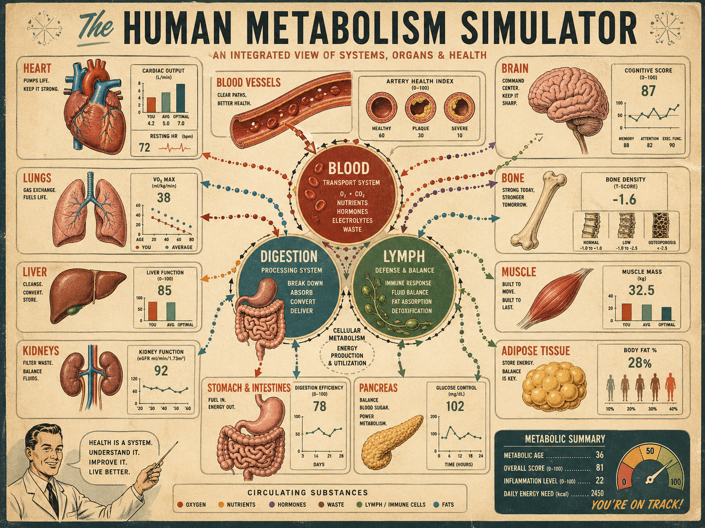
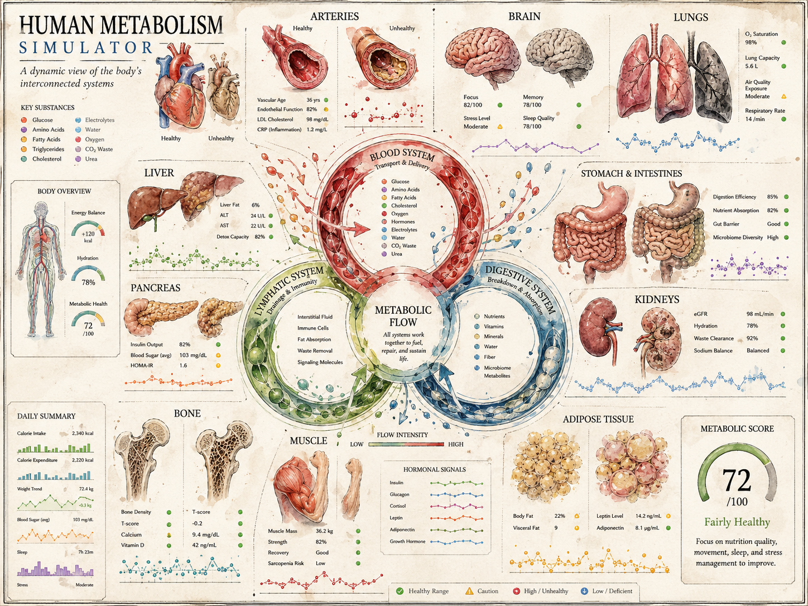
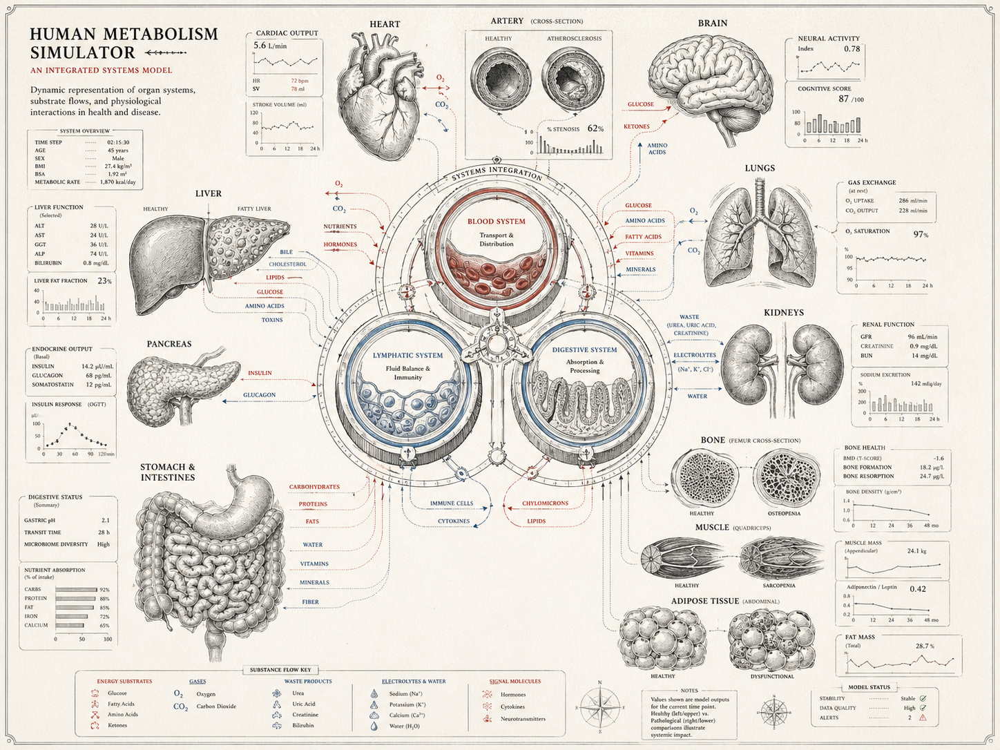
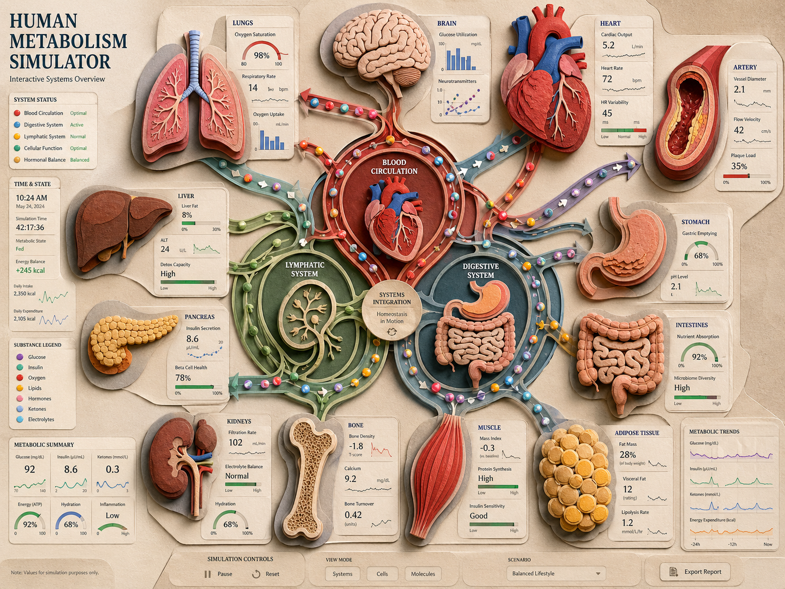
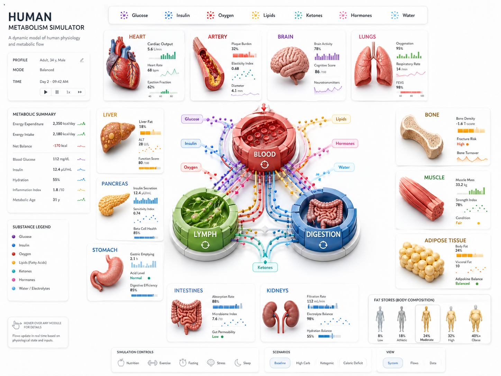
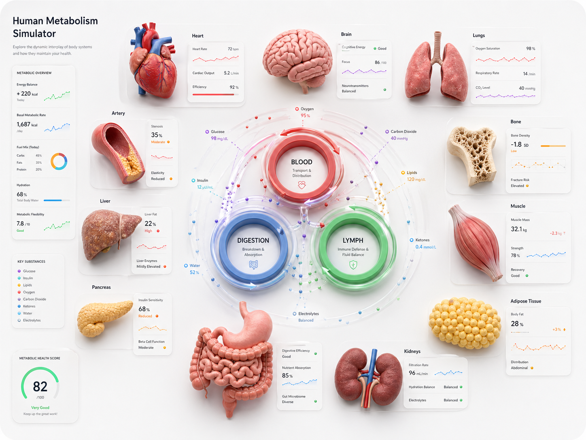
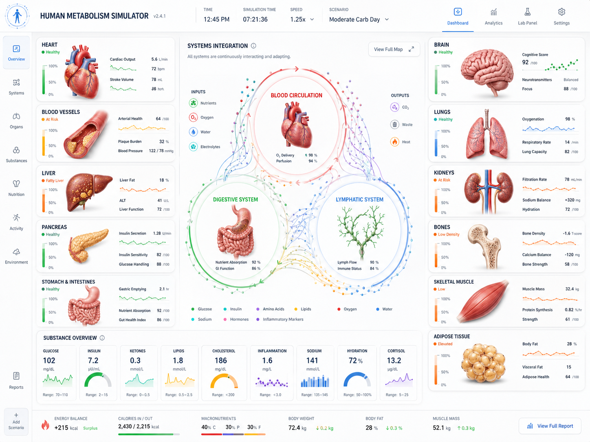
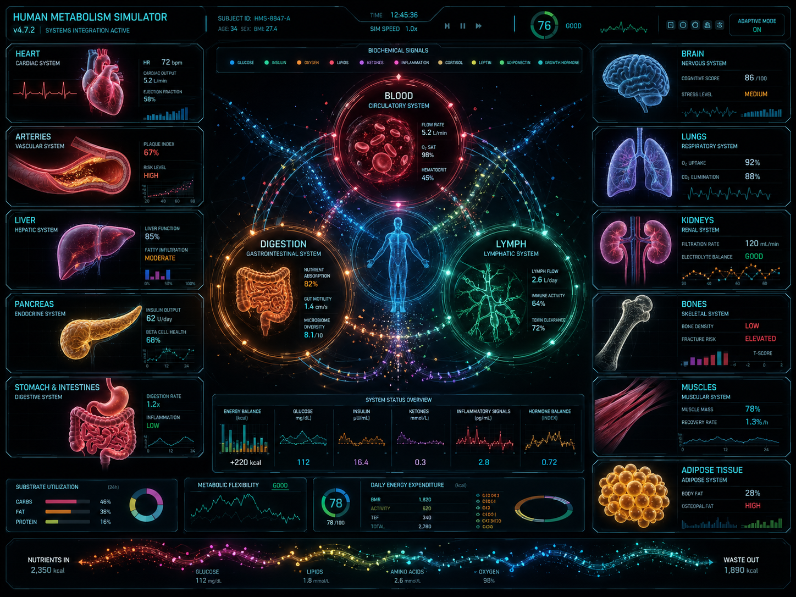

# System Diagrams — first visual exploration

Eight candidate treatments of the "all the metabolic systems on one reference diagram" question. The brief, loosely held: produce a single static frame that shows the whole body's metabolic machinery — circulation, digestion, lymph, liver, pancreas, kidneys, brain, lungs, heart, muscle, fat, bone — together with the substances flowing between them and a few summary readouts. The frame is what `design/design.md` §5 calls the **Whole Body view** at the §14 *Detailed* or *Spacious* density tier; it is the image the rest of the UI is shrunken from.

The series is deliberately wide. The eight images sweep from a vintage-poster idiom through painterly natural-history plates, clean line-art, relief illustration, two clay-render 3D treatments, a clean white dashboard, and a futuristic dark HUD. The goal is *not* to pick a winner — it is to find the spectrum, identify which directions feed the §14 *Anatomical*, *Instrument-panel*, and *Line-drawing* style families described in `design.md`, and surface what is missing.

## Source

All eight images are generative-AI outputs, dropped into the folder by the user on 2026-04-25 (file mtime). The originating prompts are **not yet recorded** — placeholder for the user to backfill if/when they want a reproducible record. Filenames hint at the prompt direction (`50s_poster`, `encyclopedia_line`, `dashboard`, etc.) and have been preserved as the image identifiers.

Files (size on disk, for triage):

- `gen_50s_poster.png` (3.0 MB)
- `gen_old_color_plate.png` (2.9 MB)
- `gen_encyclopedia_line.png` (2.8 MB)
- `gen_2.5d_wall_chart.png` (3.1 MB)
- `gen_3d_canvas_dense.png` (1.8 MB)
- `gen_3d_clean_canvas.png` (2.0 MB)
- `gen_clean_white_dense.png` (1.8 MB)
- `gen_dashboard.png` (2.1 MB)

The walkthrough below orders them from most-illustrative / most-painterly to most-instrumental / most-data-dense.

---

## 1. Vintage Infographic Poster

**What it shows.** A mid-century classroom poster. Cream paper, terracotta and teal accents, hand-lettered display title. Each organ — heart, lungs, liver, kidneys, stomach, pancreas, brain, bone, muscle, adipose — gets its own framed panel arranged around the perimeter, with a central trio of circles (*Blood, Digestion, Lymph*) tied together by dotted flow arrows. Each panel carries a small bar chart, a numeric readout (cardiac output 5.2, V̇O₂max 38, body fat 28%) and a one-line role description. Bottom-left, a 1950s science-teacher mascot points at the page; bottom-right, a metabolic summary badge with overall score, metabolic age, daily energy need, and an *"You're on track!"* tag. The eye lands on the central red *Blood* circle and walks the perimeter clockwise.

**Pointers for the app.** §5 **Whole Body** view in §14 *Anatomical* style at *Spacious*. Closest in spirit to the §14 *colourful, slightly cartoon-like* family but skewed toward the teaching-poster end. The framed-panel-per-organ structure maps cleanly onto §4 per-organ Health and detail panels — every entity already has a bordered card, so click-for-detail-panel is natural. The mascot and tone bias the audience strongly toward §3 **Plain** and toward the §5 **Kids view**; closer to a children's textbook than a clinician's dashboard.

**Strengths.**
- Each organ is its own self-contained micro-display. Adding or removing a panel does not break the layout.
- Warmth and humour. Vintage palette translates cleanly to a sepia §14 dark mode.
- The badge / score / mascot triad makes the simulator feel like something you'd want to use.

**Weaknesses.**
- Decorative-thin flow arrows die at Compact 360 × 640; the dotted lines vanish and the layout collapses to "rectangles full of tiny text."
- Hand-lettered display type rules out runtime label-mode swaps without baking the strings.
- The mascot commits the whole UI to one tonal register — hard to drop into **Technical** without it feeling sarcastic.

---

## 2. Painterly Natural-History Plate

**What it shows.** Watercolour-and-ink natural-history plate. Off-white, slightly aged paper. Each organ a small painted study with hand-numbered annotations and a few figures (LiverFat 6%, ALT 22, Heart Rate 72/min, Memory 75/100). Centre: a flame-coloured *Blood System* disc surrounded by *Lymphatic*, *Digestive*, and an inner *Metabolic Flow* ring; substance lists radiate outward (*glucose, amino acids, fatty acids, oxygen, water, hormones*). A standing-figure body-overview at upper-left carries an Energy Balance / Hydration / Metabolic Health card. Bottom-right: a circular *Metabolic Score 72/100 — Fairly Healthy* gauge. Two arteries — healthy and unhealthy — sit at the top side by side.

**Pointers for the app.** §5 **Long-Term State** view in §14 *Anatomical* (painterly) at *Detailed* / *Spacious*. The before/after artery pair is exactly the §4 *Blood vessel cross-section* stylized health diagram, and is the strongest visual argument in the series for the §7 bookmark-toggle pattern. The standing figure is a candidate template for the §4 *Body shape silhouette*. Bias: §3 **Plain** with room for **Mixed**; the painted style makes scientific terminology feel like museum caption.

**Strengths.**
- Single-scene cohesion — reads as one continuous painting, not a grid of cards.
- The §4 stylized health diagrams (vessel, bone, liver, body silhouette, muscle, lung) are *already in this language*; almost nothing needs to be invented.
- A 30-year deterioration arc rendered as a series of plates from the same volume would carry §7 bookmark before/after enormously well.

**Weaknesses.**
- Watercolour washes and annotations turn to mush at Compact.
- High render cost. SVG won't carry the brushwork; pre-rendered raster sprites per state conflict with §14's "same numbers, same layout, just different drawing pass."
- Particle streams over watercolour read as tacky — the §14 flow-particle abstraction wants a flatter substrate.

---

## 3. Encyclopedia Line Art

**What it shows.** Old-encyclopedia engraving idiom. Cream paper, single-weight black ink for the figures, sparing red for arrows and emphasis. Each organ — heart, liver, kidneys, lungs, stomach, brain, pancreas, bone (cross-section), muscle (fibre bundle), adipose — drawn as a hatched line illustration with a numbered legend tag and a small data block (Liver Function: ALT 22, AST 18, Albumin 4.2, Bilirubin 0.8). Three central rings — *Blood, Lymphatic, Digestive* — tied by labelled red arrows naming substances exchanged. Substance-flow legend at the bottom; compass rose at lower-right.

**Pointers for the app.** *The* reference for the §14 *elegant line-drawing* style direction. §5 **Whole Body** at *Detailed*. Single-weight stroke and monochrome-with-one-accent palette match §14 verbatim. Reads cleanly as a §14 *Snapshot* — the kind of frame a user would paste into a slide and have read as illustration rather than UI screenshot. Bias: §3 **Technical** by default — line engravings carry scientific authority by aesthetic — though Plain labels would render fine.

**Strengths.**
- Cheapest style to ship. SVG with two stroke widths and one accent colour. §14 light/dark inversion is one CSS variable.
- Survives Compact better than any other image in the series. Scale a line drawing to 50% and it is still a line drawing.
- Flow arrows are *part of the substrate*, not laid over a richer image — particle animations sit naturally on the same plane.

**Weaknesses.**
- Cold. No warmth, no playfulness; not the right register for the §5 Kids view.
- Colour-coding bandwidth is one accent. Distinguishing four hormones at a glance is hard; §14 wants per-system palette and glow intensity, both of which fight the line aesthetic.
- Health-score and *"how am I doing?"* feedback feels out of place — engraving says "this is how the body works," not "this is how *your* body is doing."

---

## 4. 2.5D Relief Wall Chart

**What it shows.** A relief-style classroom chart with subtle drop shadows on every card, as if panels were laser-cut from layered paper. Beige board, terracotta and sage accents. Dimensional anatomical illustrations (sculpted, slightly toy-like) on labelled cards in a loose grid; the centre carries a green-and-red rosette of *Blood Circulation*, *Lymphatic*, *Digestive* with a *Systems Integration* badge. Per-organ status panels (oxygen saturation 98%, liver fat 8%, glucose 92, kidney filtration 102, bone density -1.8) read like museum-exhibit cards. A simulation control bar runs across the bottom (*Pause / Reset*, *View / Cells / Molecules*, scenario picker, *Export Report*).

**Pointers for the app.** §5 **Whole Body** in §14 *Anatomical* at *Spacious*. Same family as the 50s poster but cleaner, more product-shaped, and — critically — already carrying simulation controls and a scenario picker. Of all eight, this is closest to "what the actual simulator chrome looks like." Bias: §3 **Plain** with room to switch.

**Strengths.**
- The relief / layered-paper trick gives depth without committing to 3D rendering. Achievable in CSS with shadow stacks.
- Per-organ cards are *already wired for* the §4 detail-panel-on-click — the visual model says "this is a card, you can pick it up."
- Bottom toolbar shows the simulator chrome the rest of the design needs.

**Weaknesses.**
- Drop shadows become visual noise that eats touch-target space at Compact.
- "Museum gift shop" quality; not the best register for §3 **Technical**.
- Squeezing in the full §4 entity list (every hormone, foreign substances, conditions) would crowd the relief illustrations.

---

## 5. 3D Clay Render — Dense

**What it shows.** Bright off-white canvas. Photoreal clay-render organs scattered around three large 3D buttons (*BLOOD*, *LYMPH*, *DIGESTION*) connected by curving particle trails of substance dots colour-coded to legend chips at the top (*glucose, insulin, oxygen, lipids, ketones, water*). Each organ has a small sparkline-and-readout card. Bottom-right: a row of human-silhouette body-composition icons running lean-to-obese. The eye is pulled to the three glowing central pucks.

**Pointers for the app.** Closest to a literal §5 **Whole Body** view at *Spacious* with §14 *Anatomical* (3D) styling. The substance-dot particle trails are the closest visual realisation of §14's "Flow animations use small particles travelling along defined paths. Density of particles encodes flow rate" — none of the others make that abstraction concrete this clearly. The body-silhouette row is a §4 *Body shape silhouette* spectrum and would work as an §8 Multiple Individuals thumbnail strip.

**Strengths.**
- The §14 flow-particle metaphor is *visualised* here. Best argument in the series for that animation style.
- The three central pucks read as system-level interactives — candidate UX for §5's future specialised subsystem views.
- Legend chips at the top prefigure §13 hypothesis-selection badges and §14 substance legend.

**Weaknesses.**
- 3D clay renders are heavyweight. Each organ would need a sprite per Health-score band and per age stage — the asset matrix gets large fast.
- Composition relies on a lot of empty white that wouldn't survive Compact compression.
- Render style makes organs look toy-like; **Technical** label mode feels off when the liver looks like candy.

---

## 6. 3D Clay Render — Clean

**What it shows.** Same render family as the previous, stripped back. Same clay organs, same three central pucks (smaller now), data cards sparser, no legend, and a large *Overall Health 82* score sitting prominently at lower-left. Less particle traffic. Reads as the "summary mode" of the dense version.

**Pointers for the app.** Same §5 / §14 mapping, but at the §14 *Standard* density tier rather than *Spacious*. This is the simulator at glance rather than study. The big *Overall Health 82* score is the §4 whole-body Health aggregate; its prominence is a useful design signal — *the headline number matters; give it the largest type on the screen*.

**Strengths.**
- Demonstrates the same rendering pass at two densities — exactly the §14 responsive-tier requirement. The fact that this and the dense version feel like the same simulator at different zoom levels is a strong endorsement of that architecture.
- Cleaner composition would survive partial compression to §14 *Standard* on a tablet (≈ 768 px wide).
- Big aggregate score is what users actually want first — argues for elevating it to the headline slot.

**Weaknesses.**
- Same asset-cost problem as the dense version.
- Loses information density quickly — slides toward wellness-app vibe rather than teaching tool.
- Central pucks now look like *buttons* rather than *systems* — subtle but real UX risk.

---

## 7. Clean White Dashboard

**What it shows.** A clean product-UI dashboard, light theme. Every organ is a tile with a small painted thumbnail, title, two or three numeric readouts, sparkline, and coloured status pill. Left rail: section navigation (*Dashboard, Substances, Hormones, Trends, Bookmarks*). Top header: simulated time, scenario name (*Moderate Carb Day*), playback rate, control icons. Centre: a *Systems Integration* schematic — three labelled circles tied by substance-flow arrows. Bottom: a *Substance Overview* row with eight or nine sparkline readouts (glucose, insulin, ketones, FFA, etc.) and an aggregate-score footer.

**Pointers for the app.** Of all eight, closest to the simulator's actual product chrome. Header layout matches §14 verbatim ("active simulated time and date are always visible in the top bar; current scenario name is always visible in the bottom-right"). Bottom row is §6 Charts and §4 substance gauges combined. Left rail handles §5 view switching. Comfortable in §3 **Plain**, **Technical**, or **Mixed** because every data point sits in its own labelled cell — longer Mixed strings don't break the grid.

**Strengths.**
- The layout the simulator probably ships with at §14 *Detailed*. All chrome included.
- High information density without feeling cramped — the §4 list of visible quantities fits.
- Sparkline-everywhere maps directly onto §6 Charts and §4 substance amounts.
- Strongest claim of any image to also work at §14 *Standard* — collapse the left rail, hide the bottom row, keep the schematic and the most-load-bearing tiles.

**Weaknesses.**
- Painted-thumbnail organ icons fight the otherwise-flat data UI — the middle ground reads slightly stock-photo.
- At Compact the tile grid needs to collapse to a single column with the schematic compressed — doable, but unproven here.
- No personality. Fine for a dashboard, less good for the §5 Kids view.

---

## 8. Futuristic HUD Dashboard

**What it shows.** A dark-theme high-density HUD. Black-to-deep-blue background. Cyan, magenta, lime, orange neon strokes. Each organ rendered as a glowing wireframe-with-fill illustration (heart with EKG trace, liver with hepatic-function bar, kidneys with renal-function ring, bones with density meter). Centre: three luminous orbs (*BLOOD, LYMPH, DIGESTION*) ringed with rotating particle constellations of substance names; a translucent body silhouette in the middle of *BLOOD*. Top bar: simulated date / time / version / scenario / aggregate score (*76*) / play rate (*1.0×*). Bottom: a long horizontal *Nutrients In / Waste Out* particle ribbon; substrate-utilisation legend; metabolic-flexibility gauge. Substance-status overview spans the lower middle (*energy balance +220 kcal*, *glucose 18.6*, *amino acids 8.1*, etc.).

**Pointers for the app.** §5 **Whole Body** in §14 *Instrument-panel* at *Spacious*, dark mode. The loudest of the eight; commits hardest to "the simulator is *running*, alive, instrumented." The rotating particle constellations are §14's flow-particle metaphor at maximum. Most complete §4 substance-readout grid in the series. Aimed at §3 **Technical** and at users who want quantitative density — reads as a *workstation*, not a teaching poster.

**Strengths.**
- Dark mode is *first-class*, exactly as §14 demands. Strongest argument in the series for designing dark mode as peer of light mode rather than a swap.
- Maximises information density — best fit for the §8 Multiple Individuals layout where six bodies need room.
- Particle / glow / ring vocabulary covers §14 hormone-glow, flow-particle, and stored-quantity-fill abstractions in one consistent visual language.
- Top bar already places everything §14 requires.

**Weaknesses.**
- Catastrophic at Compact. Neon palette and thin glowing strokes need pixels to read; at 360 × 640 the particles smear into a blur and labels disappear.
- "Sci-fi HUD" biases hard against the §5 Kids view and the §3 Plain default. A non-specialist parent dropping in to learn what insulin does will not feel met.
- Hard to print / paste. §14 wants snapshots that read as illustrations in a slide; this reads as a video-game screenshot.
- Low-contrast neon-on-black is rough on a meaningful chunk of the audience.

---

## Cross-cutting themes

**The series spans three families of intent.** The eight images are not a continuum; they cluster.

1. **Illustrative / teaching** — `gen_50s_poster`, `gen_old_color_plate`, `gen_2.5d_wall_chart`. Warm, framed, organ-centric. Aimed at the §5 Whole Body view with strong Kids-view affinity. Map onto §14's *colourful, slightly cartoon-like* family.
2. **Diagrammatic / authoritative** — `gen_encyclopedia_line`. Single-handed representative of the §14 *elegant line-drawing* family. Reads as a textbook.
3. **Instrumental / dashboard** — `gen_clean_white_dense`, `gen_dashboard`, and to a lesser extent the two clay-renders. Tile-grid, sparkline-rich, control-bar-equipped. Map onto §14's *lean, instrument-panel* family.

**The 3D clay renders sit in the middle and weaken either claim.** `gen_3d_canvas_dense` and `gen_3d_clean_canvas` could be argued into either the illustrative family or the dashboard family; in practice they commit to neither. They do however carry the cleanest realisation of the §14 flow-particle metaphor and are worth keeping for that reason alone.

**What clusters most tightly visually.**
- The poster and the relief wall-chart (`gen_50s_poster`, `gen_2.5d_wall_chart`) — both per-organ-card grids around a central system rosette, both warm earth palette, both with a control bar at the bottom. These two are arguing for the same UI.
- The two clay-render images (`gen_3d_canvas_dense`, `gen_3d_clean_canvas`) — same render style, different densities. As noted, this pair is itself the strongest visual demo in the series of §14's "same simulation, different density tier" architecture. Even though clay-render isn't likely to be the chosen style, the *density-pair* exercise is the right exercise.
- The two dashboards (`gen_clean_white_dense`, `gen_dashboard`) — same information architecture, light vs dark, painted vs neon. Strong evidence that §14 light/dark really is one design rendered twice rather than two separate designs.

**What the sample under-covers.**
- **Compact / mobile.** None of the eight is shaped like a phone screen. Every image is landscape-orientation 4:3 desktop chrome. §14 says mobile-first; this series pretends desktop-first. This is the obvious gap.
- **Animation.** All eight are static frames. The flow-particle metaphor that §14 commits to needs to be evaluated in motion, not as a still. A still frame can imply particles; only motion proves they read.
- **Time-scrubbing / before-after.** §7 makes bookmark toggling a headline interaction. None of the eight shows the before / after pair side-by-side at the same scale. The arteries-healthy-vs-unhealthy pair in `gen_old_color_plate` is the closest, and it is one small detail.
- **Multiple individuals.** None of the eight shows the §8 grid of two-to-six bodies. Worth a series of its own.
- **Kids view candidates.** All eight are aimed at adults. The §5 Kids view needs its own visual exploration — fewer entities, stronger animations, simpler labels.
- **Foreign-substance and conditions display.** The §4 list of foreign substances (blood ethanol, blood nicotine, drug levels) and §11 chronic conditions — none of the images show how these would surface visually. Several of the layouts could *carry* them, but none demonstrates it.

**Design-relevant observations to flag.**
- The flow-particle abstraction in §14 is best realised by the 3D clay-renders and the futuristic HUD; the poster and the line-art rely on static arrows. If §14's particle commitment is firm, the chosen style needs to make particles look natural — that argues against the line-art for the headline §5 Whole Body view, even though line-art wins on the §14 snapshot-as-illustration goal.
- The *Spacious* tier in §14 is well-explored by this series; *Compact* is unexplored. Any §14 style decision made on the basis of these images alone would be biased toward desktop-first, against the mobile-first commitment.
- The §4 "stylized health diagrams" (vessel, bone, body silhouette, liver, muscle, lung, skin) appear most readily in the painterly plate (`gen_old_color_plate`) and the line-art (`gen_encyclopedia_line`). These two styles are the natural homes for that family of small focused diagrams regardless of which style the main schematic adopts. This is a hint that §14 might want to allow the stylized health diagrams to live in their own visual register, even if the main view is e.g. dashboard-style.
- The header information (simulated time, date, scenario name, play rate) is best placed by `gen_clean_white_dense` and `gen_dashboard`. The §14 top-bar specification matches what those two images already do.

---

## Pointers for the next visual-research run

1. **Mobile / Compact framings.** Generate at 360 × 640 portrait. Ask the same question — show the whole metabolic system on one screen — but force the constraint §14 actually requires. This is the most important next series, because none of the eight current images respects the §14 mobile-first commitment.
2. **Motion mockups.** Take two or three of the eight (suggested: `gen_3d_canvas_dense`, `gen_dashboard`, `gen_encyclopedia_line`) and produce 5–10 second loops of the central blood / lymph / digestion subsystem with the flow particles actually moving. Ten seconds of motion will resolve more design questions than ten more still frames.
3. **Bookmark before/after pairs.** Pick a style — most likely the painterly plate or the line-art — and generate the same body at year 0 and year 10, side by side, same scale, same layout, identical except for what changed. This is the §7 bookmark-toggle interaction shown working.
4. **Stylized health diagrams as a set.** A series dedicated to the §4 small focused diagrams — vessel cross-section across four ages × Health bands, bone density across three ages, body silhouette across the §8 individual axes (sex, age, body composition, condition). These are content the simulator needs regardless of which main-view style wins.
5. **Multiple Individuals grid.** A series shaped like the §8 view — two to six bodies on shared axes, same clock, in two or three of the candidate styles. Will surface whether the chosen style scales to six panels without becoming illegible.
